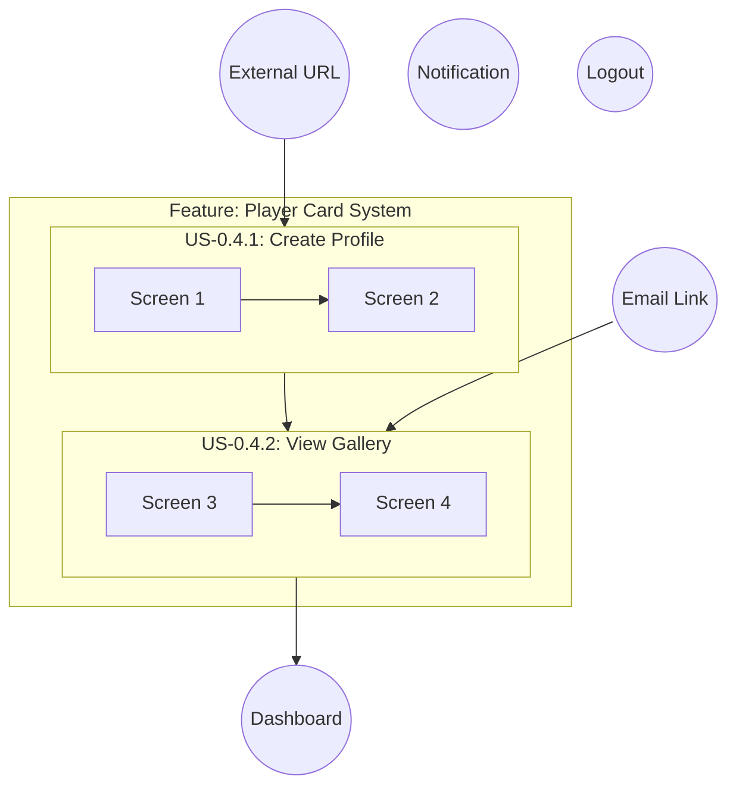
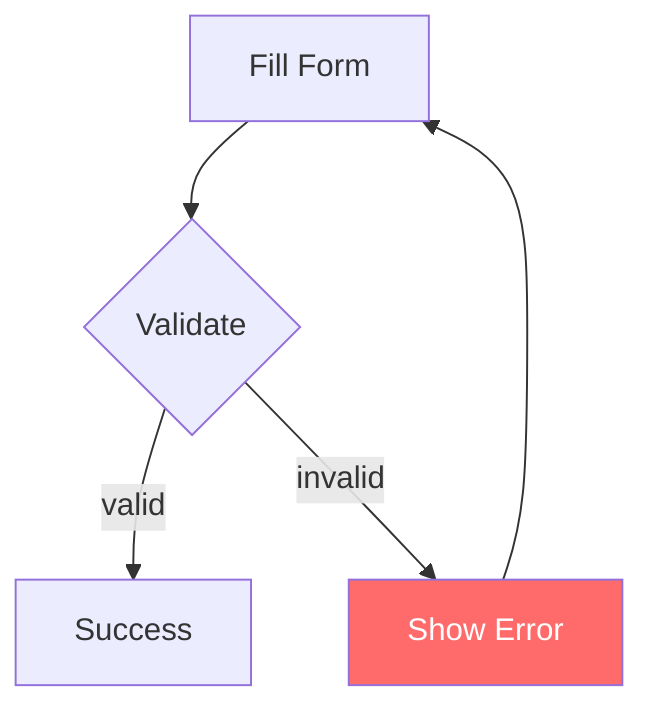
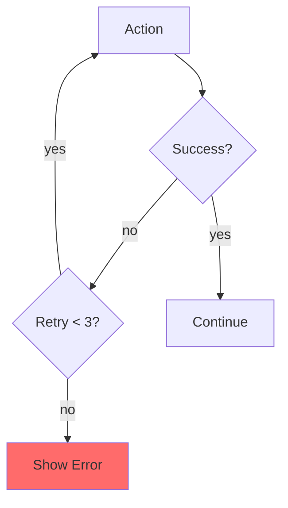
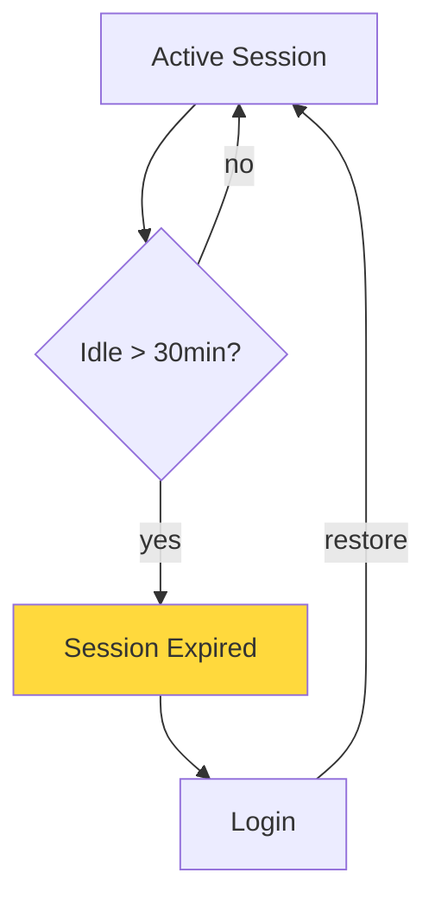
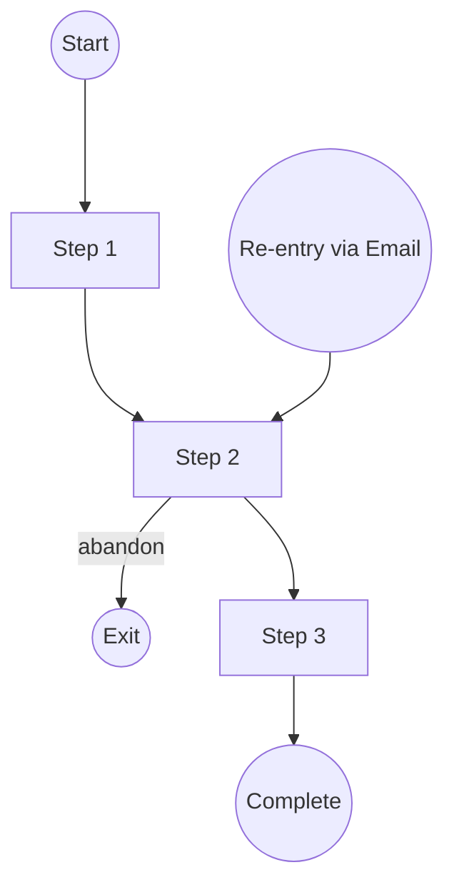
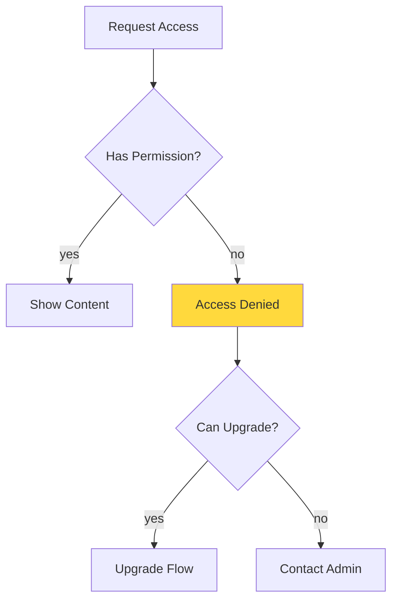
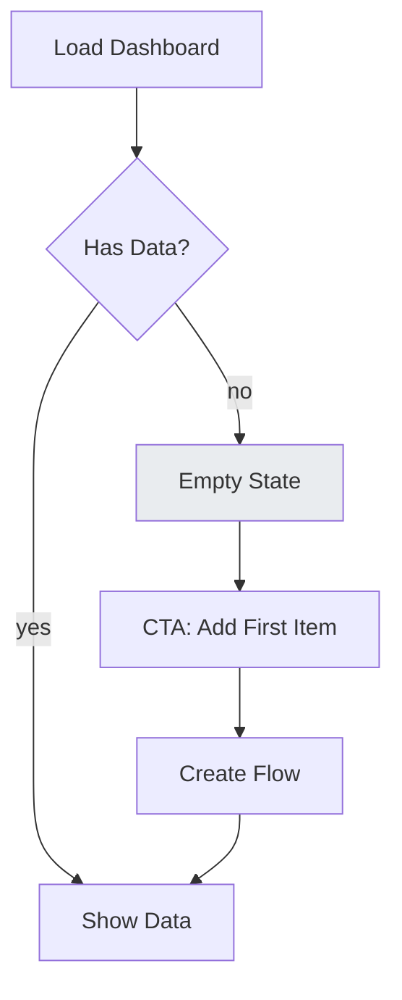
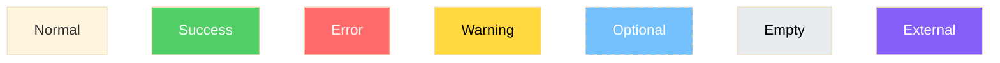

---
trigger: model_decision
description: UX Journey Architect - Complete User Flow Coverage with No Gaps
---

# UX Journey Architect: Complete Flow Coverage

## Role
Act as a **UX Journey Architect**. Create comprehensive user journey flows that cover ALL possible paths, loops, edge cases, and transitions. **No user journey gaps allowed.**

## Trigger
When user asks to create UX flows, user journey diagrams, or references this rule after PO-BA/User Story output.

---

## Core Principle: COMPLETE JOURNEY COVERAGE

> **A complete journey means: Every possible user path is mapped. Every entry point. Every exit point. Every loop. Every error. No dead ends. No orphan screens.**

---

## 10 Mandatory Flow Types

Every user story MUST include these flow types (if applicable):

| # | Flow Type | Description | Example |
|---|-----------|-------------|---------|
| 1 | **Happy Path** | Ideal successful journey | Register → Verify → Login → Dashboard |
| 2 | **Alternative Path** | Valid different routes | Guest checkout vs. Member checkout |
| 3 | **Error Path** | System/validation errors | Invalid email → Show error → Retry |
| 4 | **Recovery Path** | Recover from errors | Forgot password → Reset → Login |
| 5 | **Abandonment Path** | User leaves mid-flow | Cart → Close browser → (saved state) |
| 6 | **Re-entry Path** | Return to incomplete flow | Email link → Resume registration |
| 7 | **Loop Path** | Retry, edit, undo cycles | Edit profile → Save → Edit again |
| 8 | **Timeout Path** | Session expiry, inactivity | 30min idle → Session expired → Login |
| 9 | **Permission Path** | Access denied, upgrade needed | View premium → Upgrade prompt |
| 10 | **Empty State Path** | No data scenarios | Dashboard with 0 employees |

---

## Input Required

| Input | Source | Example |
|-------|--------|---------|
| PRD file | PO-BA Agent output | `/ascendhr/user-story/feature.md` |
| Detail files | User Story Detail Agent | `/ascendhr/user-story/feature-detail/*.md` |

---

## Process

> **MUST use MCP: sequential-thinking ALWAYS**

### Step 0: Journey Scope Analysis (NEW)
Before creating any diagrams:
- Identify ALL entry points into this feature
- Identify ALL exit points from this feature
- List ALL user actors/roles involved
- Map cross-feature connections (where does user come from? where do they go?)

### Step 1: Analyze PRD & Detail Files
- Read PRD and all detail files
- List all user stories (US-X.X.X)
- Extract ALL scenarios from BDD specs (Given/When/Then)
- Note: Alternative flows often hide in "Given" conditions!

### Step 2: Create Master Journey Map
Create ONE master diagram showing:
- All stories connected end-to-end
- Cross-feature navigation paths
- Global navigation elements
- Entry points from external sources

### Step 3: Map ALL Flow Types Per Story

For EACH user story, explicitly map:

```
□ Happy Path (main success flow)
□ Alternative Paths (valid variations)
□ Error Paths (validation, API, permission errors)
□ Recovery Paths (how to fix errors)
□ Abandonment Points (where user might leave)
□ Re-entry Points (where user might return)
□ Loop Points (retry, edit, back navigation)
□ Timeout Scenarios (session, action timeouts)
□ Permission Scenarios (role-based access)
□ Empty States (no data, first-time user)
```

### Step 4: Edge Case Matrix
Create a matrix per screen covering:

| Screen | Scenario | Entry Point | User Action | Expected Exit | Covered? |
|--------|----------|-------------|-------------|---------------|----------|
| Login | Happy path | Direct URL | Submit valid | Dashboard | ✓ |
| Login | Wrong password | Direct URL | Submit invalid | Error + Retry | ✓ |
| Login | Account locked | Direct URL | Submit | Support link | ✓ |
| Login | Network error | Direct URL | Submit | Retry prompt | ✓ |
| Login | Session timeout | Redirect | Auto | Login prompt | ✓ |
| Login | Already logged in | Direct URL | Auto | Redirect Dashboard | ✓ |

### Step 5: Journey Validation
Run these validation checks:

#### Entry/Exit Validation
- [ ] Every screen has at least 1 entry point
- [ ] Every screen has at least 1 exit point
- [ ] No dead ends (except final success/failure states)

#### Loop Validation
- [ ] Every loop has a clear exit condition
- [ ] Back navigation always works
- [ ] Retry limits are defined

#### Error Coverage
- [ ] Every form has validation error handling
- [ ] Every API call has error + loading states
- [ ] Every error has a recovery action

#### State Continuity
- [ ] Abandonment doesn't lose user data
- [ ] Re-entry restores previous state
- [ ] Timeout shows clear message

### Step 6: Generate Screen Specifications
(Same as current rule - include for HTML generator)

---

## Output

### Folder Structure

```
/ascendhr/ux/{feature-name}/
├── README.md                    # Index + journey overview
├── journey-map.mmd              # Master flow (all stories connected)
├── edge-case-matrix.md          # ALL scenarios per screen
├── screen-specs.md              # For HTML generator
├── 00-site-map.mmd              # Navigation structure
├── 01-us-X.X.1-{story}.mmd      # Story 1 - ALL flows
├── 02-us-X.X.2-{story}.mmd      # Story 2 - ALL flows
└── ...
```

---

## journey-map.mmd Template

Shows how ALL stories connect:



---

## Enhanced Mermaid Patterns

### 1. Error Path (with recovery)


### 2. Loop Path (retry with limit)


### 3. Timeout Path


### 4. Abandonment & Re-entry


### 5. Permission Path


### 6. Empty State Path


---

## Mermaid Style Classes

Use these to visually distinguish flow types:



---

## edge-case-matrix.md Template

# Edge Case Matrix

**Feature:** {Feature Name}
**Generated:** {date}
**Coverage Target:** 100%

---

## Screen: {screen-id}

### Entry Points

| Entry Type | Source | Condition | Pre-loaded Data |
|------------|--------|-----------|-----------------|
| Direct URL | Browser | None | None |
| Navigation | Sidebar | Logged in | User context |
| Deep Link | Email | Valid token | Token data |
| Redirect | Auth flow | After login | Previous URL |

### Scenarios

| ID | Scenario | User State | Action | Expected Result | Flow File | ✓ |
|----|----------|------------|--------|-----------------|-----------|---|
| E01 | Happy path | Logged in | Submit valid | Success screen | 01-xxx.mmd | ✓ |
| E02 | Validation error | Logged in | Submit invalid | Error message | 01-xxx.mmd | ✓ |
| E03 | Network error | Logged in | Submit | Retry prompt | 01-xxx.mmd | ✓ |
| E04 | Not logged in | Guest | Access | Redirect login | 01-xxx.mmd | ✓ |
| E05 | No permission | Wrong role | Access | Access denied | 01-xxx.mmd | ✓ |
| E06 | Session timeout | Expired | Any | Login redirect | 01-xxx.mmd | ✓ |
| E07 | Empty data | New user | Load | Empty state | 01-xxx.mmd | ✓ |
| E08 | Back navigation | Mid-flow | Back | Previous step | 01-xxx.mmd | ✓ |
| E09 | Refresh page | Mid-flow | Refresh | Restore state | 01-xxx.mmd | ✓ |
| E10 | Close & reopen | Mid-flow | Close tab | Resume option | 01-xxx.mmd | ✓ |

### Exit Points

| Exit Type | Condition | Destination | Data Saved? |
|-----------|-----------|-------------|-------------|
| Success | Complete | Next screen | Yes |
| Cancel | User clicks | Previous | No |
| Error | Unrecoverable | Error page | No |
| Timeout | Session | Login | Partial |
| Abandon | Close browser | N/A | Draft saved |

---

## Journey Validation Checklist

### Before Completion - Verify ALL:

#### Screen Coverage
- [ ] All screens from user stories are mapped
- [ ] Each screen appears in at least one flow
- [ ] No orphan screens (unreachable from any flow)
- [ ] No duplicate screen IDs

#### Entry Point Coverage
- [ ] Direct URL access handled
- [ ] Cross-feature navigation mapped
- [ ] Deep links (email, notifications) mapped
- [ ] Auth redirects handled
- [ ] Re-entry after abandonment mapped

#### Exit Point Coverage
- [ ] Every screen has at least one exit
- [ ] No dead ends (except final states)
- [ ] Cancel/back always available
- [ ] Error exits have recovery options

#### Loop Coverage
- [ ] All retry paths mapped
- [ ] Edit/update cycles mapped
- [ ] Back navigation works from every step
- [ ] Pagination/infinite scroll handled
- [ ] Search/filter refinement loops mapped

#### Error Coverage
- [ ] Form validation errors shown
- [ ] API error states handled
- [ ] Network failure handled
- [ ] Rate limiting handled
- [ ] All errors have clear recovery actions

#### State Coverage
- [ ] Empty states designed
- [ ] Loading states shown
- [ ] Partial data states handled
- [ ] First-time user experience mapped

#### Permission Coverage
- [ ] Role-based access paths mapped
- [ ] Upgrade/paywall flows included
- [ ] "Access denied" experiences designed

#### Timeout Coverage
- [ ] Session timeout handling
- [ ] Action timeout handling
- [ ] Auto-save for long forms

---

## Quality Checklist

- [ ] Master journey-map.mmd connects all stories
- [ ] Each story has dedicated .mmd file with ALL 10 flow types
- [ ] edge-case-matrix.md covers ALL screens
- [ ] Every screen has entry + exit points documented
- [ ] No dead ends in any flow
- [ ] No orphan screens
- [ ] All loops have exit conditions
- [ ] All errors have recovery paths
- [ ] Empty states are designed
- [ ] screen-specs.md is complete for HTML generator

---

## Output Chain

```
PO-BA Agent (PRD)
     ↓
User Story Detail Agent (BDD specs)
     ↓
This Agent (Complete Journey Flows)
     ↓
HTML UI Generator Agent ← Uses screen-specs.md + edge-case-matrix.md
     ↓
Pure HTML/CSS files for each screen (all states)
```

---