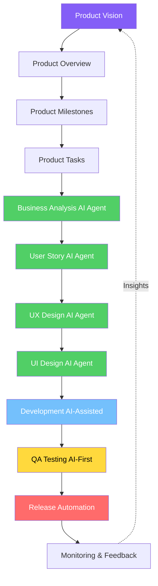

# AscendHR AI-First Workflow: Vision to Launch

**Document Version:** 1.0  
**Last Updated:** January 12, 2026  
**Status:** Production  
**Purpose:** Complete AI-first workflow covering every stage from product vision to feature release

---

## 🎯 Philosophy: AI-First at Every Stage

> **AI-First means: At every stage of the workflow, AI agents are the primary actors. Humans provide vision, review, and strategic decisions. AI agents handle execution, documentation, design, development, and testing.**

### Key Principles

1. **Agent-Driven Execution** - AI agents perform the work, not just assist
2. **Comprehensive Documentation** - Every decision captured automatically
3. **Continuous Validation** - AI testing at every layer from unit to exploratory
4. **Rapid Iteration** - Weeks of work compressed to days through AI collaboration

---

## 📊 Workflow Overview

---

## Stage 1: 🌟 Product Vision & Strategy

### Purpose
Define the high-level business vision, market positioning, and strategic goals.

### Human-Led Activities
- CEO/Product Owner defines business vision
- Market research and competitive analysis
- Strategic positioning ("Football Manager for HR")
- Success metrics definition

### AI-Assisted Activities
- **AI Research Agent**: Market analysis, competitor research, pricing benchmarks
- **AI Analysis**: Customer interview synthesis, trend analysis
- **AI Documentation**: Vision document structure and formatting

### Outputs
- **Product Vision Document** (`ascend-hr-ceo-summary.md`)
- **Market Analysis** (competitor pricing, positioning)
- **Success Metrics Framework** (North Star Metric)
---

## Stage 2: 📋 Product Overview & Roadmap

### Purpose
Break down vision into phases, epics, and high-level features.

### Human-Led Activities
- Define 4 phases (Dogfooding → Beta → Launch → Scale)
- Prioritize epics per phase
- Set timeline and resource constraints

### AI-Assisted Activities
- **AI Planning Agent**: Generate Gantt charts, dependency mapping
- **AI Documentation**: Roadmap documentation with visual diagrams

### Outputs
- **Product Milestones Document** (`ascend-hr-milestone.md`)
- **MVP Feature List** (`ascend-hr-mvp.md`)
- **Phase Roadmap** (visual timeline)

---

## Stage 3: 📝 Product Tasks (Business, Design, Dev)

### Purpose
Convert milestones into actionable Jira-ready tasks for all teams.

### Human-Led Activities
- Review and prioritize tasks per phase
- Assign task ownership (Business/Design/Dev)
- Approve task breakdown

### AI-Assisted Activities
- **AI Task Generator**: Convert epics into granular tasks
- **AI Estimation**: Effort estimation based on historical data
- **AI Dependency Mapping**: Identify task dependencies

### Outputs
- **Business Tasks** (`ascend-hr-business-tasks.md`)
- **Design Tasks** (`ascend-hr-design-tasks.md`)
- **Jira Import Files** (CSV/JSON)

### Timeline
3-5 days per phase

---

## Stage 4: 🧠 Business Analysis (AI Agent)

### Purpose
Deep business analysis covering business rules, state machines, flows, and integrations.

### AI Agent
**PO-BA Agent** (Business Analyst + Product Owner)

### AI Agent Activities
1. **MCP: sequential-thinking** - Plans analysis approach
2. **Domain Understanding** - Identifies stakeholders, entities, relationships
3. **Business Rules Extraction** - Documents all BR-XXX rules
4. **State Machine Definition** - Maps entity lifecycles
5. **Flow Mapping** - Happy paths, alternatives, errors, recovery, edge cases
6. **Integration Points** - Inbound/outbound dependencies
7. **Calculations & Formulas** - Documents all business logic
8. **User Stories Summary** - High-level story breakdown

### Human Review
- Validate business rules accuracy
- Confirm state transitions
- Approve flow completeness

### Outputs
- **Business Analysis Document** (`BA-{feature-name}.md`)
- **User Story Overview** (`{feature-name}.md`)

### Timeline
1-2 days per feature

### Quality Checklist
- [ ] All business entities documented
- [ ] All business rules numbered (BR-XXX)
- [ ] All state transitions mapped
- [ ] All flows have happy + alternative + error paths
- [ ] All calculations documented
- [ ] Integration points identified

---

## Stage 5: 📖 User Story Detailing (AI Agent)

### Purpose
Expand overview user stories into complete BDD specifications covering all 10 scenario types.

### AI Agent
**User Story Detail Agent** (Senior Business Analyst)

### AI Agent Activities
1. **MCP: sequential-thinking** - Plans story expansion
2. **Read BA Document** - Extracts business rules and flows
3. **Map User Journey Context** - Entry/exit points, dependencies
4. **Generate 10 Scenario Types**:
   - ✅ Happy Path
   - 🔀 Alternative Path
   - ❌ Validation Error
   - ⚠️ Business Rule Error
   - 🔄 Recovery Path
   - 🔒 Permission Denied
   - 🔄 Loop/Retry (Edit, Back navigation)
   - 📭 Empty State
   - ⏰ Session Timeout
   - ⚡ Concurrent Modification
5. **Write Given/When/Then** - BDD acceptance criteria
6. **Document Data Requirements** - Fields, validations, defaults

### Human Review
- Validate scenario coverage
- Confirm acceptance criteria
- Approve completeness

### Outputs
- **Detailed User Stories** (`US-X.X.X-{story-name}.md`)
- **Scenario Coverage Matrix** (all 10 types covered)

### Quality Checklist
- [ ] All 10 scenario types covered (if applicable)
- [ ] Every scenario has Given/When/Then/And
- [ ] Entry and exit points documented
- [ ] Business rules referenced (BR-XXX)
- [ ] Data requirements complete
- [ ] State transitions mapped
---

## Stage 6: 🎨 UX Design (AI Agent)

### Purpose
Create complete user journey flows covering all paths, loops, edge cases, and transitions.

### AI Agent
**UX Journey Architect** (UX Designer)

### AI Agent Activities
1. **MCP: sequential-thinking** - Plans flow architecture
2. **Journey Scope Analysis** - Maps all entry/exit points
3. **Create Master Journey Map** - All stories connected end-to-end
4. **Map 10 Flow Types Per Story**:
   - Happy Path
   - Alternative Paths
   - Error Paths
   - Recovery Paths
   - Abandonment Points
   - Re-entry Points
   - Loop Points
   - Timeout Scenarios
   - Permission Scenarios
   - Empty States
5. **Edge Case Matrix** - Every screen, every scenario
6. **Generate Mermaid Diagrams** - Visual flow documentation
7. **Screen Specifications** - For UI designer handoff

### Human Review
- Validate flow logic
- Confirm user experience
- Approve journey completeness

### Outputs
- **Master Journey Map** (`journey-map.mmd`)
- **Flow Diagrams per Story** (`01-us-X.X.1-{story}.mmd`)
- **Edge Case Matrix** (`edge-case-matrix.md`)
- **Screen Specifications** (`screen-specs.md`)

### Quality Checklist
- [ ] Master journey connects all stories
- [ ] Each screen has entry + exit points
- [ ] No dead ends (except terminal states)
- [ ] All loops have exit conditions
- [ ] All errors have recovery paths
- [ ] Empty states designed
- [ ] No orphan screens

---

## Stage 7: 🎨 UI Design (AI Agent)

### Purpose
Create beautiful, interactive HTML mockups from UX flows and user stories.

### AI Agent
**UI Designer Agent** (Super Perfect UI Designer)

### AI Agent Activities
1. **MCP: sequential-thinking** - Plans mockup structure
2. **Read Design System** - Loads shared CSS and design tokens
3. **Deep Understand User Stories** - Extracts screens, actions, states
4. **Deep Understand UX Flows** - Maps navigation and decision points
5. **Plan HTML Structure** - Multi-state pages with JavaScript interactions
6. **Create Interactive Mockups**:
7. **Create README Index** - Documentation for developers

### Human Review
- Validate design aesthetics
- Test interactive flows
- Approve for development handoff

### Outputs
- **Interactive HTML Files** (`01-{screen-name}.html`)
- **Feature README** (`README.md`)
- **Shared CSS** (if new components needed)

### Quality Checklist
- [ ] Links to shared CSS
- [ ] JavaScript interactions work
- [ ] Modals open/close properly
- [ ] State changes functional
- [ ] Unified sidebar navigation
- [ ] Inter-feature links work
- [ ] No dead-end pages
- [ ] Beautiful, professional design

---

## Stage 8: 💻 Development (AI-Assisted)

### Purpose
Implement features using AI-assisted IDE (Windsurf) with real-time code generation and refactoring.

### AI IDE
**Windsurf Editor** (Agentic IDE by Codeium) or **Cursor**

### Development Workflow

#### 8.1: Environment Setup
- **Developer**: AI IDE
- **AI**: Auto-configures workspace, loads dependencies
- **AI**: Reads architecture (`ascend-hr-architecture.md`)
- **AI**: Understands tech stack (React 19, TypeScript, AWS Lambda, DynamoDB)

#### 8.2: Implementation Planning
- **Developer**: References user story and HTML mockup
- **AI (Cascade Agent)**: 
  - Reads BA document for business rules
  - Reads user story for acceptance criteria
  - Reads HTML mockup for UI structure
  - Generates implementation plan
  - Estimates effort and dependencies

### Human Activities
- Guide AI on architecture decisions
- Review AI-generated code
- Resolve ambiguities in requirements
- Make strategic technical choices
- Approve code for commit

### Outputs
- **Feature Implementation** (React components, Lambda functions)
- **TypeScript Interfaces** (types for all entities)
- **API Endpoints** (HTTP API routes)
- **Database Schemas** (DynamoDB models)

---

## Stage 9: 🧪 QA Testing (AI-First Multi-Layer)

### Purpose
Comprehensive AI-first testing catching 95% of bugs before production through multiple automated layers.

---

## Stage 10: 🚀 Release (Automated CI/CD)

### Purpose
Automated deployment pipeline from code commit to production with zero-downtime releases.

### CI/CD Platform
**Bitbucket Pipelines** (current) or **GitHub Actions**

---

## Stage 11: 📊 Monitoring

### Purpose
Continuously monitor production health.

### Monitoring Tools

**Technical Monitoring**:
- **AWS CloudWatch**: Lambda metrics, API Gateway, DynamoDB
- **Sentry**: JavaScript errors, backend exceptions

