# Scouting Network (ATS-Lite) - Business Analysis

**Epic:** Epic 0.7 - Scouting Network (ATS-Lite)
**Version:** 1.0
**Created:** January 12, 2026
**Status:** Draft

---

## 1. Executive Summary

### Business Problem

Companies struggle with disconnected recruitment processes that are separate from their team management systems. Traditional ATS platforms:
- Are disconnected from actual team composition and skill gaps
- Don't provide visibility into how candidates fit into existing team structures
- Lack integration with workforce planning and gap analysis
- Use different data models for candidates vs employees, creating friction when hiring
- Don't enable strategic hiring based on Formation View insights

**Real-World Scenario:** An engineering manager sees gaps in the Formation View (missing Senior Backend Developer with Database expertise 16+) but has to switch to a separate ATS that doesn't understand this context. Candidates are evaluated in isolation rather than as potential squad members filling specific gaps.

### Business Value

The Scouting Network (ATS-Lite) creates a **complete, real-world recruitment loop** that:
- **Unified Platform:** Recruitment and team management in one system
- **Context-Aware Hiring:** Candidates evaluated against actual squad gaps from Formation View
- **Consistent Data Model:** Same Player Card attributes for candidates and employees
- **Strategic Decisions:** Fit scores show how candidates fill specific team gaps
- **Seamless Conversion:** One-click transformation from candidate to employee when hired
- **Complete Loop:** Handles full recruitment lifecycle from position creation to employee onboarding

**ROI for Phase 1:**
- Reduce time-to-hire by 30% through streamlined, integrated workflow
- Improve hiring quality via data-driven fit scoring
- Eliminate dual data entry (ATS → HRIS) through unified system
- Enable managers to make strategic hiring decisions based on Formation View gaps

### Stakeholders

| Stakeholder | Interest | Impact |
|-------------|----------|--------|
| **HR/Recruiter** | Manage full recruitment pipeline, track candidates, fill positions | High |
| **Hiring Manager** | Find candidates that fit team gaps, review/approve candidates | High |
| **Leadership** | Strategic hiring aligned with Formation View, pipeline visibility | Medium |
| **Scouts/Talent Acquisition** | Source and track candidates efficiently | High |
| **Candidates** | (External) Smooth application experience | Medium |
| **Existing Employees** | Refer candidates, see team growth | Low |

---

## 2. Business Entities

### Entity: Position

Represents an open role that needs to be filled.

| Attribute | Type | Rules |
|-----------|------|-------|
| position_id | UUID | PK, auto-generated |
| position_code | String | Unique, auto-generated (e.g., "POS-2026-001") |
| title | String | Required, max 100 chars |
| department_id | UUID | FK to Department (Club Setup) |
| team_id | UUID | FK to Team (Club Setup), optional |
| formation_position_id | UUID | FK to Formation Position, links to Formation View |
| status | Enum | Draft, Open, Active, On Hold, Filled, Cancelled |
| employment_type | Enum | Full-time, Part-time, Contract, Internship |
| seniority_level | Enum | Junior, Mid, Senior, Lead, Principal |
| headcount | Integer | Default 1, min 1, max 99 |
| salary_min | Decimal | Optional, currency based on club settings |
| salary_max | Decimal | Optional, must be >= salary_min |
| description | Text | Rich text, job description |
| requirements | Text | Rich text, role requirements |
| hiring_manager_id | UUID | FK to Employee, required |
| recruiter_id | UUID | FK to Employee (Scout role), optional |
| target_start_date | Date | Optional |
| created_by | UUID | FK to User |
| created_at | Timestamp | Auto-generated |
| updated_at | Timestamp | Auto-updated |
| filled_at | Timestamp | Set when status → Filled |
| filled_by_candidate_id | UUID | FK to Candidate when hired |

### Entity: PositionRequirement

Defines attribute requirements for a position (used for fit score calculation).

| Attribute | Type | Rules |
|-----------|------|-------|
| requirement_id | UUID | PK, auto-generated |
| position_id | UUID | FK to Position, required |
| attribute_id | UUID | FK to Attribute (Player Card System) |
| required_score | Integer | 1-20, minimum score required |
| weight | Decimal | 0.0-1.0, default 0.5, sum of all weights should = 1.0 |
| is_mandatory | Boolean | If true, candidate must meet minimum score |

**Business Rule:** Sum of all weights for a position should equal 1.0 for accurate fit score calculation.

### Entity: Candidate

Represents a person being recruited.

| Attribute | Type | Rules |
|-----------|------|-------|
| candidate_id | UUID | PK, auto-generated |
| candidate_code | String | Unique, auto-generated (e.g., "CAN-2026-001") |
| first_name | String | Required, max 50 chars |
| last_name | String | Required, max 50 chars |
| email | String | Required, unique, valid email format |
| phone | String | Optional, valid phone format |
| linkedin_url | String | Optional, valid URL |
| portfolio_url | String | Optional, valid URL |
| current_company | String | Optional, max 100 chars |
| current_title | String | Optional, max 100 chars |
| years_experience | Integer | Optional, min 0, max 50 |
| location | String | Optional, max 100 chars |
| source_id | UUID | FK to Source, required |
| source_details | String | Optional, e.g., "Referral from John Doe" |
| resume_url | String | Optional, file storage path |
| cover_letter | Text | Optional |
| status | Enum | Active, Inactive, Hired, Blacklisted |
| current_ability | Integer | 1-20, overall rating based on resume/initial assessment |
| potential_ability | Integer | 1-20, estimated growth potential |
| created_by | UUID | FK to User |
| created_at | Timestamp | Auto-generated |
| updated_at | Timestamp | Auto-updated |
| hired_at | Timestamp | Set when converted to Employee |
| employee_id | UUID | FK to Employee when hired, nullable |

### Entity: CandidateAttribute

Stores Player Card attributes for candidates (same system as employees).

| Attribute | Type | Rules |
|-----------|------|-------|
| candidate_attribute_id | UUID | PK, auto-generated |
| candidate_id | UUID | FK to Candidate, required |
| attribute_id | UUID | FK to Attribute (Player Card System) |
| score | Integer | 1-20, required |
| assessed_by | UUID | FK to User who rated |
| assessed_at | Timestamp | Auto-generated |
| notes | Text | Optional, rationale for score |

### Entity: Application

Links a candidate to a position, tracks their progress through the pipeline.

| Attribute | Type | Rules |
|-----------|------|-------|
| application_id | UUID | PK, auto-generated |
| application_code | String | Unique, auto-generated (e.g., "APP-2026-001") |
| candidate_id | UUID | FK to Candidate, required |
| position_id | UUID | FK to Position, required |
| status | Enum | New, Screening, Screening_Passed, Interview_Scheduled, Interviewed, Offer_Pending, Offer_Sent, Offer_Accepted, Hired, Screening_Failed, Interview_Failed, Offer_Rejected, Withdrew, Rejected |
| fit_score | Decimal | 0-100%, calculated based on PositionRequirements |
| applied_at | Timestamp | Auto-generated |
| current_stage | String | Current Kanban stage for display |
| stage_updated_at | Timestamp | Last stage change |
| assigned_recruiter_id | UUID | FK to Employee (Scout) |
| notes | Text | Internal notes about application |
| rejection_reason | String | Required if status = Rejected/Failed |

**Business Rule:** A candidate can have multiple applications to different positions, but only ONE active application per position.

### Entity: Interview

Tracks interview sessions for an application.

| Attribute | Type | Rules |
|-----------|------|-------|
| interview_id | UUID | PK, auto-generated |
| application_id | UUID | FK to Application, required |
| interview_type | Enum | Phone_Screen, Technical, Behavioral, Culture_Fit, Final |
| scheduled_at | Timestamp | Required, future date/time |
| duration_minutes | Integer | Default 60, min 15, max 480 |
| interviewer_id | UUID | FK to Employee, required |
| location | String | Optional, e.g., "Zoom link" or "Office Room 3A" |
| status | Enum | Scheduled, Completed, Cancelled, No_Show |
| feedback | Text | Required after status = Completed |
| rating | Integer | 1-5, optional, overall interview rating |
| recommendation | Enum | Strong_Hire, Hire, Maybe, No_Hire |
| completed_at | Timestamp | Set when status → Completed |

### Entity: Offer

Manages job offers sent to candidates.

| Attribute | Type | Rules |
|-----------|------|-------|
| offer_id | UUID | PK, auto-generated |
| application_id | UUID | FK to Application, required, unique |
| position_id | UUID | FK to Position, required |
| candidate_id | UUID | FK to Candidate, required |
| salary_offered | Decimal | Required, within position salary range |
| employment_type | Enum | Must match Position employment_type |
| start_date | Date | Proposed start date |
| offer_letter_url | String | File storage path for offer letter PDF |
| sent_at | Timestamp | When offer was sent to candidate |
| valid_until | Date | Offer expiration date |
| status | Enum | Draft, Sent, Accepted, Rejected, Expired, Withdrawn |
| accepted_at | Timestamp | Set when status → Accepted |
| rejection_reason | Text | Optional, why candidate rejected |
| approved_by | UUID | FK to User, hiring manager approval |
| approved_at | Timestamp | When hiring manager approved |

### Entity: Source

Recruitment channels where candidates come from.

| Attribute | Type | Rules |
|-----------|------|-------|
| source_id | UUID | PK, auto-generated |
| name | String | Required, unique, max 100 chars |
| type | Enum | Job_Board, LinkedIn, Referral, Agency, University, Career_Fair, Direct_Application, Other |
| is_active | Boolean | Default true |
| cost_per_hire | Decimal | Optional, for ROI tracking |
| created_at | Timestamp | Auto-generated |

**Pre-seeded Sources:** LinkedIn, Indeed, Employee Referral, Direct Application, Agency, University Recruiting

### Entity Relationships

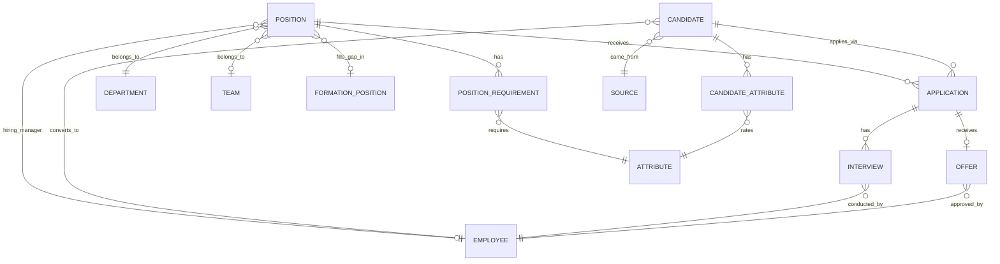

---

## 3. Business Rules

### BR-001: Position Creation Requirements
- **Rule:** A position must have a valid department, title, and hiring manager before it can be opened
- **Trigger:** User attempts to change position status from Draft → Open
- **Validation:** 
  - department_id exists in Department table
  - hiring_manager_id exists and user has Manager role
  - title is not empty
  - At least one PositionRequirement is defined
- **Error Message:** "Cannot open position: Missing required fields (Department, Hiring Manager, Title) or no position requirements defined"

### BR-002: Position Requirement Weights
- **Rule:** Sum of all requirement weights for a position must equal 1.0 (100%)
- **Trigger:** User saves PositionRequirements for a position
- **Validation:** SUM(weight) WHERE position_id = X must equal 1.0 (±0.01 tolerance)
- **Error Message:** "Position requirements weights must sum to 100%. Current total: {calculated}%"

### BR-003: Fit Score Calculation
- **Rule:** Fit Score = weighted percentage match between candidate attributes and position requirements
- **Formula:** 
  ```
  Fit Score = (Σ(candidate_score_i × weight_i) / Σ(required_score_i × weight_i)) × 100
  ```
- **Trigger:** Automatically calculated when:
  - Candidate is added to position (Application created)
  - Candidate attributes are updated
  - Position requirements are changed
- **Validation:** Result must be 0-999% (can exceed 100% if candidate exceeds requirements)
- **Display:** Show as percentage with color coding:
  - Green: ≥ 90%
  - Yellow: 70-89%
  - Red: < 70%

### BR-004: Duplicate Application Prevention
- **Rule:** A candidate can only have ONE active application per position
- **Trigger:** User attempts to add candidate to a position
- **Validation:** Check if Application exists where candidate_id = X AND position_id = Y AND status NOT IN (Hired, Rejected, Withdrew)
- **Error Message:** "Candidate {name} already has an active application for this position (Status: {status})"

### BR-005: Candidate Email Uniqueness
- **Rule:** Email must be unique across all candidates
- **Trigger:** User creates or updates candidate
- **Validation:** No other candidate has the same email
- **Error Message:** "A candidate with email {email} already exists (Candidate ID: {id})"
- **Note:** Case-insensitive comparison

### BR-006: Application Stage Transitions
- **Rule:** Applications must follow valid stage progression
- **Valid Transitions:**
  - New → Screening, Rejected, Withdrew
  - Screening → Screening_Passed, Screening_Failed, Rejected, Withdrew
  - Screening_Passed → Interview_Scheduled, Rejected, Withdrew
  - Interview_Scheduled → Interviewed, Rejected, Withdrew
  - Interviewed → Offer_Pending, Interview_Failed, Rejected, Withdrew
  - Offer_Pending → Offer_Sent, Rejected, Withdrew
  - Offer_Sent → Offer_Accepted, Offer_Rejected, Withdrew
  - Offer_Accepted → Hired
- **Trigger:** User drags application to new stage in Kanban or changes status
- **Validation:** Check transition is in valid paths
- **Error Message:** "Invalid stage transition: Cannot move from {current} to {target}"

### BR-007: Interview Completion Requirements
- **Rule:** Interview must have feedback and recommendation before marking as Completed
- **Trigger:** User attempts to mark interview status as Completed
- **Validation:** feedback is not empty AND recommendation is set
- **Error Message:** "Cannot complete interview: Feedback and recommendation are required"

### BR-008: Offer Salary Range Validation
- **Rule:** Offer salary must be within position's defined salary range
- **Trigger:** User creates or updates offer
- **Validation:** 
  - If position has salary_min: offer_salary >= salary_min
  - If position has salary_max: offer_salary <= salary_max
- **Error Message:** "Offer salary ฿{amount} is outside position range ฿{min} - ฿{max}"

### BR-009: Offer Approval Required
- **Rule:** Offer cannot be sent to candidate without hiring manager approval
- **Trigger:** User attempts to change offer status from Draft → Sent
- **Validation:** approved_by is set AND approved_by = position.hiring_manager_id
- **Error Message:** "Offer requires hiring manager approval before sending"

### BR-010: Candidate to Employee Conversion
- **Rule:** When application status → Hired, candidate must be converted to Employee in Player Card System
- **Trigger:** Application status changes to Hired
- **Automated Actions:**
  1. Create Employee record with same attributes as Candidate
  2. Set employee.department_id = position.department_id
  3. Set employee.position_title = position.title
  4. Set employee.hire_date = offer.start_date
  5. Copy all CandidateAttributes → EmployeeAttributes
  6. Update candidate.status = Hired
  7. Update candidate.employee_id = new employee ID
  8. Update position.status = Filled (if headcount reached)
  9. Update Formation View to show new employee in position
- **Error Message:** "Conversion failed: {specific error}. Contact system administrator"

### BR-011: Position Closing
- **Rule:** Position status automatically changes to Filled when all headcount is hired
- **Trigger:** Application status → Hired
- **Validation:** 
  - Count applications where position_id = X AND status = Hired
  - If count >= position.headcount, set position.status = Filled
- **Side Effect:** All remaining active applications for this position → Rejected with reason "Position filled"

### BR-012: Mandatory Attribute Requirements
- **Rule:** If a position requirement is marked as mandatory, candidate must meet or exceed the required score
- **Trigger:** Application created or candidate attributes updated
- **Validation:** For each requirement where is_mandatory = true, candidate_score >= required_score
- **Display:** Show warning icon on application if any mandatory requirements not met
- **Note:** Does not prevent application creation, but affects fit score and displays warning

### BR-013: Interview Scheduling Constraints
- **Rule:** Interview must be scheduled in the future and interviewer must be available
- **Trigger:** User schedules interview
- **Validation:**
  - scheduled_at > current timestamp
  - interviewer_id exists and is an active employee
  - (Optional Phase 2: Check interviewer calendar availability)
- **Error Message:** "Cannot schedule interview: {reason}"

### BR-014: Offer Expiration
- **Rule:** Offer automatically expires if not accepted before valid_until date
- **Trigger:** System cron job runs daily at midnight
- **Validation:** If offer.status = Sent AND current_date > valid_until, set status = Expired
- **Side Effect:** Application status → Offer_Rejected with note "Offer expired"

### BR-015: Rejection Reason Required
- **Rule:** Rejection reason must be provided when rejecting candidates
- **Trigger:** Application status changes to Rejected, Screening_Failed, Interview_Failed
- **Validation:** rejection_reason is not empty
- **Error Message:** "Please provide a reason for rejection"
- **Compliance Note:** Required for audit trail and potential legal compliance

### BR-016: Source Effectiveness Tracking
- **Rule:** System automatically calculates conversion metrics per source
- **Calculation:** 
  - Total Candidates from Source = COUNT(candidates WHERE source_id = X)
  - Hired from Source = COUNT(candidates WHERE source_id = X AND status = Hired)
  - Conversion Rate = (Hired / Total) × 100
  - Cost per Hire = source.cost_per_hire (manual entry)
- **Trigger:** Calculated on-demand when viewing Source Analytics dashboard
- **Display:** Dashboard showing source comparison table

### BR-017: Blacklist Prevention
- **Rule:** Candidates marked as Blacklisted cannot be added to any position
- **Trigger:** User attempts to create application for blacklisted candidate
- **Validation:** candidate.status != Blacklisted
- **Error Message:** "Cannot add candidate: This candidate is blacklisted. Reason: {blacklist_reason}"
- **Override:** Only HR Admin can override with special approval

### BR-018: Position Code Auto-Generation
- **Rule:** Position codes follow format: POS-{YEAR}-{SEQUENCE}
- **Trigger:** Position is created
- **Validation:** Unique within club
- **Example:** POS-2026-001, POS-2026-002
- **Sequence:** Resets each year

### BR-019: Application Code Auto-Generation
- **Rule:** Application codes follow format: APP-{YEAR}-{SEQUENCE}
- **Trigger:** Application is created
- **Example:** APP-2026-001, APP-2026-002

### BR-020: Candidate Code Auto-Generation
- **Rule:** Candidate codes follow format: CAN-{YEAR}-{SEQUENCE}
- **Trigger:** Candidate is created
- **Example:** CAN-2026-001, CAN-2026-002

---

## 4. State Transitions

### Position Lifecycle

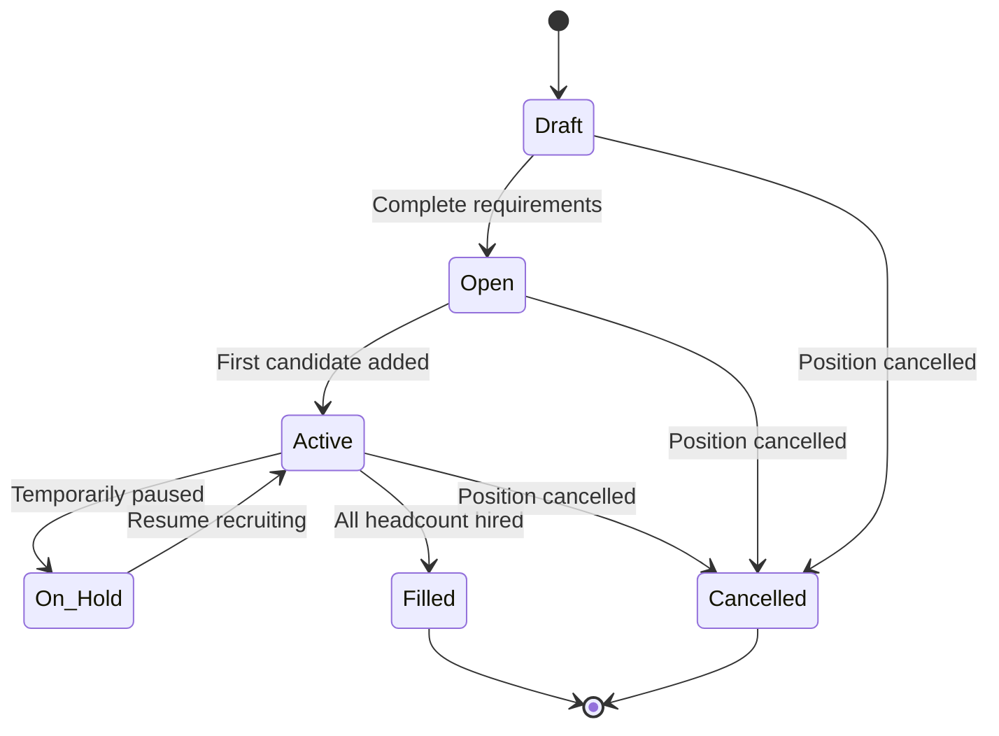

| From State | To State | Trigger | Conditions | Side Effects |
|------------|----------|---------|------------|--------------|
| Draft | Open | User clicks "Open Position" | BR-001: Has dept, manager, title, requirements | Email hiring manager |
| Open | Active | First application created | Application count > 0 | Start tracking time-to-hire |
| Active | On Hold | User pauses recruiting | User has permission | All active applications marked "Position on hold" |
| On Hold | Active | User resumes | - | Notify candidates position is active |
| Active | Filled | Application → Hired | Hired count >= headcount | BR-011: Reject remaining applications |
| Any | Cancelled | User cancels position | User has permission | All active applications → Rejected |

### Application Lifecycle

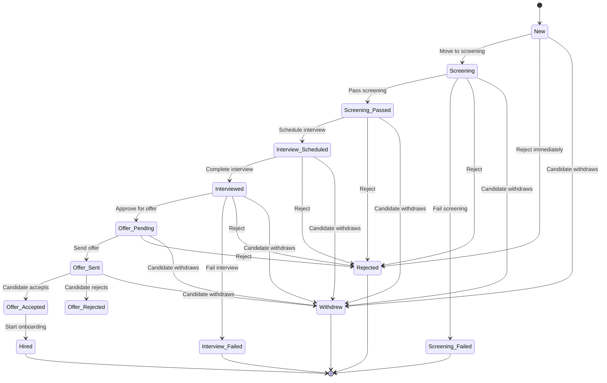

| From State | To State | Trigger | Conditions | Side Effects |
|------------|----------|---------|------------|--------------|
| New | Screening | Recruiter moves to screening | - | Update stage_updated_at |
| Screening | Screening_Passed | Recruiter approves screening | - | Auto-calculate fit score |
| Screening | Screening_Failed | Recruiter rejects | BR-015: Rejection reason required | Email candidate (optional) |
| Screening_Passed | Interview_Scheduled | Interview created | BR-013: Valid schedule | Calendar invite sent |
| Interview_Scheduled | Interviewed | Interview status = Completed | BR-007: Feedback required | Update application notes |
| Interviewed | Offer_Pending | Hiring manager approves | Interview.recommendation = Hire/Strong_Hire | Notify HR to prepare offer |
| Offer_Pending | Offer_Sent | Offer status = Sent | BR-009: Manager approval | Email candidate with offer |
| Offer_Sent | Offer_Accepted | Candidate accepts | - | Notify hiring manager |
| Offer_Accepted | Hired | Recruiter confirms hire | - | BR-010: Convert to Employee |

### Candidate Global Status

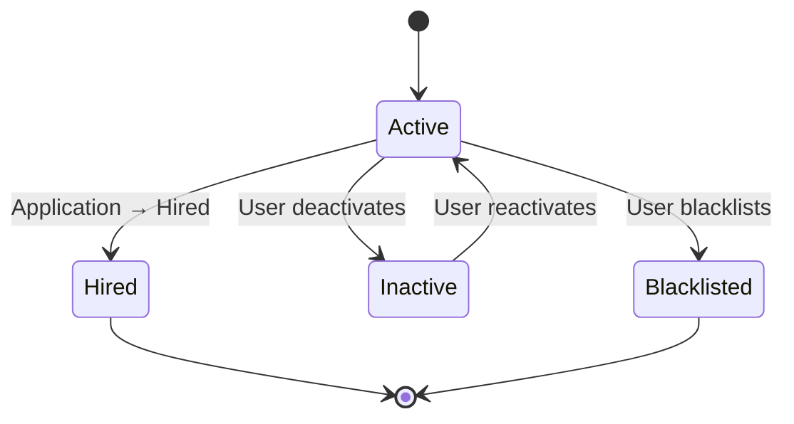

| From State | To State | Trigger | Conditions | Side Effects |
|------------|----------|---------|------------|--------------|
| Active | Hired | Any application → Hired | BR-010: Conversion successful | Create Employee record |
| Active | Inactive | User deactivates | - | Remove from active searches |
| Active | Blacklisted | HR admin marks blacklist | Reason required | BR-017: Prevent future applications |
| Inactive | Active | User reactivates | - | Available for new positions |

### Interview Status

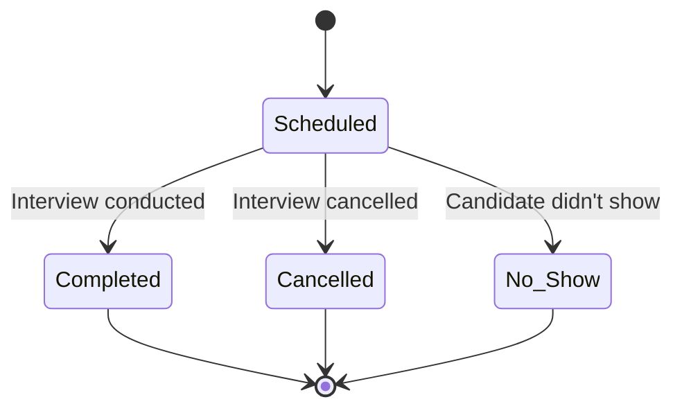

### Offer Status

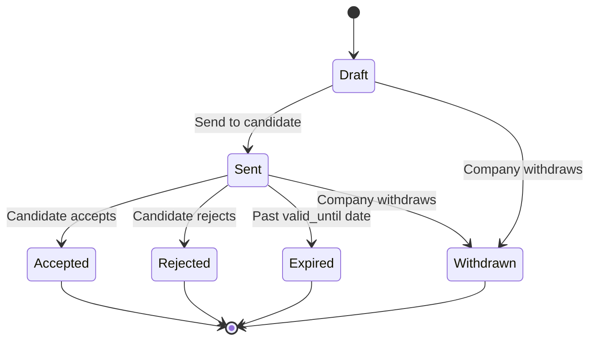

---

## 5. Process Flows

### Flow 1: Create Position with Requirements

#### Happy Path

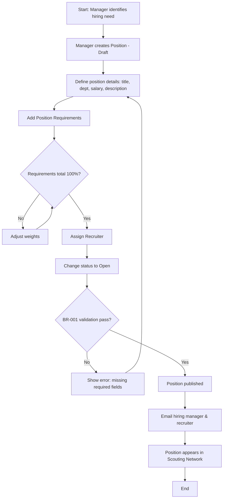

| Step | Actor | Action | System Response | Rules Applied |
|------|-------|--------|-----------------|---------------|
| 1 | Hiring Manager | Reviews Formation View and identifies gap | Shows open positions list | - |
| 2 | Manager | Clicks "Create Position" | Opens position creation form | - |
| 3 | Manager | Fills position details (title, dept, salary, description) | Validates input fields | - |
| 4 | Manager | Clicks "Add Requirements" | Shows attribute selection modal | - |
| 5 | Manager | Selects attributes (e.g., Technical, Leadership) | Displays selected attributes | - |
| 6 | Manager | Sets required scores (1-20) and weights (%) | Validates weight sum = 100% | BR-002 |
| 7 | System | Saves requirements | Displays requirements summary | - |
| 8 | Manager | Assigns recruiter from dropdown | Validates recruiter is Scout role | - |
| 9 | Manager | Clicks "Open Position" | Validates all required fields | BR-001 |
| 10 | System | Changes status to Open | Position published, sends notifications | - |
| 11 | System | Position appears in Scouting Network Kanban | Ready to receive candidates | - |

#### Alternative Paths

| Path ID | Condition | Flow |
|---------|-----------|------|
| 1a | Manager copies requirements from similar position | System pre-fills requirements from template |
| 1b | Manager saves as Draft to complete later | Position saved but not visible to recruiters |
| 1c | Formation View has position template | Auto-populate requirements based on formation position role |

#### Error Paths

| Error ID | Trigger | Error Message | Recovery |
|----------|---------|---------------|----------|
| E1 | Requirements weights don't sum to 100% | BR-002 error message | Adjust weights, show remaining % |
| E2 | Missing hiring manager | "Hiring manager is required" | Assign manager from employee list |
| E3 | Department not selected | "Department is required" | Select from department dropdown |
| E4 | No requirements defined | "At least one position requirement must be defined" | Add requirements |

---

### Flow 2: Add Candidate to Scouting Network

#### Happy Path

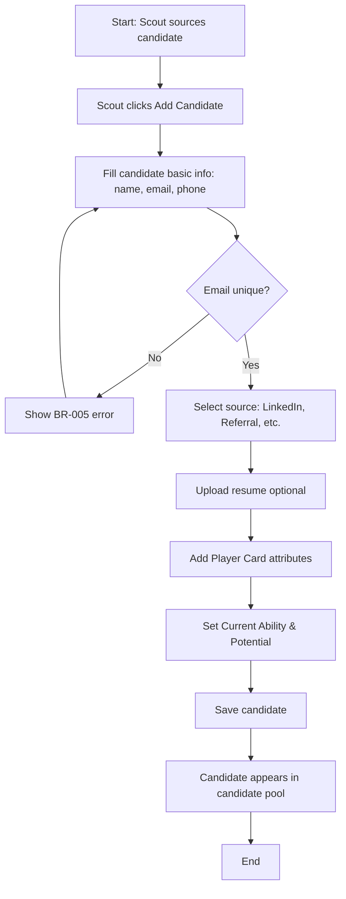

| Step | Actor | Action | System Response | Rules Applied |
|------|-------|--------|-----------------|---------------|
| 1 | Scout/Recruiter | Clicks "Add Candidate" button | Opens candidate creation form | - |
| 2 | Scout | Enters first name, last name, email, phone | Validates email format | - |
| 3 | System | Checks email uniqueness | Validates against existing candidates | BR-005 |
| 4 | Scout | Selects source (LinkedIn, Referral, etc.) | Shows source dropdown | - |
| 5 | Scout | Optionally adds source details (e.g., "Referred by John") | Free text field | - |
| 6 | Scout | Uploads resume (optional) | Stores file in cloud storage | - |
| 7 | Scout | Rates candidate attributes (Technical, Leadership, etc.) | Displays 1-20 rating sliders | - |
| 8 | Scout | Sets Current Ability (overall rating 1-20) | Based on resume/initial impression | - |
| 9 | Scout | Sets Potential Ability (growth estimate 1-20) | Estimated future capability | - |
| 10 | Scout | Clicks "Save Candidate" | Creates Candidate + CandidateAttributes records | BR-018, BR-020 |
| 11 | System | Assigns candidate code (CAN-2026-XXX) | Auto-generated unique code | BR-020 |
| 12 | System | Candidate added to pool | Available to apply to positions | - |

#### Alternative Paths

| Path ID | Condition | Flow |
|---------|-----------|------|
| 2a | Bulk import from CSV | Upload CSV with multiple candidates, system validates and imports |
| 2b | Quick add (minimal info) | Enter only name + email, complete attributes later |
| 2c | Import from LinkedIn profile URL | System pre-fills data from LinkedIn (Phase 2 API integration) |

#### Error Paths

| Error ID | Trigger | Error Message | Recovery |
|----------|---------|---------------|----------|
| E1 | Duplicate email | BR-005 error message | Edit email or link to existing candidate |
| E2 | Invalid email format | "Invalid email format" | Correct email format |
| E3 | Resume file too large (>10MB) | "Resume file must be less than 10MB" | Compress or split file |
| E4 | Required attributes missing | "Please rate all required attributes" | Complete attribute ratings |

---

### Flow 3: Calculate and Display Fit Score

#### Happy Path

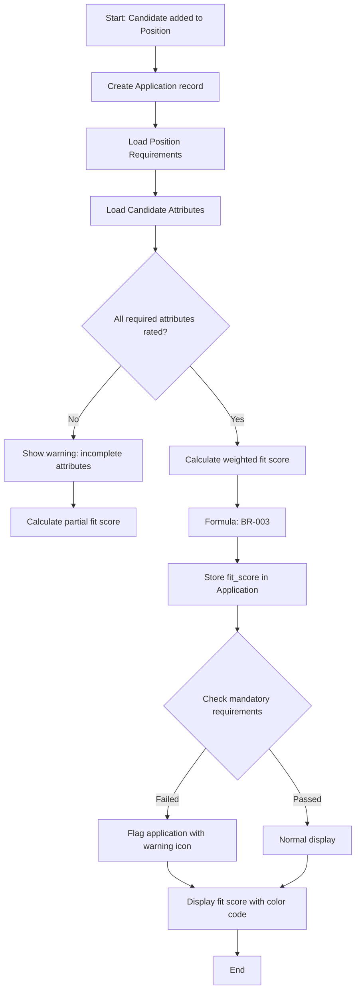

**Calculation Example:**

Position Requirements:
- Technical (Backend): Required=16, Weight=50%
- Teamwork: Required=14, Weight=30%
- Leadership: Required=10, Weight=20%

Candidate Attributes:
- Technical: 18
- Teamwork: 12
- Leadership: 8

Calculation:
```
Fit Score = ((18×0.5 + 12×0.3 + 8×0.2) / (16×0.5 + 14×0.3 + 10×0.2)) × 100
         = ((9 + 3.6 + 1.6) / (8 + 4.2 + 2)) × 100
         = (14.2 / 14.2) × 100
         = 100%
```

| Step | Actor | Action | System Response | Rules Applied |
|------|-------|--------|-----------------|---------------|
| 1 | Scout | Drags candidate card to position column in Kanban | Creates Application record | - |
| 2 | System | Checks for duplicate application | Validates BR-004 | BR-004 |
| 3 | System | Loads position requirements | Retrieves PositionRequirement records | - |
| 4 | System | Loads candidate attributes | Retrieves CandidateAttribute records | - |
| 5 | System | Applies fit score formula | Calculates weighted match % | BR-003 |
| 6 | System | Stores result in application.fit_score | Updates database | - |
| 7 | System | Checks mandatory requirements | Validates BR-012 | BR-012 |
| 8 | System | Displays fit score with color | Green ≥90%, Yellow 70-89%, Red <70% | BR-003 |
| 9 | System | Shows attribute breakdown tooltip | Hover shows which attributes match/miss | - |

#### Alternative Paths

| Path ID | Condition | Flow |
|---------|-----------|------|
| 3a | Candidate attributes incomplete | Calculate with available attributes, show warning |
| 3b | Position requirements changed after application | Recalculate all fit scores for that position |
| 3c | Candidate attributes updated | Recalculate fit scores for all their applications |

#### Error Paths

| Error ID | Trigger | Error Message | Recovery |
|----------|---------|---------------|----------|
| E1 | Duplicate application | BR-004 error message | View existing application instead |
| E2 | Position has no requirements | "Cannot calculate fit score: Position has no defined requirements" | Add requirements to position |
| E3 | Division by zero (all required scores = 0) | "Invalid position requirements" | Fix position requirements |

---

### Flow 4: Move Candidate Through Pipeline (Kanban)

#### Happy Path

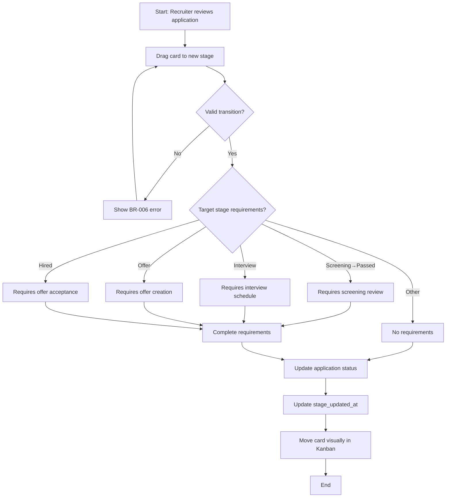

| Step | Actor | Action | System Response | Rules Applied |
|------|-------|--------|-----------------|---------------|
| 1 | Recruiter | Views Kanban board for a position | Displays columns: New, Screening, Interview, Offer, Hired | - |
| 2 | Recruiter | Drags application card from "New" to "Screening" | Validates transition | BR-006 |
| 3 | System | Updates application.status and current_stage | Changes status to Screening | - |
| 4 | System | Updates stage_updated_at timestamp | Records when stage changed | - |
| 5 | System | Card moves to Screening column | Visual feedback | - |
| 6 | Recruiter | Later drags from Screening to Interview | Checks if screening passed | BR-006 |
| 7 | System | Prompts for screening decision if not set | Modal: Pass/Fail screening? | - |
| 8 | Recruiter | Marks as "Screening Passed" | Updates status | - |
| 9 | System | Allows move to Interview column | Creates Interview placeholder | - |
| 10 | Recruiter | Schedules interview details | Opens interview scheduling modal | BR-013 |

#### Alternative Paths

| Path ID | Condition | Flow |
|---------|-----------|------|
| 4a | Bulk move multiple candidates | Select multiple cards, move all to same stage |
| 4b | Candidate withdraws | Recruiter drags to "Withdrew" terminal state |
| 4c | Quick reject | Right-click card → Reject → Enter reason | BR-015 |

#### Error Paths

| Error ID | Trigger | Error Message | Recovery |
|----------|---------|---------------|----------|
| E1 | Invalid stage transition | BR-006 error message | Card snaps back to original column |
| E2 | Missing interview before moving to Offer | "Cannot move to Offer: No completed interview found" | Schedule and complete interview first |
| E3 | Missing screening decision | "Please mark screening as Passed or Failed" | Complete screening review |

---

### Flow 5: Conduct Interview and Collect Feedback

#### Happy Path

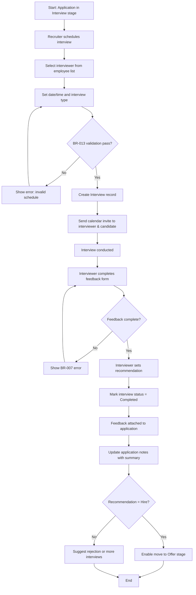

| Step | Actor | Action | System Response | Rules Applied |
|------|-------|--------|-----------------|---------------|
| 1 | Recruiter | Clicks "Schedule Interview" on application | Opens interview scheduling modal | - |
| 2 | Recruiter | Selects interview type (Phone, Technical, Behavioral, etc.) | Shows type dropdown | - |
| 3 | Recruiter | Selects interviewer from employee list | Filters employees by relevant role | - |
| 4 | Recruiter | Sets date/time and duration | Date picker with time slots | BR-013 |
| 5 | Recruiter | Adds location/meeting link (Zoom, Google Meet) | Free text field | - |
| 6 | System | Creates Interview record with status = Scheduled | Stores in database | - |
| 7 | System | Sends calendar invite to interviewer | Email with .ics attachment | - |
| 8 | System | Optionally sends interview confirmation to candidate | Candidate communication | - |
| 9 | Interviewer | Conducts interview on scheduled date | - | - |
| 10 | Interviewer | Opens application and clicks "Complete Interview" | Shows feedback form | - |
| 11 | Interviewer | Writes detailed feedback (strengths, concerns) | Rich text editor | - |
| 12 | Interviewer | Rates overall interview (1-5 stars) | Star rating component | - |
| 13 | Interviewer | Sets recommendation (Strong Hire, Hire, Maybe, No Hire) | Dropdown selection | BR-007 |
| 14 | Interviewer | Clicks "Submit Feedback" | Validates required fields | BR-007 |
| 15 | System | Updates interview.status = Completed | Records completion timestamp | - |
| 16 | System | Appends feedback summary to application.notes | Makes visible to hiring manager | - |
| 17 | System | Notifies hiring manager of completed interview | Email notification | - |

#### Alternative Paths

| Path ID | Condition | Flow |
|---------|-----------|------|
| 5a | Multiple interview rounds | Schedule multiple interviews before offer decision |
| 5b | Interview cancelled | Interviewer cancels, interview.status = Cancelled, reschedule |
| 5c | Candidate no-show | Interviewer marks as No_Show, decision to reschedule or reject |
| 5d | Panel interview | Multiple interviewers, each submits separate feedback |

#### Error Paths

| Error ID | Trigger | Error Message | Recovery |
|----------|---------|---------------|----------|
| E1 | Incomplete feedback | BR-007 error message | Complete feedback and recommendation |
| E2 | Interview scheduled in past | BR-013 error message | Select future date |
| E3 | Interviewer not found | "Selected interviewer is not an active employee" | Select different interviewer |

---

### Flow 6: Manage Job Offer

#### Happy Path

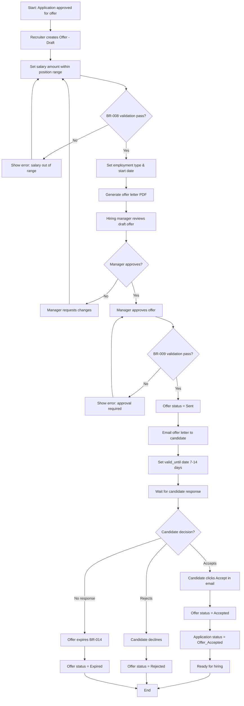

| Step | Actor | Action | System Response | Rules Applied |
|------|-------|--------|-----------------|---------------|
| 1 | Recruiter | Clicks "Create Offer" for application | Opens offer creation form | - |
| 2 | Recruiter | Enters salary amount | Shows position salary range for reference | BR-008 |
| 3 | System | Validates salary within range | Checks min/max boundaries | BR-008 |
| 4 | Recruiter | Confirms employment type (matches position) | Auto-filled from position | - |
| 5 | Recruiter | Sets proposed start date | Date picker | - |
| 6 | Recruiter | Reviews offer details | Shows offer preview | - |
| 7 | System | Generates offer letter PDF from template | Populates candidate/position data | - |
| 8 | Recruiter | Sends offer to hiring manager for approval | Changes offer to "Pending Approval" | - |
| 9 | Hiring Manager | Reviews offer in platform | Email notification received | - |
| 10 | Manager | Clicks "Approve Offer" | Records approval timestamp and approver | BR-009 |
| 11 | System | Validates manager is position.hiring_manager_id | Authorization check | BR-009 |
| 12 | Recruiter | Clicks "Send Offer to Candidate" | Changes offer status to Sent | - |
| 13 | System | Emails offer letter PDF to candidate | Includes accept/reject links | - |
| 14 | System | Sets valid_until = current_date + 7 days | Configurable expiration period | - |
| 15 | Candidate | Receives offer email | External action | - |
| 16 | Candidate | Clicks "Accept Offer" link | Redirects to acceptance page | - |
| 17 | System | Updates offer.status = Accepted | Records acceptance timestamp | - |
| 18 | System | Updates application.status = Offer_Accepted | Ready for final hiring | - |
| 19 | System | Notifies hiring manager & recruiter | Success notification | - |

#### Alternative Paths

| Path ID | Condition | Flow |
|---------|-----------|------|
| 6a | Candidate negotiates salary | Recruiter creates revised offer, requires new approval |
| 6b | Offer withdrawn by company | HR admin withdraws, offer.status = Withdrawn |
| 6c | Custom offer template | Use role-specific or custom offer letter template |
| 6d | Multiple offer components | Include benefits, equity, bonuses in offer details |

#### Error Paths

| Error ID | Trigger | Error Message | Recovery |
|----------|---------|---------------|----------|
| E1 | Salary out of range | BR-008 error message | Adjust salary or update position range |
| E2 | Offer sent without approval | BR-009 error message | Get hiring manager approval |
| E3 | Offer expired | BR-014 automated expiration | Create new offer if candidate still interested |
| E4 | Candidate already has accepted offer | "Candidate already accepted offer for another position" | Coordinate with other hiring manager |

---

### Flow 7: Convert Hired Candidate to Employee (Critical Integration)

#### Happy Path

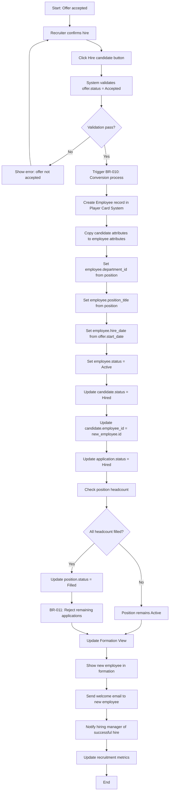

| Step | Actor | Action | System Response | Rules Applied |
|------|-------|--------|-----------------|---------------|
| 1 | Recruiter | Reviews offer_accepted applications | Filters applications ready for hire | - |
| 2 | Recruiter | Clicks "Complete Hire" button | Opens hire confirmation dialog | - |
| 3 | System | Validates offer is accepted and not expired | Checks offer.status = Accepted | - |
| 4 | Recruiter | Confirms hire date and onboarding details | Date confirmation | - |
| 5 | System | **Creates Employee record** | Calls Player Card System API | BR-010 |
| 6 | System | Copies all CandidateAttribute records → EmployeeAttribute | Maintains attribute ratings | BR-010 |
| 7 | System | Sets employee.department_id = position.department_id | Links to department from Club Setup | BR-010 |
| 8 | System | Sets employee.team_id = position.team_id | Links to team if specified | BR-010 |
| 9 | System | Sets employee.position_title = position.title | Employee's job title | BR-010 |
| 10 | System | Sets employee.hire_date = offer.start_date | When employee officially starts | BR-010 |
| 11 | System | Sets employee.employment_type = offer.employment_type | Full-time, Contract, etc. | BR-010 |
| 12 | System | Sets employee.salary = offer.salary_offered | Compensation record | BR-010 |
| 13 | System | Updates candidate.status = Hired | Candidate no longer active in pool | BR-010 |
| 14 | System | Updates candidate.employee_id = new employee ID | Bidirectional link | BR-010 |
| 15 | System | Updates candidate.hired_at = current timestamp | Track hire date | BR-010 |
| 16 | System | Updates application.status = Hired | Final application state | BR-010 |
| 17 | System | Counts hired applications for position | Query: COUNT WHERE status = Hired | BR-011 |
| 18 | System | If count >= position.headcount → position.status = Filled | Closes position | BR-011 |
| 19 | System | If position filled → All other active applications → Rejected | Bulk rejection | BR-011 |
| 20 | System | **Updates Formation View** | Shows new employee in formation position | Integration |
| 21 | System | Recalculates Gap Analysis | Updates team strength scores | Integration |
| 22 | System | Creates onboarding task list | Sends to HR/Manager (optional) | - |
| 23 | System | Sends welcome email to new employee | Includes login credentials | - |
| 24 | System | Updates recruitment analytics | Time-to-hire, source effectiveness | - |

#### Alternative Paths

| Path ID | Condition | Flow |
|---------|-----------|------|
| 7a | Bulk hire multiple candidates | Select multiple offer_accepted applications, hire all at once |
| 7b | Delayed start date | Employee created but status = Pending_Start until hire_date |
| 7c | Employee already exists | Candidate is returning employee, update existing record instead of creating new |

#### Error Paths

| Error ID | Trigger | Error Message | Recovery |
|----------|---------|---------------|----------|
| E1 | Offer not accepted | "Cannot hire: Offer has not been accepted by candidate" | Wait for acceptance or resend offer |
| E2 | Employee creation fails | BR-010 error message with specific failure reason | Contact system admin, check Player Card System |
| E3 | Department/team no longer exists | "Cannot assign employee: Department has been deleted" | Restore department or assign to different one |
| E4 | Duplicate employee email | "Employee with this email already exists" | Check if returning employee or email conflict |

---

### Flow 8: Track Source Effectiveness (Analytics)

#### Happy Path

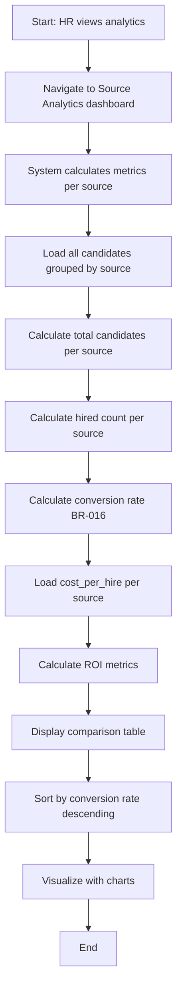

| Step | Actor | Action | System Response | Rules Applied |
| ------|-------|--------|-----------------|---------------|
| 1 | HR Admin | Clicks "Analytics" → "Source Effectiveness" | Loads analytics dashboard | - |
| 2 | System | Queries all candidates grouped by source_id | Database aggregation | - |
| 3 | System | Calculates per source: Total, Hired, Active, Rejected | COUNT queries with filters | BR-016 |
| 4 | System | Calculates conversion rate = (Hired / Total) × 100 | Percentage calculation | BR-016 |
| 5 | System | Loads source.cost_per_hire for each source | Manual cost input | - |
| 6 | System | Displays comparison table with columns: Source, Total, Hired, Conversion %, Cost/Hire | Sortable table | - |
| 7 | HR Admin | Sorts by conversion rate | Identifies best-performing sources | - |
| 8 | System | Shows trend chart over time | Line graph of monthly conversions | - |
| 9 | HR Admin | Filters by date range or position | Refined analytics | - |

---

## 6. Integration Points

### Inbound Dependencies (Data Received)

| From Feature | Data Received | When | Purpose |
|--------------|---------------|------|---------|
| **Player Card System** | Attribute definitions (Technical, Leadership, etc.) | On position requirement setup | Define what attributes to require for positions |
| **Player Card System** | Attribute rating scale (1-20) | On candidate attribute rating | Consistent rating system across candidates & employees |
| **Club Setup** | Department list | On position creation | Assign position to department |
| **Club Setup** | Team list | On position creation | Optionally assign position to specific team |
| **Club Setup** | Employee list (for hiring managers, recruiters, interviewers) | Multiple flows | Assign people to roles in recruitment |
| **Formation View** | Formation positions (roles/slots) | On position creation | Link open position to specific formation slot |
| **Gap Analysis** | Gap analysis results (missing skills, weak positions) | On position requirement suggestion | Auto-suggest requirements based on identified gaps |
| **Foundation Auth** | User roles (Scout, Manager, HR Admin) | Permission checks | Control who can create positions, hire, etc. |

### Outbound Effects (Data Sent)

| To Feature | Data Sent | When | Purpose |
|------------|-----------|------|---------|
| **Player Card System** | New Employee record with attributes | When candidate hired (BR-010) | Convert candidate to employee |
| **Player Card System** | Employee attributes copied from candidate | When candidate hired | Maintain consistent player card data |
| **Formation View** | Position filled notification | When candidate hired | Update formation to show new employee in slot |
| **Formation View** | Open position notification | When position created | Show empty slot in formation |
| **Gap Analysis** | Trigger recalculation | When candidate hired | Update team strength after adding new employee |
| **Club Setup** | Department headcount update | When candidate hired | Increment department employee count |
| **Foundation Auth** | New user account creation | When employee hired (optional) | Auto-create login for new employee |
| **Analytics/Reporting** | Recruitment metrics (time-to-hire, conversion rates) | Continuous updates | Track recruiting performance |

### Critical Integration: Candidate → Employee Conversion Flow

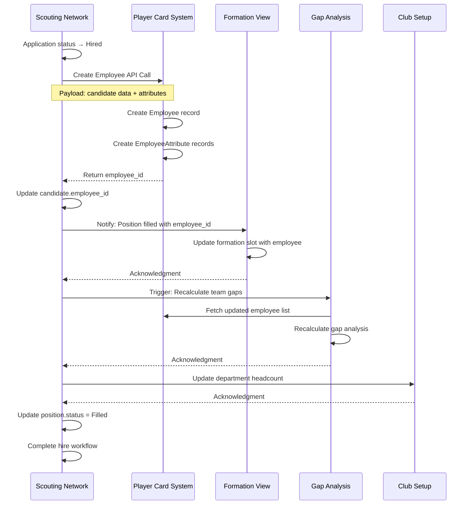

### API Contracts (Phase 1 MVP)

**API Endpoint: Create Employee from Candidate**

```
POST /api/v1/employees/from-candidate
Authorization: Bearer {token}
Content-Type: application/json

Request Body:
{
  "candidate_id": "uuid",
  "position_id": "uuid",
  "offer_id": "uuid",
  "start_date": "2026-02-01",
  "created_by": "user_uuid"
}

Response (Success 201):
{
  "employee_id": "uuid",
  "employee_code": "EMP-2026-001",
  "status": "success",
  "message": "Employee created successfully from candidate"
}

Response (Error 400):
{
  "status": "error",
  "code": "INVALID_CANDIDATE",
  "message": "Candidate is not in Hired status"
}
```

---

## 7. Calculations & Formulas

### CALC-001: Fit Score Calculation

**Formula:**
```
Fit Score (%) = (Σ(candidate_attribute_i × weight_i) / Σ(required_attribute_i × weight_i)) × 100
```

**Inputs:**
- candidate_attribute_i: Candidate's score for attribute i (1-20)
- required_attribute_i: Position's required score for attribute i (1-20)
- weight_i: Weight assigned to attribute i (0.0-1.0, sum = 1.0)

**Output:** Percentage (0-999%, can exceed 100% if candidate exceeds all requirements)

**Used In:**
- Application card display (Kanban board)
- Candidate comparison view
- Position candidate list sorting

**Example:**
```
Position Requirements:
- Backend Development (16 required, 0.40 weight)
- Problem Solving (15 required, 0.30 weight)
- Communication (12 required, 0.20 weight)
- Leadership (10 required, 0.10 weight)

Candidate Scores:
- Backend Development: 18
- Problem Solving: 14
- Communication: 13
- Leadership: 11

Calculation:
Numerator = (18×0.40) + (14×0.30) + (13×0.20) + (11×0.10)
          = 7.2 + 4.2 + 2.6 + 1.1 = 15.1

Denominator = (16×0.40) + (15×0.30) + (12×0.20) + (10×0.10)
            = 6.4 + 4.5 + 2.4 + 1.0 = 14.3

Fit Score = (15.1 / 14.3) × 100 = 105.59%
```

**Business Rule:** If fit score ≥ 100%, candidate exceeds requirements (ideal hire)

### CALC-002: Source Conversion Rate

**Formula:**
```
Conversion Rate (%) = (Hired Candidates from Source / Total Candidates from Source) × 100
```

**Inputs:**
- Hired count: COUNT(candidates WHERE source_id = X AND status = Hired)
- Total count: COUNT(candidates WHERE source_id = X)

**Output:** Percentage (0-100%)

**Used In:**
- Source Analytics dashboard
- Source comparison reports
- Recruitment strategy planning

**Example:**
```
LinkedIn Source:
- Total candidates: 45
- Hired: 9
- Conversion Rate = (9 / 45) × 100 = 20%

Employee Referral Source:
- Total candidates: 12
- Hired: 7
- Conversion Rate = (7 / 12) × 100 = 58.33%

Insight: Employee Referrals have 2.9× higher conversion rate
```

### CALC-003: Time to Hire

**Formula:**
```
Time to Hire (days) = Hired Date - Application Created Date
```

**Inputs:**
- application.applied_at: Timestamp when candidate added to position
- candidate.hired_at: Timestamp when candidate converted to employee

**Output:** Integer (number of days)

**Used In:**
- Recruitment efficiency metrics
- Position analytics
- Recruiter performance tracking

**Aggregations:**
- Average time to hire per position
- Average time to hire per department
- Average time to hire per recruiter

**Example:**
```
Application created: 2026-01-05
Candidate hired: 2026-02-20
Time to Hire = 46 days
```

### CALC-004: Pipeline Conversion Rate per Stage

**Formula:**
```
Stage Conversion (%) = (Applications moved to next stage / Total in current stage) × 100
```

**Inputs:**
- Applications in stage: COUNT(applications WHERE status = X)
- Applications progressed: COUNT(applications WHERE status moved from X to Y)

**Output:** Percentage for each stage transition

**Used In:**
- Pipeline funnel analysis
- Identify bottlenecks
- Process optimization

**Example:**
```
Screening Stage:
- Total in screening: 50
- Passed to interview: 30
- Failed/rejected: 20
- Conversion Rate = (30 / 50) × 100 = 60%

Interview Stage:
- Total interviewed: 30
- Moved to offer: 12
- Failed/rejected: 18
- Conversion Rate = (12 / 30) × 100 = 40%
```

### CALC-005: Cost per Hire (by Source)

**Formula:**
```
Cost per Hire (฿) = Total Source Cost / Number of Hires from Source
```

**Inputs:**
- source.cost_per_hire: Manually entered total cost for source
- Hired count: COUNT(candidates WHERE source_id = X AND status = Hired)

**Output:** Currency amount

**Used In:**
- Source ROI analysis
- Budget planning
- Source effectiveness comparison

**Example:**
```
LinkedIn Recruiter Subscription:
- Annual cost: ฿120,000
- Hires from LinkedIn: 24
- Cost per Hire = ฿120,000 / 24 = ฿5,000

Employee Referral Program:
- Total bonuses paid: ฿70,000
- Hires from referrals: 14
- Cost per Hire = ฿70,000 / 14 = ฿5,000
```

### CALC-006: Position Fill Rate

**Formula:**
```
Fill Rate (%) = (Filled Positions / Total Open Positions) × 100
```

**Inputs:**
- Filled: COUNT(positions WHERE status = Filled)
- Total open: COUNT(positions WHERE status IN (Open, Active))

**Output:** Percentage (0-100%)

**Used In:**
- Recruitment effectiveness tracking
- Executive dashboards
- Capacity planning

---

## 8. User Stories Summary

The following user stories will be created based on this Business Analysis:

| Story ID | Title | Priority | Effort (days) | Dependencies |
|----------|-------|----------|---------------|--------------|
| US-4.1 | Create Position with Requirements | High | 3 | Club Setup, Player Card System |
| US-4.2 | Add Candidate to Scouting Network | High | 2 | Player Card System |
| US-4.3 | Calculate and Display Fit Score | High | 2 | US-4.1, US-4.2 |
| US-4.4 | View Candidates in Kanban Board | High | 3 | US-4.2 |
| US-4.5 | Move Candidate Through Pipeline Stages | High | 2 | US-4.4 |
| US-4.6 | Conduct Screening Review | Medium | 2 | US-4.5 |
| US-4.7 | Schedule and Record Interview | High | 3 | US-4.5 |
| US-4.8 | Collect Interview Feedback | High | 2 | US-4.7 |
| US-4.9 | Create and Manage Job Offer | High | 3 | US-4.8 |
| US-4.10 | Convert Hired Candidate to Employee | Critical | 4 | US-4.9, Player Card System, Formation View |
| US-4.11 | Track and Display Source Effectiveness | Medium | 2 | US-4.2, US-4.10 |
| US-4.12 | Bulk Import Candidates from CSV | Low | 2 | US-4.2 |
| US-4.13 | Send Email Notifications to Candidates | Medium | 2 | US-4.5, US-4.9 |
| US-4.14 | View Recruitment Analytics Dashboard | Medium | 3 | US-4.10, US-4.11 |
| US-4.15 | Compare Candidates Side-by-Side | Medium | 2 | US-4.3 |

**Total Estimated Effort:** 37 days (approximately 7-8 weeks with 1 developer)

**Critical Path:** US-4.1 → US-4.2 → US-4.3 → US-4.4 → US-4.5 → US-4.7 → US-4.8 → US-4.9 → US-4.10

**Phase 1 MVP Scope (Must-Have):**
- ✅ US-4.1, US-4.2, US-4.3, US-4.4, US-4.5, US-4.7, US-4.8, US-4.9, US-4.10
- Total: 24 days for core recruitment loop

**Phase 1 Nice-to-Have:**
- US-4.6, US-4.11, US-4.13, US-4.14, US-4.15
- Total: 11 days for enhanced features

**Phase 2 Enhancements:**
- US-4.12: Bulk import
- Resume parsing automation
- Calendar integration for interview scheduling
- Advanced analytics and reporting
- Email campaign automation

---

## 9. Data Model Summary

### Core Tables

**positions**
- Primary entity for open roles
- Links to departments, teams, hiring managers
- Tracks position lifecycle (Draft → Open → Active → Filled)

**position_requirements**
- Defines attribute criteria for positions
- Links to Player Card attribute definitions
- Stores required scores and weights for fit calculation

**candidates**
- Central candidate records
- Uses Player Card attribute system
- Tracks source and status (Active → Hired)

**candidate_attributes**
- Stores 1-20 ratings for candidate skills
- Same attribute definitions as employees
- Enables fit score calculation

**applications**
- Junction table: candidate × position
- Tracks pipeline status and stage transitions
- Stores calculated fit_score

**interviews**
- Interview sessions for applications
- Collects feedback and recommendations
- Links to interviewers (employees)

**offers**
- Job offers linked to applications
- Tracks offer lifecycle and acceptance
- Stores salary and employment terms

**sources**
- Recruitment channel definitions
- Tracks cost per hire for ROI analysis
- Pre-seeded with common sources

### Key Indexes

```sql
-- Performance optimization indexes
CREATE INDEX idx_applications_position_status ON applications(position_id, status);
CREATE INDEX idx_applications_candidate ON applications(candidate_id);
CREATE INDEX idx_candidates_email ON candidates(email);
CREATE INDEX idx_candidates_source ON candidates(source_id);
CREATE INDEX idx_candidates_status ON candidates(status);
CREATE INDEX idx_interviews_application ON interviews(application_id);
CREATE INDEX idx_offers_application ON offers(application_id);
CREATE INDEX idx_position_requirements_position ON position_requirements(position_id);
```

---

## 10. Permission Matrix

| Role | Create Position | Add Candidate | Move Pipeline | Schedule Interview | Approve Offer | Complete Hire | View Analytics |
|------|----------------|---------------|---------------|-------------------|---------------|---------------|----------------|
| **Scout/Recruiter** | ✅ | ✅ | ✅ | ✅ | ❌ | ✅ | ✅ (own positions) |
| **Hiring Manager** | ✅ (own dept) | ✅ | ✅ (own positions) | ✅ | ✅ (own positions) | ✅ | ✅ (own positions) |
| **HR Admin** | ✅ | ✅ | ✅ | ✅ | ✅ | ✅ | ✅ (all) |
| **Interviewer** | ❌ | ❌ | ❌ | ❌ | ❌ | ❌ | ❌ |
| **Employee** | ❌ | ✅ (referrals only) | ❌ | ❌ | ❌ | ❌ | ❌ |
| **System Admin** | ✅ | ✅ | ✅ | ✅ | ✅ | ✅ | ✅ |

**Notes:**
- Interviewers can only provide feedback on assigned interviews
- Employees can refer candidates but cannot manage applications
- Hiring managers can only act on positions where they are assigned as hiring_manager_id
- Scouts can manage any position assigned to them

---

## 11. Validation Rules Summary

### Position Validation
- ✅ Title: Required, max 100 chars, no special chars except spaces/hyphens
- ✅ Department: Must exist in Club Setup
- ✅ Hiring Manager: Must be active employee with Manager role
- ✅ Salary Range: If provided, max >= min, both must be positive
- ✅ Headcount: Min 1, max 99
- ✅ Requirements: At least 1 requirement, weights sum to 1.0

### Candidate Validation
- ✅ Email: Required, unique (case-insensitive), valid format
- ✅ Name: Required, max 50 chars each
- ✅ Phone: Optional, valid international format
- ✅ LinkedIn URL: Optional, must start with https://linkedin.com or https://www.linkedin.com
- ✅ Current/Potential Ability: 1-20 range
- ✅ Years Experience: 0-50 range

### Application Validation
- ✅ No duplicate active applications (same candidate + position)
- ✅ Candidate must not be Blacklisted
- ✅ Position must be Open or Active
- ✅ Stage transitions must follow valid paths (BR-006)

### Interview Validation
- ✅ Scheduled date/time must be in future
- ✅ Duration: 15-480 minutes
- ✅ Interviewer must be active employee
- ✅ Feedback required before marking Completed
- ✅ Recommendation required before marking Completed

### Offer Validation
- ✅ Salary must be within position range
- ✅ Employment type must match position
- ✅ Start date must be in future
- ✅ Hiring manager approval required before sending
- ✅ Valid_until must be after sent date

---

## 12. UI/UX Requirements

### Kanban Board View (Primary Interface)

**Layout:**
- Horizontal columns: New | Screening | Interview | Offer | Hired
- Each column shows count of applications
- Drag-and-drop between columns
- Color-coded cards based on fit score

**Application Card Design:**
- Candidate photo/avatar
- Candidate name + current title
- Fit score badge (color-coded)
- Position title
- Days in current stage
- Quick actions: View details, Schedule interview, Reject

**Filters:**
- By position
- By recruiter
- By date range
- By fit score range
- By source

### Position List View

**Columns:**
- Position code
- Title
- Department
- Status badge
- Applications count
- Days open
- Hiring manager
- Actions: View, Edit, Close

### Candidate Pool View

**Layout:**
- Grid or list view toggle
- Search by name/email
- Filter by status, source, attributes

**Candidate Card:**
- Name + current company
- Current Ability rating
- Potential Ability rating
- Source
- Active applications count
- Quick add to position

### Position Detail Page

**Sections:**
1. Position Info (title, department, description)
2. Requirements (attributes + scores + weights)
3. Applications Pipeline (mini Kanban)
4. Analytics (time to hire, conversion rate)

### Candidate Detail Page

**Sections:**
1. Basic Info (name, contact, LinkedIn)
2. Player Card (all attributes with 1-20 ratings)
3. Resume/Documents
4. Application History (all positions applied to)
5. Interview History (all interviews + feedback)
6. Notes & Activity Timeline

---

## 13. Open Questions

| # | Question | Owner | Status | Resolution |
|---|----------|-------|--------|------------|
| 1 | Should candidates be able to self-apply through a public portal, or only added by recruiters? | Product Owner | Open | Phase 1: Recruiter-only, Phase 2: Public portal |
| 2 | What email service should be used for candidate communications? | Tech Lead | Open | Options: SendGrid, AWS SES, Mailgun |
| 3 | Should the system support multi-stage interview processes (e.g., Phone → Technical → Culture Fit → Final)? | Product Owner | Resolved | Yes, allow multiple interviews per application |
| 4 | What happens to candidate data after 1 year of inactivity (GDPR compliance)? | Legal/HR Admin | Open | Need data retention policy |
| 5 | Should hiring managers be able to override fit scores and hire candidates with low scores? | Product Owner | Open | Likely yes, but require justification note |
| 6 | Can a position have multiple hiring managers (hiring committee)? | Product Owner | Open | Phase 1: Single manager, Phase 2: Committee support |
| 7 | Should the system integrate with background check services? | Product Owner | Open | Phase 2 enhancement |
| 8 | What currency should be used for salary and cost tracking? | Product Owner | Resolved | Use club's default currency from Club Setup (฿ Thai Baht for internal use) |
| 9 | Should candidates receive automated status update emails at each stage? | HR Admin | Open | Optional per-position setting, default OFF |
| 10 | How should employee referrals be tracked for referral bonus payouts? | HR Admin | Open | Add referrer_employee_id field to candidates |
| 11 | Should the system support requisition approval workflow before opening positions? | HR Admin | Open | Phase 2 enhancement |
| 12 | What file formats should be supported for resume uploads? | Tech Lead | Resolved | PDF, DOC, DOCX (max 10MB) |

---

## 14. Success Metrics

### Primary Metrics (Phase 1)

**Adoption:**
- ✅ 100% of open positions tracked in Scouting Network
- ✅ All recruiters use Kanban board daily
- ✅ 90% of candidates added through platform (vs external ATS)

**Efficiency:**
- ✅ Reduce time-to-hire by 30% vs current process
- ✅ 80% of positions filled within 60 days
- ✅ Recruiter productivity: 10+ positions managed per recruiter

**Quality:**
- ✅ Average candidate fit score for hired employees: ≥ 85%
- ✅ 90-day retention rate: ≥ 95% for platform hires
- ✅ Hiring manager satisfaction: ≥ 4.5/5 stars

**Integration:**
- ✅ 100% of hired candidates successfully converted to employees
- ✅ Zero manual data entry for employee onboarding
- ✅ Formation View updated within 1 minute of hire

### Secondary Metrics

**Source Effectiveness:**
- Track conversion rates per source
- Optimize budget allocation to high-ROI sources
- Employee referrals target: 30% of hires

**Pipeline Health:**
- Average conversion rate per stage: ≥ 50%
- Low drop-off rate between Interview → Offer (≥ 60%)
- Offer acceptance rate: ≥ 80%

---

## 15. Risk Assessment

### Technical Risks

| Risk | Impact | Likelihood | Mitigation |
|------|--------|------------|------------|
| Player Card System API failure during conversion | High | Low | Implement retry logic + error handling |
| Fit score calculation performance issues at scale | Medium | Medium | Cache calculations, async processing |
| Email delivery failures | Medium | Medium | Use reliable provider, implement delivery tracking |
| Data migration from existing ATS | High | High | Build import tools, manual verification |

### Business Risks

| Risk | Impact | Likelihood | Mitigation |
|------|--------|------------|------------|
| Recruiters resist changing from existing ATS | High | Medium | Training sessions, highlight benefits |
| Fit score algorithm not accurate | High | Medium | Allow manual override, iterate on weights |
| Candidate experience poor (if public portal added) | Medium | Low | UX testing before Phase 2 launch |
| GDPR compliance issues with data retention | High | Low | Implement auto-deletion policies |

### Dependency Risks

| Risk | Impact | Likelihood | Mitigation |
|------|--------|------------|------------|
| Player Card System not ready for integration | Critical | Low | Coordinate development schedules |
| Formation View changes break integration | Medium | Low | Version API contracts, integration tests |
| Club Setup department structure changes | Medium | Medium | Handle deleted departments gracefully |

---

## 16. Phase 1 Implementation Sequence

**Week 1-2: Foundation**
- Set up database schema (positions, candidates, applications, etc.)
- Implement Position CRUD + Requirements
- Implement Candidate CRUD + Attributes
- US-4.1, US-4.2

**Week 3-4: Core Pipeline**
- Implement Application creation
- Build Kanban board UI
- Implement fit score calculation
- Implement stage transitions
- US-4.3, US-4.4, US-4.5

**Week 5-6: Interview & Offer**
- Implement interview scheduling
- Build feedback collection forms
- Implement offer creation and approval workflow
- US-4.7, US-4.8, US-4.9

**Week 7: Critical Integration**
- Implement candidate → employee conversion (BR-010)
- Integration with Player Card System API
- Integration with Formation View
- Integration with Gap Analysis
- US-4.10

**Week 8: Testing & Polish**
- End-to-end testing of complete recruitment loop
- Bug fixes
- UI polish
- Documentation

**Week 9-10: Analytics & Enhancements**
- Source effectiveness dashboard
- Recruitment analytics
- Email notifications
- US-4.11, US-4.13, US-4.14

---

## 17. Acceptance Criteria for BA Document

- [x] All business entities documented with complete attributes
- [x] All business rules numbered (BR-001 through BR-020) and described
- [x] All state transitions mapped with triggers and conditions
- [x] All process flows have happy path + alternatives + error paths
- [x] All calculations/formulas documented with examples
- [x] Integration points identified (inbound and outbound)
- [x] No undefined loops or dead ends in flows
- [x] User stories summary created with dependencies
- [x] Open questions documented
- [x] Success metrics defined
- [x] Risk assessment completed
- [x] Implementation sequence proposed

---

## Appendix A: Glossary

**ATS (Applicant Tracking System):** Software for managing recruitment and hiring process

**Fit Score:** Calculated percentage match between candidate attributes and position requirements

**Kanban:** Visual workflow management method using columns and cards

**Player Card:** Football Manager-style profile with 1-20 attribute ratings

**Scouting Network:** Recruitment feature named after Football Manager's transfer shortlist

**Application:** Link between a candidate and a specific position they're being considered for

**Pipeline Stage:** Current step in the recruitment process (Screening, Interview, Offer, etc.)

**Source:** Recruitment channel where candidates come from (LinkedIn, Referral, etc.)

**Conversion:** Process of transforming a hired candidate into an active employee

**Formation View:** Visual representation of team structure as football pitch

**Gap Analysis:** Automated detection of weak positions and missing skills in team

---

## Appendix B: Example User Journey

**Scenario:** Hiring a Senior Backend Developer

1. **Engineering Manager** reviews Formation View, sees Backend position is weak (avg rating 12/20, need 16+)
2. Manager creates **Position** "Senior Backend Developer" with requirements:
   - Backend Development: 16+ (50% weight)
   - Database Design: 16+ (30% weight)
   - System Architecture: 14+ (20% weight)
3. Manager assigns **Recruiter** Sarah to the position
4. Sarah sources 3 candidates from LinkedIn, 2 from referrals
5. Sarah adds **Candidates** to Scouting Network, rates their attributes based on resumes
6. System calculates **Fit Scores**:
   - Candidate A (LinkedIn): 92%
   - Candidate B (Referral): 105% ⭐
   - Candidate C (LinkedIn): 78%
   - Candidate D (Referral): 88%
   - Candidate E (LinkedIn): 65%
7. Sarah moves top 3 candidates (B, A, D) to **Screening** stage
8. After screening calls, Sarah moves B and A to **Interview** stage
9. Sarah schedules **Technical Interviews**:
   - Candidate B with Senior Engineer John
   - Candidate A with Tech Lead Maria
10. John and Maria conduct interviews, submit **Feedback**:
    - Candidate B: "Strong Hire" recommendation
    - Candidate A: "Hire" recommendation
11. Manager reviews feedback, approves both for **Offer** stage
12. Sarah creates **Offer** for Candidate B (top choice):
    - Salary: ฿90,000/month (within range ฿80k-100k)
    - Start date: 2026-03-01
13. Manager approves offer
14. Sarah sends offer to Candidate B
15. Candidate B **accepts** offer within 3 days
16. Sarah clicks **"Complete Hire"**
17. System **converts** Candidate B to Employee:
    - Creates employee record in Player Card System
    - Copies all attributes (Backend=18, Database=17, Architecture=15)
    - Assigns to Backend team
    - Updates Formation View to show new employee in position
    - Triggers Gap Analysis recalculation (Backend strength now 15/20 avg)
18. Position status changes to **Filled**
19. Remaining candidates (A, D) auto-rejected with message "Position filled"
20. Candidate B receives welcome email with onboarding instructions

**Result:** Complete end-to-end recruitment process in 28 days, seamlessly integrated with team management.

---

**END OF BUSINESS ANALYSIS DOCUMENT**

---

**Next Steps:**
1. Review and approve this BA document with stakeholders
2. Create detailed User Stories document (scouting-network.md)
3. Hand off to UX Designer for wireframes and mockups
4. Create technical architecture document
5. Begin development in sequence outlined in Section 16

