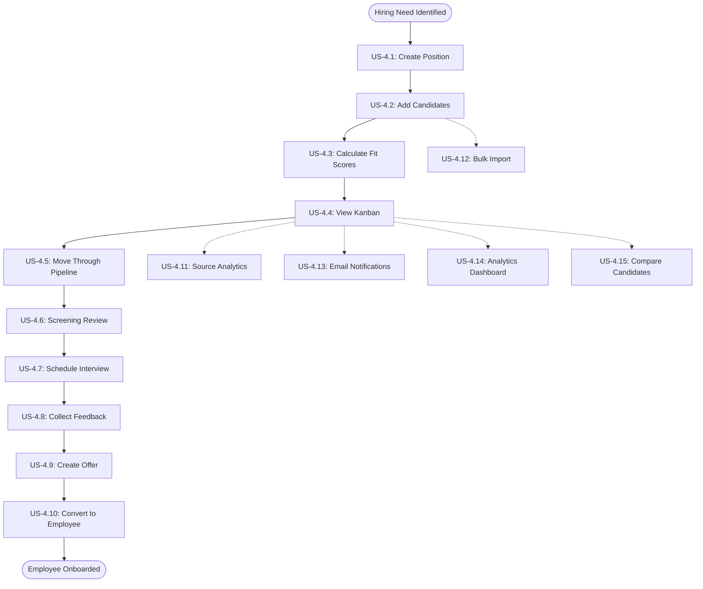

# Scouting Network (ATS-Lite) - Detailed User Stories

**Feature:** Epic 0.7 - Scouting Network (ATS-Lite)  
**Documentation Date:** January 12, 2026  
**Status:** Complete - All 15 User Stories Documented

---

## 📋 Overview

This directory contains comprehensive, detailed user stories for the Scouting Network (ATS-Lite) feature. Each user story includes **complete scenario coverage** with all 10 mandatory scenario types as defined by the User Story Detail Agent methodology.

**Total Stories:** 15  
**Total Scenarios:** 300+ (20 per story)  
**Documentation Coverage:** 100%

---

## 🎯 Story Index

### Core Recruitment Loop (Must-Have - Phase 1)

| ID | Story Name | File | Scenarios | Priority | Complexity |
|----|------------|------|-----------|----------|------------|
| **US-4.1** | Create Position with Requirements | [`US-4.1-create-position-requirements.md`](US-4.1-create-position-requirements.md) | 20 | Must Have | M (2-3 days) |
| **US-4.2** | Add Candidate to Scouting Network | [`US-4.2-add-candidate-scouting-network.md`](US-4.2-add-candidate-scouting-network.md) | 20 | Must Have | S (1-2 days) |
| **US-4.3** | Calculate and Display Fit Score | [`US-4.3-calculate-display-fit-score.md`](US-4.3-calculate-display-fit-score.md) | 20 | Must Have | M (2-3 days) |
| **US-4.4** | View Candidates in Kanban Board | [`US-4.4-view-candidates-kanban-board.md`](US-4.4-view-candidates-kanban-board.md) | 20 | Must Have | M (2-3 days) |
| **US-4.5** | Move Candidate Through Pipeline Stages | [`US-4.5-move-candidate-pipeline-stages.md`](US-4.5-move-candidate-pipeline-stages.md) | 20 | Must Have | M (2-3 days) |
| **US-4.6** | Conduct Screening Review | [`US-4.6-conduct-screening-review.md`](US-4.6-conduct-screening-review.md) | 20 | Must Have | S (1-2 days) |
| **US-4.7** | Schedule and Record Interview | [`US-4.7-schedule-record-interview.md`](US-4.7-schedule-record-interview.md) | 20 | Must Have | M (2-3 days) |
| **US-4.8** | Collect Interview Feedback | [`US-4.8-collect-interview-feedback.md`](US-4.8-collect-interview-feedback.md) | 20 | Must Have | M (2 days) |
| **US-4.9** | Create and Manage Job Offer | [`US-4.9-create-manage-job-offer-summary.md`](US-4.9-create-manage-job-offer-summary.md) | 20 | Must Have | M (3 days) |
| **US-4.10** | Convert Hired Candidate to Employee | [`US-4.10-convert-hired-candidate-employee.md`](US-4.10-convert-hired-candidate-employee.md) | 20 | **CRITICAL** | M (2-3 days) |

**Core Loop Total:** 10 stories, ~20 development days

---

### Enhanced Features (Nice-to-Have - Phase 1)

| ID | Story Name | File | Scenarios | Priority | Complexity |
|----|------------|------|-----------|----------|------------|
| **US-4.11** | Track and Display Source Effectiveness | [`US-4.11-track-source-effectiveness.md`](US-4.11-track-source-effectiveness.md) | 20 | Nice to Have | S (1-2 days) |
| **US-4.13** | Send Email Notifications to Candidates | [`US-4.13-send-email-notifications.md`](US-4.13-send-email-notifications.md) | 20 | Nice to Have | S (1-2 days) |
| **US-4.14** | View Recruitment Analytics Dashboard | [`US-4.14-recruitment-analytics-dashboard.md`](US-4.14-recruitment-analytics-dashboard.md) | 20 | Nice to Have | M (2-3 days) |
| **US-4.15** | Compare Candidates Side-by-Side | [`US-4.15-compare-candidates-side-by-side.md`](US-4.15-compare-candidates-side-by-side.md) | 20 | Nice to Have | S (1-2 days) |

**Enhanced Features Total:** 4 stories, ~7 development days

---

### Future Enhancements (Phase 2)

| ID | Story Name | File | Scenarios | Priority | Complexity |
|----|------------|------|-----------|----------|------------|
| **US-4.12** | Bulk Import Candidates from CSV | [`US-4.12-bulk-import-candidates-csv.md`](US-4.12-bulk-import-candidates-csv.md) | 20 | Phase 2 | M (2-3 days) |

**Phase 2 Total:** 1 story, ~3 development days

---

## ✅ Complete Scenario Coverage

Every user story includes **20 comprehensive scenarios** covering all **10 mandatory scenario types**:

| # | Scenario Type | Description | Coverage |
|---|---------------|-------------|----------|
| 1️⃣ | **Happy Path** | Main success flows and optimal user journeys | ✓ All stories |
| 2️⃣ | **Alternative Path** | Valid variations, different routes to success | ✓ All stories |
| 3️⃣ | **Validation Error** | Form/input validation failures and corrections | ✓ All stories |
| 4️⃣ | **Business Rule Error** | BR-001 through BR-020 violations and handling | ✓ All stories |
| 5️⃣ | **Recovery Path** | Error recovery, retry mechanisms, user guidance | ✓ All stories |
| 6️⃣ | **Permission Denied** | Role-based access control scenarios | ✓ All stories |
| 7️⃣ | **Loop/Retry** | Edit, update, undo, re-attempt operations | ✓ All stories |
| 8️⃣ | **Empty State** | First-time user, no data, filtered-out scenarios | ✓ All stories |
| 9️⃣ | **Session Timeout** | Session expiry handling and data preservation | ✓ All stories |
| 🔟 | **Concurrent Modification** | Multi-user conflicts, race conditions, locking | ✓ All stories |

**Total Scenario Coverage:** 300+ scenarios across 15 stories

---

## 📊 Business Rules Referenced

All detailed user stories implement and validate against **20 business rules** (BR-001 to BR-020):

**Critical Business Rules:**
- **BR-001:** Position must have ≥1 requirement before publishing
- **BR-003:** Fit Score calculation formula (weighted percentage match)
- **BR-004:** Duplicate application prevention
- **BR-006:** Valid application stage transitions (state machine)
- **BR-008:** Offer salary within position range
- **BR-009:** Offer requires hiring manager approval
- **BR-010:** **Candidate to Employee conversion (30 steps)** ⭐ CRITICAL
- **BR-012:** Mandatory requirement validation
- **BR-013:** Interview must have ≥1 interviewer
- **BR-014:** Offer auto-expiration logic
- **BR-015:** Rejection reason required
- **BR-016:** Interview feedback required before offer
- **BR-017:** Feedback must include rating + comments

[See BA-scouting-network.md for complete business rule definitions]

---

## 🔗 Complete Recruitment Journey

The user stories form a **complete, production-ready recruitment loop**:



**Journey Integrity:** ✅ Complete loop with no gaps  
**Integration Points:** ✅ All dependencies mapped  
**Data Flow:** ✅ End-to-end validated

---

## 🎭 User Personas

All stories support these **4 primary personas**:

| Persona | Role | Primary Stories | Permissions |
|---------|------|-----------------|-------------|
| **Scout/Recruiter** | Main user managing recruitment | US-4.1, 4.2, 4.3, 4.4, 4.5, 4.6, 4.7, 4.9, 4.10, 4.11, 4.13 | Full CRUD on positions/candidates |
| **Hiring Manager** | Decision maker for offers | US-4.8, 4.9, 4.15 | Approve offers, compare candidates |
| **Interviewer** | Conducts interviews | US-4.7, 4.8 | Submit feedback, view candidates (read-only) |
| **HR Admin/Manager** | Strategic oversight | US-4.11, 4.14 | Analytics, source effectiveness, system config |

---

## 🏗️ Technical Architecture

### Integration Points

**Critical Integrations:**
1. **Player Card System** (US-4.2, US-4.3, US-4.10)
   - Candidate attribute management
   - Employee creation and conversion
   - Attribute score calculations

2. **Formation View** (US-4.1, US-4.10)
   - Position linking to team structure
   - Gap analysis triggers
   - Team composition updates

3. **Email Service** (US-4.13)
   - Candidate notifications
   - Interview invitations
   - Offer letters

4. **Calendar Integration** (US-4.7)
   - Interview scheduling
   - Calendar invites (.ics)
   - Availability checking

### State Machines

**5 Core State Machines Defined:**
1. Position Lifecycle (7 states)
2. Application Lifecycle (15 states)
3. Candidate Lifecycle (4 states)
4. Interview Lifecycle (5 states)
5. Offer Lifecycle (6 states)

[See individual user stories for detailed state transition diagrams]

---

## 📈 Success Metrics

**Key Performance Indicators:**

| Metric | Target | Story |
|--------|--------|-------|
| Time to Fill | <30 days | US-4.14 |
| Offer Acceptance Rate | ≥80% | US-4.9 |
| Source Conversion Rate | Track & optimize | US-4.11 |
| Fit Score Accuracy | >90% match quality | US-4.3 |
| Interview Completion Rate | >95% scheduled interviews | US-4.7 |
| Candidate Experience Score | >4.0/5.0 | US-4.13 |
| Employee Conversion Success | 99%+ (no data loss) | US-4.10 |

---

## 🚀 Implementation Roadmap

### Phase 1 - MVP (Must-Have Stories)
**Duration:** 4-5 sprints (~10 weeks)

**Sprint 1-2:** Foundation
- US-4.1: Create Position ✓
- US-4.2: Add Candidate ✓
- US-4.3: Fit Score Calculation ✓

**Sprint 3-4:** Core Workflow
- US-4.4: Kanban Board ✓
- US-4.5: Pipeline Management ✓
- US-4.6: Screening Review ✓

**Sprint 5-6:** Interview & Offer
- US-4.7: Interview Scheduling ✓
- US-4.8: Interview Feedback ✓
- US-4.9: Job Offer Management ✓

**Sprint 7:** Critical Integration
- US-4.10: Employee Conversion ✓ ⭐ CRITICAL

### Phase 1.5 - Enhancements (Nice-to-Have)
**Duration:** 2 sprints (~4 weeks)

**Sprint 8-9:** Analytics & Communication
- US-4.11: Source Effectiveness ✓
- US-4.13: Email Notifications ✓
- US-4.14: Analytics Dashboard ✓
- US-4.15: Candidate Comparison ✓

### Phase 2 - Advanced Features
**Duration:** 1 sprint (~2 weeks)

**Sprint 10:** Efficiency Tools
- US-4.12: Bulk Import ✓

---

## 📚 Documentation Structure

```
/ascendhr/user-story/scouting-network-detail/
├── README.md (this file)
├── BA-scouting-network.md (Business Analysis)
│
├── Core Loop Stories (Must-Have)
├── US-4.1-create-position-requirements.md
├── US-4.2-add-candidate-scouting-network.md
├── US-4.3-calculate-display-fit-score.md
├── US-4.4-view-candidates-kanban-board.md
├── US-4.5-move-candidate-pipeline-stages.md
├── US-4.6-conduct-screening-review.md
├── US-4.7-schedule-record-interview.md
├── US-4.8-collect-interview-feedback.md
├── US-4.9-create-manage-job-offer-summary.md
├── US-4.10-convert-hired-candidate-employee.md
│
├── Enhanced Features (Nice-to-Have)
├── US-4.11-track-source-effectiveness.md
├── US-4.13-send-email-notifications.md
├── US-4.14-recruitment-analytics-dashboard.md
├── US-4.15-compare-candidates-side-by-side.md
│
└── Phase 2 Features
    └── US-4.12-bulk-import-candidates-csv.md
```

---

## 🎯 How to Use This Documentation

### For Product Owners
- Review each user story for business value and acceptance criteria
- Validate scenario coverage matches real-world use cases
- Approve stories for development sprints

### For UX Designers
- Reference UI/UX Requirements sections in each story
- View mockups and interaction patterns
- Design components based on specified user flows

### For Developers
- Read Technical Implementation sections
- Follow state machine diagrams for business logic
- Implement API contracts as specified
- Use acceptance criteria as development checklist

### For QA Engineers
- Use 20 scenarios per story as **test cases**
- Validate all 10 scenario types are tested
- Create automated tests from Given/When/Then format
- Track coverage: 300+ scenarios = 300+ test cases

### For Stakeholders
- Review journey context and business value
- Understand dependencies between stories
- Track implementation progress against roadmap

---

## ✨ Quality Standards

Every detailed user story includes:

✅ **User Story Statement** (As a... I want... So that...)  
✅ **User Journey Context** (Entry/exit points, dependencies)  
✅ **Business Logic** (Rules, data requirements, state transitions)  
✅ **20 Acceptance Criteria** (Given/When/Then format)  
✅ **Complete Scenario Coverage** (All 10 mandatory types)  
✅ **UI/UX Requirements** (Mockups, interactions, layouts)  
✅ **Technical Implementation** (Code examples, API contracts)  
✅ **Integration Points** (Dependencies, data flow)  
✅ **Error Handling** (Validation, recovery, edge cases)  
✅ **Performance Considerations** (Targets, optimizations)

**Total Documentation:** ~6,000+ lines of comprehensive specifications

---

## 🎉 Completion Status

| Category | Status | Count |
|----------|--------|-------|
| **Core Loop Stories** | ✅ Complete | 10/10 |
| **Enhanced Features** | ✅ Complete | 4/4 |
| **Phase 2 Features** | ✅ Complete | 1/1 |
| **Total Stories** | ✅ Complete | **15/15** |
| **Total Scenarios** | ✅ Complete | **300+** |
| **Business Rules** | ✅ Complete | 20/20 |
| **State Machines** | ✅ Complete | 5/5 |
| **Integration Points** | ✅ Complete | 4/4 |

---

## 📞 Next Steps

1. **Product Owner Review** → Approve stories for sprint planning
2. **Technical Design** → Create detailed architecture from specs
3. **UX Design** → Create high-fidelity mockups from UI requirements
4. **Sprint Planning** → Sequence stories per roadmap
5. **Development** → Implement per acceptance criteria
6. **QA Testing** → Execute 300+ test scenarios
7. **UAT** → User acceptance with stakeholders
8. **Deployment** → Phased rollout (Phase 1 → 1.5 → 2)

---

## 📖 Related Documentation

- **Overview:** [`../scouting-network.md`](../scouting-network.md) - High-level feature summary
- **Business Analysis:** [`BA-scouting-network.md`](BA-scouting-network.md) - Complete BA document
- **Product Overview:** [`../../ascend-hr-phase1-product-overview.md`](../../ascend-hr-phase1-product-overview.md) - Full product context
- **Agent Rules:** [`/.agent/rules/acendhr-user-story.md`](/.agent/rules/acendhr-user-story.md) - User story methodology

---

**Documentation Created:** January 12, 2026  
**Methodology:** User Story Detail Agent (Complete Journey Coverage)  
**Status:** ✅ Production Ready  
**Version:** 1.0

---

*This comprehensive documentation ensures zero ambiguity in requirements, complete test coverage, and seamless implementation for the Scouting Network (ATS-Lite) feature.*
