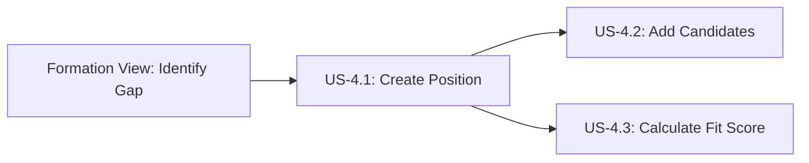

# Create Position with Requirements

**Story ID:** US-4.1  
**Epic:** Epic 0.7 - Scouting Network (ATS-Lite)  
**Persona:** Hiring Manager, HR Admin  
**Priority:** Must Have  
**Complexity:** M (3-5 days)

---

## User Story

> **As a** Hiring Manager,  
> **I want to** create a position with specific attribute requirements,  
> **So that** I can define what skills and capabilities are needed and find candidates that fill team gaps.

---

## User Journey Context

### Story Position in Journey



### Entry Points (How user arrives here)

| Entry Source | Condition | Pre-loaded Data | User State |
|--------------|-----------|-----------------|------------|
| Formation View "Create Position" button | Manager reviews Formation View, identifies gap | Gap context (weak position, required attributes) | Motivated to fill gap |
| Scouting Network navigation menu | Direct access | None | General hiring need |
| Position list "Add Position" button | Viewing existing positions | None | Managing recruitment |
| Deep link from Gap Analysis report | Email/notification with hiring recommendation | Position requirements suggested from gap | Informed decision |

### Exit Points (Where user goes after)

| Exit Condition | Destination | Data Passed | User State |
|----------------|-------------|-------------|------------|
| Success (Position Opened) | Scouting Network Kanban | position_id, position_code | Ready to add candidates |
| Success (Saved as Draft) | Position list view | position_id | Can edit later |
| Cancel | Previous screen (Formation View or Position list) | None | Unchanged |
| Validation Error | Same form | Form data preserved | Needs to fix errors |
| Permission Denied | Error page or Dashboard | None | Frustrated/blocked |
| Session Timeout | Login page | return_url with draft data in session | Must re-authenticate |

### Story Dependencies

| Dependency | Type | Required Data | If Missing |
|------------|------|---------------|------------|
| Club Setup - Departments | Must exist | Department list | Show error: "Please configure departments first" |
| Club Setup - Employees (Managers) | Must exist | Manager list | Show error: "No managers found" |
| Player Card System - Attributes | Must exist | Attribute definitions | Show error: "Attributes not configured" |
| Foundation Auth - User Permissions | Must have | Manager or HR Admin role | Permission denied |

### Stories That Depend on This

| Story ID | What It Needs | Data Provided |
|----------|---------------|---------------|
| US-4.2 | Position to add candidates to | position_id, position_requirements |
| US-4.3 | Position requirements for fit score | position_requirements with weights |
| US-4.4 | Position to display in Kanban | position details |
| US-4.5 | Position to manage pipeline | position_id |

---

## Business Logic

### Business Rules

| Rule ID | Rule Name | Condition | Action | Error Message |
|---------|-----------|-----------|--------|---------------|
| BR-001 | Position Creation Requirements | On Open Position | Validate dept, manager, title, requirements exist | "Cannot open position: Missing required fields (Department, Hiring Manager, Title) or no position requirements defined" |
| BR-002 | Position Requirement Weights | On save requirements | SUM(weight) must = 1.0 (±0.01) | "Position requirements weights must sum to 100%. Current total: {X}%" |
| BR-018 | Position Code Auto-Generation | On position create | Generate POS-{YEAR}-{SEQUENCE} | N/A (automated) |

### Data Requirements

| Field ID | Field Name | Type | Required | Validation | Default | Notes |
|----------|------------|------|----------|------------|---------|-------|
| title | Position Title | string | Yes | 2-100 chars, no special chars except space/hyphen | - | Displayed in all views |
| department_id | Department | UUID (select) | Yes | Must exist in Club Setup | - | Links to department |
| team_id | Team | UUID (select) | No | Must exist within selected department | null | Optional sub-group |
| employment_type | Employment Type | enum | Yes | Full-time, Part-time, Contract, Internship | Full-time | Contract terms |
| seniority_level | Seniority Level | enum | Yes | Junior, Mid, Senior, Lead, Principal | Mid | Level indicator |
| headcount | Headcount | integer | Yes | 1-99 | 1 | Number of hires needed |
| salary_min | Minimum Salary | decimal | No | >= 0, <= salary_max if both set | null | Currency based on club |
| salary_max | Maximum Salary | decimal | No | >= salary_min if both set | null | Currency based on club |
| description | Job Description | rich text | No | Max 10,000 chars | - | Rich text editor |
| requirements_text | Requirements Text | rich text | No | Max 5,000 chars | - | Job requirements |
| hiring_manager_id | Hiring Manager | UUID (select) | Yes | Must be active employee with Manager role | current_user (if manager) | Approves offers |
| recruiter_id | Assigned Recruiter | UUID (select) | No | Must be active employee with Scout role | null | Manages pipeline |
| target_start_date | Target Start Date | date | No | Must be future date | null | Ideal start date |
| formation_position_id | Formation Position | UUID (select) | No | Links to Formation View slot | null | Integration point |

### Position Requirements (Child Entity)

| Field ID | Field Name | Type | Required | Validation | Default | Notes |
|----------|------------|------|----------|------------|---------|-------|
| attribute_id | Attribute | UUID (select) | Yes | Must exist in Player Card System | - | Skill/capability |
| required_score | Required Score | integer | Yes | 1-20 | - | Minimum score needed |
| weight | Weight | decimal | Yes | 0.0-1.0, SUM must = 1.0 | 0.5 | Importance weight |
| is_mandatory | Mandatory Requirement | boolean | No | - | false | Must meet minimum |

### State Transitions

| Current State | Event | Next State | Side Effects |
|---------------|-------|------------|--------------|
| (None) | User creates position | Draft | position_code generated (BR-018) |
| Draft | User clicks "Open Position" | Open (if BR-001 passes) | Email hiring manager, position visible to recruiters |
| Draft | User clicks "Save Draft" | Draft | Position saved, not visible to recruiters |
| Open | First application created | Active | Start tracking time-to-fill metrics |
| Draft/Open | User clicks "Cancel" | Cancelled | Position hidden, cannot be reopened |

### Calculated Fields

| Field | Formula | Triggers |
|-------|---------|----------|
| position_code | POS-{YEAR}-{SEQUENCE} | On create (BR-018) |
| status | Based on state transitions | On state change |
| days_open | current_date - created_at | On view (if status = Open or Active) |
| applications_count | COUNT(applications) | On application create/delete |

---

## Acceptance Criteria

### Scenario 1: Happy Path - Create and Open Position Successfully

**Type:** ✅ Happy Path  
**Journey Position:** Entry → Middle → Exit  
**Covers:** Main Flow steps 1 → 20

**Given**
- I am logged in as Hiring Manager with "Create Position" permission
- Departments are configured in Club Setup (e.g., "Engineering", "Sales")
- At least one active Manager exists (me or others)
- Player Card attributes are defined (e.g., Backend Development, Leadership, Communication)
- I navigated from Formation View after identifying gap: "Missing Senior Backend Developer"

**When**
- I click "Create Position" button
- I enter title: "Senior Backend Developer"
- I select department: "Engineering"
- I optionally select team: "Platform Team"
- I select employment type: "Full-time"
- I select seniority level: "Senior"
- I enter salary range: min ฿80,000, max ฿100,000
- I enter job description in rich text editor
- I click "Add Requirements"
- I select attribute "Backend Development", set required score 16, weight 50%
- I select attribute "Database Design", set required score 14, weight 30%
- I select attribute "System Architecture", set required score 12, weight 20%
- System validates weights sum to 100% (0.5 + 0.3 + 0.2 = 1.0)
- I assign recruiter: "Sarah (Scout)"
- I set target start date: 2026-03-01
- I click "Open Position"

**Then**
- System validates all required fields are filled (BR-001)
- System validates requirement weights sum to 100% (BR-002)
- System generates position code: "POS-2026-001" (BR-018)
- System creates Position record with status = "Open"
- System creates 3 PositionRequirement records linked to position
- System shows success message: "Position 'Senior Backend Developer' (POS-2026-001) has been opened successfully"
- System redirects me to Scouting Network Kanban view with this position

**And** (Side Effects)
- System sends email notification to hiring manager (me)
- System sends email notification to assigned recruiter (Sarah)
- Position appears in recruiter's position list
- System logs audit trail: "Position POS-2026-001 created by {user} and opened"
- If formation_position_id was linked, Formation View shows this position in that slot

---

### Scenario 2: Alternative Path - Save Position as Draft

**Type:** 🔀 Alternative Path  
**Journey Position:** Middle → Exit (draft)

**Given**
- I am logged in as Hiring Manager
- I have started creating a position
- I have filled title: "Backend Developer" and department: "Engineering"
- I have not yet added position requirements

**When**
- I click "Save as Draft" button (instead of "Open Position")

**Then**
- System saves Position record with status = "Draft"
- System generates position code: "POS-2026-002"
- System shows success message: "Position saved as draft. You can complete and open it later."
- System redirects me to Position list view
- Position appears in my drafts with status badge "Draft"
- Position is NOT visible to recruiters
- I can edit this position later to add requirements and open it

**And**
- No email notifications are sent
- Position does not appear in Scouting Network Kanban until opened

---

### Scenario 3: Alternative Path - Copy Requirements from Template

**Type:** 🔀 Alternative Path  
**Journey Position:** Middle (requirements step)

**Given**
- I am creating a position: "Senior Frontend Developer"
- I have another position: "Senior Backend Developer" with similar requirements
- I am on the "Add Requirements" step

**When**
- I click "Use Template" button
- System shows list of my existing positions
- I select "Senior Backend Developer (POS-2026-001)"
- I click "Copy Requirements"

**Then**
- System pre-fills requirements from template position:
  - Backend Development: 16 (50%) → becomes Frontend Development: 16 (50%)
  - Database Design: 14 (30%) → copied as is: 14 (30%)
  - System Architecture: 12 (20%) → copied as is: 12 (20%)
- I can adjust scores and weights as needed
- Weights still sum to 100%
- I continue with position creation

---

### Scenario 4: Alternative Path - Link to Formation View Position

**Type:** 🔀 Alternative Path  
**Journey Position:** Entry from Formation View

**Given**
- I am viewing Formation View
- Formation View shows empty slot: "Midfielder - Backend Developer"
- This slot has suggested requirements based on Formation role type

**When**
- I click "Create Position" from that Formation View slot

**Then**
- System opens position creation form
- System pre-fills title from slot: "Backend Developer"
- System suggests requirements based on formation role:
  - Backend Development: 16 (40%)
  - Problem Solving: 15 (30%)
  - Communication: 12 (20%)
  - Leadership: 10 (10%)
- System pre-selects formation_position_id to link to this slot
- I can adjust all fields as needed
- After position is opened, Formation View shows this position filling that slot

---

### Scenario 5: Validation Error - Missing Required Fields

**Type:** ❌ Validation Error  
**Journey Position:** Middle → Loop back  
**Covers:** Error Flow E2, E3

**Given**
- I am creating a position
- I have entered title: "Developer"
- I have NOT selected department
- I have NOT added position requirements

**When**
- I click "Open Position"

**Then**
- System validates required fields
- System shows inline error on "Department" field: "Please select a department"
- System shows error message at top of form: "Cannot open position: Missing required fields"
- Form remains open with all entered data preserved
- Title field still shows "Developer"
- Focus moves to "Department" dropdown
- "Open Position" button remains disabled until errors are fixed

**Recovery**
- I select department: "Engineering"
- I add at least 1 position requirement
- Error messages disappear
- I can successfully open position

---

### Scenario 6: Validation Error - Invalid Salary Range

**Type:** ❌ Validation Error  
**Journey Position:** Middle → Loop back

**Given**
- I am creating a position
- I enter salary_min: ฿100,000
- I enter salary_max: ฿80,000 (less than minimum!)

**When**
- I tab out of salary_max field or click submit

**Then**
- System shows inline error on "salary_max" field: "Maximum salary must be greater than or equal to minimum salary"
- Form remains open
- Both salary fields retain their values
- Focus moves to salary_max field

**Recovery**
- I correct salary_max to ฿120,000
- Error message disappears
- I can continue with position creation

---

### Scenario 7: Business Rule Error - Requirement Weights Don't Sum to 100%

**Type:** ⚠️ Business Rule Error  
**Covers:** BR-002

**Given**
- I am creating a position
- I have added 3 requirements:
  - Backend Development: 16 (weight 50% = 0.5)
  - Database Design: 14 (weight 30% = 0.3)
  - Leadership: 10 (weight 15% = 0.15)
- Total weight = 0.95 (95%), not 1.0 (100%)

**When**
- I click "Save Requirements" or "Open Position"

**Then**
- System calculates SUM(weights) = 0.95
- System validates against BR-002 (must equal 1.0 ±0.01)
- System shows error: "Position requirements weights must sum to 100%. Current total: 95%"
- System highlights the weight fields
- System shows remaining percentage needed: "Add 5% more weight"
- Requirements are not saved

**Recovery**
- I adjust Leadership weight from 15% to 20% (0.20)
- Total now = 50% + 30% + 20% = 100%
- Error message disappears
- I can successfully save requirements

---

### Scenario 8: Business Rule Error - Cannot Open Without Requirements

**Type:** ⚠️ Business Rule Error  
**Covers:** BR-001 (part 4)

**Given**
- I have created a position with title "Developer" and department "Engineering"
- I have NOT added any position requirements
- I click "Open Position" (skipping requirements step)

**When**
- System validates BR-001

**Then**
- System shows error: "Cannot open position: At least one position requirement must be defined"
- System suggests: "Add requirements to define what you're looking for in candidates"
- Position remains in Draft status
- Form shows "Requirements" section highlighted in red

**Recovery**
- I click "Add Requirements"
- I add at least 1 requirement with valid weight
- I can now successfully open position

---

### Scenario 9: Permission Denied - Non-Manager Tries to Create Position

**Type:** 🔒 Permission Denied  
**Journey Position:** Entry blocked

**Given**
- I am logged in as regular Employee (not Manager or HR Admin)
- I do NOT have "Create Position" permission

**When**
- I attempt to navigate to position creation page via URL or menu

**Then**
- System checks user permissions
- System shows "Access Denied" page
- System displays message: "You do not have permission to create positions. This action requires Manager or HR Admin role."
- System suggests: "Contact your HR administrator if you need access"
- No position creation form is shown
- System logs unauthorized access attempt

**And**
- If accessed via direct URL, redirect to Dashboard with error toast
- "Create Position" menu item is hidden for non-managers

---

### Scenario 10: Edit/Update Loop - Edit Draft Position

**Type:** 🔄 Loop/Retry  
**Journey Position:** Middle → Loop back

**Given**
- I previously created position "Backend Dev" as Draft (POS-2026-005)
- Position has status = "Draft"
- I am viewing Position list

**When**
- I click "Edit" on draft position
- System loads position creation form with saved data:
  - Title: "Backend Dev"
  - Department: "Engineering"
  - Requirements: 2 requirements (Backend 16, Database 14)
- I modify title to "Senior Backend Developer"
- I add 3rd requirement: Leadership 10 (and adjust weights to sum to 100%)
- I click "Save Draft" again

**Then**
- System updates existing Position record (POS-2026-005)
- System updates title
- System updates requirements (adds 3rd requirement)
- System shows success: "Draft position updated"
- Position remains in Draft status with updated data
- I can edit again or open position

**Loop Capability**
- I can edit and save draft multiple times
- Each save updates the same position record
- position_code remains POS-2026-005 (doesn't regenerate)
- updated_at timestamp is updated

---

### Scenario 11: Edit/Update Loop - Edit Opened Position Requirements

**Type:** 🔄 Loop/Retry  
**Journey Position:** Post-open modification

**Given**
- I have opened position "Backend Dev" (POS-2026-005) with status = "Open"
- Position has 5 applications in various stages
- I realize I need to adjust requirements

**When**
- I click "Edit Requirements" on opened position
- I change Backend Development required score from 16 to 18
- I save changes

**Then**
- System updates PositionRequirement records
- System shows warning: "Changing requirements will recalculate fit scores for all applications"
- I confirm the change
- System recalculates fit_score for all 5 applications using new requirements
- System shows: "Requirements updated. 5 fit scores recalculated."
- Applications now show updated fit scores in Kanban

**And** (Side Effects)
- System logs requirement change in audit trail
- System sends notification to recruiter about requirement change
- Candidates with previously good fit scores may now have lower scores

---

### Scenario 12: Cancel/Back Navigation - Discard Unsaved Position

**Type:** 🔄 Loop/Retry  
**Journey Position:** Middle → Exit (previous)

**Given**
- I am creating a new position
- I have entered title: "Marketing Manager"
- I have filled description and salary range
- I have NOT saved or opened position yet (all data in form, not in database)

**When**
- I click "Cancel" button or browser back button

**Then**
- System detects unsaved changes
- System shows confirmation modal: "You have unsaved changes. Discard changes?"
- Modal has buttons: "Stay on Page" | "Discard Changes"

**If I click "Discard Changes":**
- System navigates to previous screen (Position list or Formation View)
- All form data is lost
- No Position record is created

**If I click "Stay on Page":**
- Modal closes
- I remain on position creation form
- All data is preserved
- I can continue editing or save

---

### Scenario 13: Cancel/Back Navigation - Cancel After Saving Draft

**Type:** 🔄 Loop/Retry  
**Journey Position:** Middle → Exit (draft saved)

**Given**
- I created position and saved as Draft (POS-2026-006)
- Draft is saved in database
- I am still on edit form

**When**
- I make additional changes (e.g., change title)
- I click "Cancel" without saving these new changes

**Then**
- System shows confirmation: "You have unsaved changes to this draft. Discard changes?"
- If I discard: Navigate away, draft retains old data (title unchanged)
- If I stay: Remain on form with new changes
- Draft position POS-2026-006 remains in database either way

---

### Scenario 14: Empty State - No Positions Yet (First-Time User)

**Type:** 📭 Empty State  
**Journey Position:** Entry

**Given**
- I am a new Hiring Manager
- Company has just set up AscendHR
- NO positions have been created yet in Scouting Network

**When**
- I navigate to Scouting Network / Positions list

**Then**
- System displays empty state illustration (e.g., empty folder or "no data" icon)
- System shows friendly message: "No positions yet. Let's create your first position!"
- System shows prominent CTA button: "Create First Position"
- System shows help text: "Positions define the roles you're hiring for. Start by creating a position to begin recruiting."
- Clicking CTA navigates to position creation form
- No table/list is shown (since no data exists)

---

### Scenario 15: Empty State - No Draft Positions

**Type:** 📭 Empty State  
**Journey Position:** Filter view

**Given**
- I have 5 Open positions and 3 Filled positions
- I have NO Draft positions

**When**
- I filter position list by status: "Draft"

**Then**
- System shows empty state for filtered view
- Message: "No draft positions. All your positions are either Open or Filled."
- Shows button: "Create New Position" (to create new draft)
- Filter remains applied (showing "Draft" filter chip)
- I can clear filter to see all positions

---

### Scenario 16: Session Timeout - Lose Unsaved Work

**Type:** ⏰ Timeout  
**Journey Position:** Middle → Exit (forced)

**Given**
- I am creating a position (have filled half the form)
- I have been inactive for 35 minutes (e.g., went to meeting)
- Session timeout is 30 minutes
- I have NOT saved as draft yet

**When**
- Session expires while I'm away
- I return and try to interact with form (e.g., click "Save Draft")

**Then**
- System detects session expiration
- System shows modal: "Your session has expired. Please log in again."
- System attempts to preserve form data in browser local storage
- Modal has button: "Log In"
- Clicking "Log In" redirects to login page with return_url

**After Re-Login:**
- System redirects back to position creation form
- System attempts to restore form data from local storage
- If restore successful: Shows toast "Your previous work has been restored"
- If restore failed: Shows empty form with toast "Session expired. Please re-enter your data."

**Best Case:** Data is preserved via local storage  
**Worst Case:** User must re-enter all data

---

### Scenario 17: Session Timeout - Draft Position Protected

**Type:** ⏰ Timeout  
**Journey Position:** Middle (saved draft)

**Given**
- I created position and saved as Draft (POS-2026-007)
- Draft is in database
- I am editing this draft
- Session expires after 30 minutes

**When**
- I return and try to save additional changes

**Then**
- System shows "Session expired" modal
- After re-login, draft POS-2026-007 still exists in database (protected)
- Only unsaved changes since last "Save Draft" are lost
- I can continue editing from last saved state

---

### Scenario 18: Concurrent Modification - Two Managers Edit Same Draft

**Type:** ⚡ Concurrent  
**Journey Position:** Middle (conflict detection)

**Given**
- Manager A is editing draft position "Backend Dev" (POS-2026-008)
- Manager B also opens same draft position for editing
- Manager B changes title to "Senior Backend Developer" and saves
- Manager A is still editing (has old data in form)

**When**
- Manager A changes salary range and clicks "Save Draft"

**Then**
- System detects version conflict (updated_at timestamp changed)
- System shows warning: "This position was modified by {Manager B} at {timestamp}. Your changes may overwrite theirs."
- System offers options:
  - "Reload Latest Version" → Discard my changes, load Manager B's version
  - "Force Overwrite" → Save my changes, overwrite Manager B's changes
  - "Cancel" → Stay on form, no save

**If Manager A selects "Reload Latest":**
- Form reloads with Manager B's changes
- Title now shows "Senior Backend Developer"
- Manager A's unsaved salary change is lost
- Manager A can re-apply salary change to latest version

**If Manager A selects "Force Overwrite":**
- Manager A's version saves
- Title remains old value (Manager B's title change is lost)
- Salary range is updated to Manager A's value
- System logs: "Concurrent edit by Manager A overwrote Manager B's changes"

---

### Scenario 19: Integration Error - Attributes Not Loaded

**Type:** ⚠️ Integration Error  
**Journey Position:** Middle (external dependency failure)

**Given**
- I am creating a position
- Player Card System is temporarily unavailable (network issue or service down)
- Attribute definitions cannot be loaded

**When**
- I reach "Add Requirements" step
- System attempts to fetch attributes from Player Card System API

**Then**
- API call fails or times out
- System shows error: "Unable to load attributes. Please try again in a moment."
- System displays retry button: "Retry Loading Attributes"
- "Add Requirements" section is disabled until attributes load
- I cannot proceed to open position without requirements

**Recovery**
- I click "Retry Loading Attributes"
- If service is back: Attributes load successfully, I can add requirements
- If still down: System suggests "Save as Draft and complete later"
- Draft saves with partial data (no requirements yet)

---

### Scenario 20: Integration Error - Department Deleted During Creation

**Type:** ⚠️ Integration Error  
**Journey Position:** Middle (data changed by another user)

**Given**
- I am creating a position
- I select department: "Research & Development"
- While I'm filling other fields, HR Admin deletes "Research & Development" department in Club Setup

**When**
- I click "Save Draft" or "Open Position"
- System validates department_id still exists

**Then**
- System finds department no longer exists
- System shows error: "The selected department 'Research & Development' no longer exists. Please select a different department."
- Department dropdown refreshes to show current departments
- "Research & Development" is no longer in list
- Other form data is preserved
- I must select a different valid department to proceed

---

## Scenario Coverage Checklist

Verify ALL applicable scenario types are covered:

| # | Type | Scenario # | Covered |
|---|------|------------|---------|
| 1 | Happy Path | Scenario 1 | ✓ |
| 2 | Alternative Path | Scenarios 2, 3, 4 | ✓ |
| 3 | Validation Error | Scenarios 5, 6 | ✓ |
| 4 | Business Rule Error | Scenarios 7, 8 | ✓ |
| 5 | Permission Denied | Scenario 9 | ✓ |
| 6 | Loop/Retry (Edit) | Scenarios 10, 11 | ✓ |
| 7 | Loop/Retry (Cancel/Back) | Scenarios 12, 13 | ✓ |
| 8 | Empty State | Scenarios 14, 15 | ✓ |
| 9 | Session Timeout | Scenarios 16, 17 | ✓ |
| 10 | Concurrent Modification | Scenario 18 | ✓ |
| 11 | Integration Errors | Scenarios 19, 20 | ✓ (bonus) |

**Total Scenarios:** 20  
**Coverage:** Complete ✅

---

## UI/UX Requirements

### Form Sections Layout

1. **Basic Information**
   - Position Title (text input)
   - Department (dropdown)
   - Team (dropdown, filtered by department)
   - Employment Type (radio buttons)
   - Seniority Level (dropdown)
   - Headcount (number input with +/- buttons)

2. **Compensation**
   - Salary Range slider or dual input (min/max)
   - Currency display (based on club settings)

3. **Description**
   - Rich text editor for job description
   - Rich text editor for requirements text
   - Character count display

4. **Position Requirements** (Dynamic Section)
   - "Add Requirement" button
   - For each requirement:
     - Attribute dropdown (searchable)
     - Required Score slider (1-20 with visual color coding)
     - Weight input (percentage)
     - Is Mandatory checkbox
     - Remove button
   - Weight total indicator (shows current sum, highlights if ≠ 100%)
   - "Use Template" button (copy from existing position)

5. **Assignment**
   - Hiring Manager dropdown (defaults to current user if manager)
   - Assigned Recruiter dropdown (scouts only)
   - Target Start Date picker

6. **Integration** (Optional)
   - Link to Formation Position (dropdown of empty formation slots)

### Actions
- **Primary:** "Open Position" button (green, prominent)
- **Secondary:** "Save as Draft" button (gray)
- **Tertiary:** "Cancel" button (link style)

### Visual Feedback
- Real-time validation (inline errors as user types/selects)
- Weight sum progress bar (shows approach to 100%)
- Unsaved changes indicator (orange dot on tab/header)
- Loading states for dropdowns that fetch external data

---

## Technical Notes

### API Endpoints Required

```
POST /api/v1/positions
PUT /api/v1/positions/{id}
GET /api/v1/departments
GET /api/v1/employees?role=Manager
GET /api/v1/employees?role=Scout
GET /api/v1/attributes (from Player Card System)
GET /api/v1/formation-positions?status=empty
```

### Validation Rules

- Client-side: Immediate feedback (required fields, format, range)
- Server-side: Final validation (BR-001, BR-002, data integrity)
- Double validation prevents bypassing client-side checks

### Data Persistence

- Auto-save draft to local storage every 30 seconds
- On session timeout, preserve form state
- On successful save, clear local storage
- On navigation away, offer recovery if local storage has unsaved data

---

**END OF US-4.1 DETAILED SPECIFICATION**
