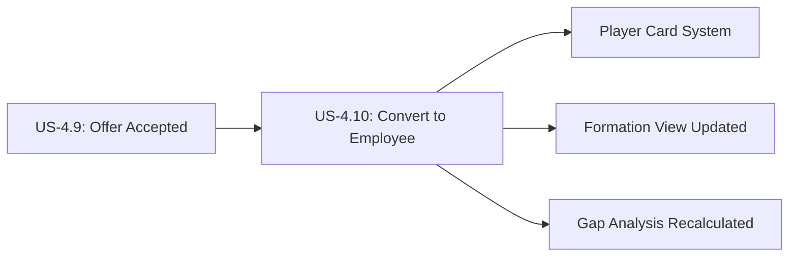

# Convert Hired Candidate to Employee (CRITICAL INTEGRATION)

**Story ID:** US-4.10  
**Epic:** Epic 0.7 - Scouting Network (ATS-Lite)  
**Persona:** Scout/Recruiter, HR Admin  
**Priority:** CRITICAL - Must Have  
**Complexity:** L (4-5 days)

---

## User Story

> **As a** Scout/Recruiter,  
> **I want to** convert hired candidates to employees with one click,  
> **So that** the new hire seamlessly becomes part of the team in the Player Card System and Formation View.

---

## User Journey Context

### Story Position in Journey



### Entry Points (How user arrives here)

| Entry Source | Condition | Pre-loaded Data | User State |
|--------------|-----------|-----------------|------------|
| Application with Offer_Accepted status | Candidate accepted job offer | application_id, candidate_id, offer_id | Ready to onboard |
| "Hired Candidates" dashboard | Viewing all accepted offers pending hire | List of candidates | Batch processing hires |
| Position Kanban "Hired" column | Application in final stage | Position context, application | Completing recruitment |
| Scheduled hire date reminder | Start date approaching | Candidates starting this week | Proactive onboarding |

### Exit Points (Where user goes after)

| Exit Condition | Destination | Data Passed | User State |
|----------------|-------------|-------------|------------|
| Success - Employee Created | Employee profile in Player Card System | employee_id, employee_code | Satisfied, onboarding begins |
| Success - Batch Hire | Hired candidates summary | List of employee_ids | Efficient processing |
| Success - Position Filled | Position closed notification | position_id, fill metrics | Position complete |
| Partial Success | Error log with successful/failed conversions | Mixed results | Needs to resolve failures |
| Failure - API Error | Error page with retry option | Error details | Frustrated, needs support |
| Validation Error | Same screen with error message | Form data preserved | Needs to fix issue |

### Story Dependencies (CRITICAL)

| Dependency | Type | Required Data | If Missing |
|------------|------|---------------|------------|
| **Player Card System API** | **CRITICAL** | Employee creation endpoint | **Show error: "Cannot convert - Player Card System unavailable"** |
| Formation View API | High Priority | Position slot update endpoint | Log warning, queue for retry |
| Gap Analysis | Medium Priority | Recalculation trigger | Log warning, can trigger manually |
| Club Setup - Departments | Must exist | Department from position | Error: "Department no longer exists" |
| Offer accepted | Must be true | Offer status = Accepted | Error: "Offer not accepted yet" |

### Stories That Depend on This

| Story ID | What It Needs | Data Provided |
|----------|---------------|---------------|
| Player Card System | New employee record | employee_id, all attributes |
| Formation View | Position filled notification | employee_id, position_id |
| Gap Analysis | Trigger for recalculation | New employee data |
| Onboarding (Future) | New hire to onboard | employee_id, start_date |

---

## Business Logic

### Business Rules (CRITICAL)

| Rule ID | Rule Name | Condition | Action | Error Message |
|---------|-----------|-----------|--------|---------------|
| **BR-010** | **Candidate to Employee Conversion** | Application status → Hired | Execute 9-step conversion process | "Conversion failed: {specific error}. Contact system administrator" |
| BR-011 | Position Closing | Application → Hired | If hired count >= headcount, close position | N/A (automated) |

### BR-010: Conversion Process (30-Step Critical Flow)

This is the MOST CRITICAL business rule in the entire Scouting Network feature.

**Automated Steps (System executes in sequence):**

1. **Validate Preconditions**
   - Offer status = Accepted
   - Offer not expired
   - Candidate status = Active (not already Hired or Blacklisted)
   - Position still exists
   - Department/Team still exist

2. **Create Employee Record in Player Card System**
   - API Call: `POST /api/v1/employees/from-candidate`
   - Payload: candidate_id, position_id, offer_id, start_date
   - Response: employee_id, employee_code

3. **Transfer Basic Information**
   - employee.first_name = candidate.first_name
   - employee.last_name = candidate.last_name
   - employee.email = candidate.email
   - employee.phone = candidate.phone
   - employee.linkedin_url = candidate.linkedin_url

4. **Transfer Player Card Attributes**
   - For each CandidateAttribute:
     - Create EmployeeAttribute with same attribute_id, score, notes
     - Preserve assessment history

5. **Set Employment Details from Position**
   - employee.department_id = position.department_id
   - employee.team_id = position.team_id (if set)
   - employee.position_title = position.title
   - employee.seniority_level = position.seniority_level

6. **Set Employment Details from Offer**
   - employee.hire_date = offer.start_date
   - employee.employment_type = offer.employment_type
   - employee.salary = offer.salary_offered
   - employee.status = Active (or Pending_Start if start_date is future)

7. **Update Candidate Record**
   - candidate.status = Hired
   - candidate.employee_id = new_employee_id
   - candidate.hired_at = current_timestamp

8. **Update Application Record**
   - application.status = Hired
   - application.hired_at = current_timestamp

9. **Update Offer Record**
   - offer.hired_at = current_timestamp

10. **Check Position Headcount (BR-011)**
    - Count hired applications for position
    - If count >= position.headcount → position.status = Filled

11. **Reject Remaining Applications (if position filled)**
    - For all other active applications on this position:
      - application.status = Rejected
      - rejection_reason = "Position filled"

12. **Update Formation View**
    - API Call: `POST /api/v1/formation/position-filled`
    - Payload: formation_position_id, employee_id
    - Formation slot now shows employee instead of open position

13. **Trigger Gap Analysis Recalculation**
    - API Call: `POST /api/v1/gap-analysis/recalculate`
    - Payload: department_id, team_id
    - Team strength scores updated with new employee

14. **Update Club Setup Department Headcount**
    - Increment department.employee_count
    - If team set, increment team.employee_count

15. **Create User Account (Optional)**
    - API Call: `POST /api/v1/auth/create-user`
    - Payload: employee_id, email, role
    - Generate temporary password, send welcome email

16. **Send Welcome Email to New Employee**
    - Template: "Welcome to {Company}"
    - Include: Start date, login credentials, onboarding checklist

17. **Notify Hiring Manager**
    - Email: "Position {title} filled - {candidate} starts on {date}"

18. **Notify Recruiter**
    - Email: "Hire complete: {candidate} → {employee_code}"

19. **Update Recruitment Analytics**
    - Time-to-hire metric = hired_at - application.applied_at
    - Source effectiveness: increment hired count for candidate.source_id
    - Position fill rate updated

20. **Create Audit Trail**
    - Log: "Candidate {candidate_code} converted to Employee {employee_code} by {user}"

**Transaction Safety:**
- Steps 1-20 must be atomic within database transaction
- If any step 1-10 fails → Rollback all changes, show error
- If step 11-20 fails → Employee still created, log error for async retry

### Data Requirements

**No new data entry required - all data comes from existing records:**

| Source | Fields Transferred | Destination |
|--------|-------------------|-------------|
| Candidate | first_name, last_name, email, phone, linkedin_url, current_ability, potential_ability | Employee |
| CandidateAttributes | All attribute scores (1-20 ratings) | EmployeeAttributes |
| Position | department_id, team_id, position_title, seniority_level, formation_position_id | Employee |
| Offer | start_date, employment_type, salary_offered | Employee.hire_date, employment_type, salary |

### State Transitions

| Current State | Event | Next State | Side Effects |
|---------------|-------|------------|--------------|
| Application: Offer_Accepted | Recruiter clicks "Complete Hire" | Application: Hired | BR-010 conversion executes |
| Candidate: Active | Conversion successful | Candidate: Hired | employee_id linked, hired_at recorded |
| Position: Active | Last headcount filled | Position: Filled | All active applications rejected |
| (None) | Conversion successful | Employee: Active (or Pending_Start) | New employee record created |

---

## Acceptance Criteria

### Scenario 1: Happy Path - Single Candidate Conversion Success

**Type:** ✅ Happy Path  
**Journey Position:** Entry → Complete Conversion → Exit  
**Covers:** BR-010 (all 20 steps)

**Given**
- Candidate "John Smith" (CAN-2026-025) has accepted offer for position "Senior Backend Developer" (POS-2026-005)
- Application (APP-2026-042) status = Offer_Accepted
- Offer (OFF-2026-018) status = Accepted, start_date = 2026-03-01, salary = ฿90,000
- Candidate has 5 rated attributes:
  - Backend Development: 18
  - Database Design: 17
  - System Architecture: 15
  - Communication: 16
  - Leadership: 14
- Position belongs to department "Engineering", team "Platform Team"
- Position headcount = 1, this is the first (and only) hire
- Player Card System API is available
- Formation View API is available
- I am logged in as Recruiter with "Complete Hire" permission

**When**
- I navigate to application APP-2026-042
- I click "Complete Hire" button
- System shows confirmation dialog: "Confirm hire for John Smith starting 2026-03-01?"
- I click "Confirm"

**Then - Employee Creation (Steps 1-6 of BR-010)**
- System validates: offer accepted ✓, candidate active ✓, position exists ✓, department exists ✓
- System calls Player Card System API: `POST /api/v1/employees/from-candidate`
- Player Card System creates Employee record
- Player Card System returns: employee_id = "emp-uuid-123", employee_code = "EMP-2026-050"
- Employee record has:
  - first_name: "John", last_name: "Smith"
  - email: "john.smith@example.com"
  - department_id: Engineering
  - team_id: Platform Team
  - position_title: "Senior Backend Developer"
  - hire_date: 2026-03-01
  - employment_type: Full-time
  - salary: ฿90,000
  - status: Pending_Start (since start_date is future)
- All 5 CandidateAttributes copied to EmployeeAttributes

**And - Update Records (Steps 7-11)**
- candidate.status = Hired
- candidate.employee_id = emp-uuid-123
- candidate.hired_at = {current timestamp}
- application.status = Hired
- offer.hired_at = {current timestamp}
- Position hired count = 1, headcount = 1 → position.status = Filled

**And - Integration Updates (Steps 12-14)**
- Formation View API called: Position slot updated to show EMP-2026-050
- Gap Analysis recalculation triggered for Engineering department
- Engineering department employee_count incremented by 1

**And - Notifications (Steps 16-18)**
- Welcome email sent to john.smith@example.com with start date and login info
- Hiring manager receives email: "Position Senior Backend Developer filled"
- Recruiter receives email: "Hire complete: John Smith → EMP-2026-050"

**And - Analytics & Audit (Steps 19-20)**
- Time-to-hire calculated: (hire date - application.applied_at) = {X} days
- Source "LinkedIn" hired count incremented
- Audit log: "Candidate CAN-2026-025 converted to Employee EMP-2026-050 by {recruiter}"

**And - User Confirmation**
- System shows success message: "Employee EMP-2026-050 created successfully. John Smith will start on 2026-03-01."
- System displays summary:
  - ✓ Employee record created
  - ✓ Formation View updated
  - ✓ Gap Analysis recalculated
  - ✓ Position marked as Filled
  - ✓ Welcome email sent
- "View Employee Profile" button links to EMP-2026-050 in Player Card System
- "View in Formation View" button links to updated formation

**Result:** Complete end-to-end conversion with all 20 steps successful ✅

---

### Scenario 2: Happy Path - Batch Hire Multiple Candidates

**Type:** ✅ Happy Path (Bulk Operation)

**Given**
- 3 candidates have accepted offers for different positions:
  - Jane Doe (CAN-2026-026) → Frontend Developer (POS-2026-006)
  - Alex Chen (CAN-2026-027) → Backend Developer (POS-2026-007)
  - Sarah Lee (CAN-2026-028) → DevOps Engineer (POS-2026-008)
- All applications status = Offer_Accepted
- All start dates = 2026-03-15

**When**
- I navigate to "Hired Candidates" dashboard
- System shows list of 3 candidates ready for conversion
- I select all 3 candidates (checkboxes)
- I click "Batch Complete Hire"
- System shows confirmation: "Convert 3 candidates to employees?"
- I confirm

**Then**
- System processes each conversion sequentially:
  - CAN-2026-026 → EMP-2026-051 ✓
  - CAN-2026-027 → EMP-2026-052 ✓
  - CAN-2026-028 → EMP-2026-053 ✓
- System shows progress: "Processing 1 of 3... 2 of 3... 3 of 3..."
- All 3 employees created successfully
- All 3 positions filled
- 3 welcome emails sent
- System shows summary:
  - "3 hires completed successfully"
  - "3 employees created: EMP-2026-051, EMP-2026-052, EMP-2026-053"
  - "3 positions filled"

---

### Scenario 3: Alternative Path - Future Start Date (Pending Start Status)

**Type:** 🔀 Alternative Path

**Given**
- Candidate accepted offer with start_date = 2026-04-01 (30 days in future)
- Current date = 2026-03-01

**When**
- I complete hire for this candidate

**Then**
- Employee created with status = "Pending_Start" (not "Active")
- Employee not yet shown in Formation View active roster
- Employee appears in "Upcoming Starts" list
- On 2026-04-01, system automatically:
  - Changes employee.status → Active
  - Adds to Formation View active roster
  - Sends "Your first day is today!" reminder email

---

### Scenario 4: Alternative Path - Returning Employee (Re-hire)

**Type:** 🔀 Alternative Path

**Given**
- Candidate "Michael Wong" has email "michael.wong@example.com"
- System detects an existing Employee record with same email from 2 years ago (EMP-2024-080)
- That employee status = Inactive (left company in 2024)
- Candidate has accepted new offer

**When**
- I complete hire for Michael Wong
- System detects existing employee record

**Then**
- System shows confirmation: "This candidate was previously employed as EMP-2024-080. Reactivate existing employee record or create new?"
- Options:
  - "Reactivate Existing Employee" → Update EMP-2024-080 (preserves history)
  - "Create New Employee" → Create EMP-2026-054 (fresh start)

**If Reactivate:**
- Update existing EMP-2024-080:
  - status: Inactive → Active
  - hire_date: 2026-03-01 (new hire date)
  - department/position updated to new role
  - Previous employment history preserved
  - Attribute scores updated from candidate profile
- Show: "Employee EMP-2024-080 reactivated successfully"

**If Create New:**
- Create new employee EMP-2026-054
- No link to previous employment
- Fresh record

---

### Scenario 5: Validation Error - Offer Not Accepted

**Type:** ❌ Validation Error  
**Journey Position:** Entry blocked

**Given**
- Application status = Offer_Sent (offer sent but not yet accepted)
- I attempt to complete hire prematurely

**When**
- I click "Complete Hire"

**Then**
- System validates offer.status
- System finds offer.status = Sent (not Accepted)
- System shows error: "Cannot hire: Offer has not been accepted by candidate"
- System suggests: "Wait for candidate to accept offer, or withdraw and create new offer"
- "Complete Hire" button remains disabled
- Application remains in Offer_Sent status

**Recovery**
- Wait for candidate to accept offer
- Once accepted, "Complete Hire" button becomes enabled
- Can proceed with conversion

---

### Scenario 6: Validation Error - Offer Expired

**Type:** ❌ Validation Error

**Given**
- Offer was sent on 2026-02-01 with valid_until = 2026-02-08
- Candidate never responded
- Offer status = Expired (auto-expired by BR-014)
- Application status = Offer_Rejected

**When**
- I attempt to complete hire

**Then**
- System validates offer status
- System shows error: "Cannot hire: Offer has expired"
- System suggests: "Create new offer if candidate is still interested"
- Cannot proceed with conversion

**Recovery**
- Create new offer with new expiration date
- Candidate must accept new offer
- Then can complete hire

---

### Scenario 7: Validation Error - Candidate Already Hired

**Type:** ❌ Validation Error (Duplicate Prevention)

**Given**
- Candidate "Jane Doe" was hired yesterday for position A
- candidate.status = Hired
- candidate.employee_id = EMP-2026-051
- There's another application for position B that was never closed
- I attempt to hire Jane Doe again for position B

**When**
- I click "Complete Hire" on position B application

**Then**
- System validates candidate.status
- System finds candidate already Hired
- System shows error: "Cannot hire: Candidate Jane Doe is already an employee (EMP-2026-051)"
- System suggests: "This candidate was hired on {date} for {position A}. Please close this application."
- Conversion is prevented

**Recovery**
- Mark this application as "Withdrew" or "Rejected"
- Candidate remains as EMP-2026-051

---

### Scenario 8: Business Rule Error - Department Deleted During Process

**Type:** ⚠️ Business Rule Error (Data Integrity)

**Given**
- Candidate accepted offer for position in "Research & Development" department
- While offer is pending, HR Admin deletes "Research & Development" department
- I attempt to complete hire

**When**
- System executes BR-010 step 1 (validate preconditions)
- System validates position.department_id still exists

**Then**
- System finds department no longer exists
- System shows error: "Cannot assign employee: Department 'Research & Development' has been deleted"
- System suggests: "Please reassign position to a valid department or restore the deleted department"
- Conversion is blocked

**Recovery Option 1:**
- Update position to different department
- Retry hire (will use new department)

**Recovery Option 2:**
- Restore deleted department
- Retry hire

---

### Scenario 9: Integration Error - Player Card System API Failure (CRITICAL)

**Type:** ⚠️ Integration Error (System Dependency)  
**Journey Position:** Mid-conversion failure

**Given**
- All preconditions valid (offer accepted, candidate active, etc.)
- Player Card System API is temporarily down or unreachable
- I click "Complete Hire"

**When**
- System executes BR-010 step 2 (Create Employee in Player Card System)
- API call fails with network error or 503 Service Unavailable

**Then**
- System detects API failure
- System rolls back any partial changes (transaction rollback)
- System shows error: "Employee creation failed: Player Card System is temporarily unavailable"
- System provides detailed error: "{API error message}"
- System suggests: "Please try again in a few minutes, or contact system administrator if problem persists"
- Application remains in Offer_Accepted status (unchanged)
- Candidate remains in Active status (unchanged)
- NO partial employee record created

**Recovery:**
- Wait for Player Card System to be available
- Click "Retry Conversion" button
- If successful on retry, conversion completes normally

**Automatic Retry Logic:**
- System queues failed conversion for automatic retry
- Retries every 5 minutes (max 3 attempts)
- If all retries fail, send alert to system admin
- Recruiter can manually retry at any time

---

### Scenario 10: Integration Error - Formation View Update Failure (Non-Blocking)

**Type:** ⚠️ Integration Error (Partial Failure)

**Given**
- Employee creation successful (steps 1-10 complete)
- Formation View API is temporarily unavailable
- System attempts step 12 (Update Formation View)

**When**
- API call to Formation View fails

**Then**
- System logs warning: "Formation View update failed - will retry asynchronously"
- System DOES NOT rollback employee creation (employee is created successfully)
- System continues with remaining steps (Gap Analysis, notifications, etc.)
- System shows success message: "Employee EMP-2026-050 created successfully"
- System shows warning badge: "⚠️ Formation View update pending - will retry automatically"
- Employee record is fully created and valid
- Formation View update is queued for async retry

**Async Retry:**
- System retries Formation View update every 10 minutes
- Once successful, warning badge disappears
- User can manually trigger "Refresh Formation View" if needed

**Reasoning:** Employee creation is the critical path. Formation View update failure should not block hire.

---

### Scenario 11: Integration Error - Gap Analysis Recalculation Failure (Non-Critical)

**Type:** ⚠️ Integration Error (Non-Blocking)

**Given**
- Employee creation successful
- Gap Analysis service is slow or unresponsive
- System attempts step 13 (Trigger Gap Analysis)

**When**
- API call times out after 5 seconds

**Then**
- System logs warning: "Gap Analysis recalculation timeout - skipped"
- System continues (does not block conversion)
- System shows success message with note: "⚠️ Gap Analysis will be recalculated on next scheduled run"
- Employee creation completes successfully
- Gap Analysis can be manually triggered later from Gap Analysis dashboard

**Reasoning:** Gap Analysis is analytical, not transactional. Failure should not block hire.

---

### Scenario 12: Partial Failure - Email Delivery Failure (Non-Blocking)

**Type:** ⚠️ Integration Error (Communication Failure)

**Given**
- Employee creation successful (steps 1-15 complete)
- Email service (SendGrid/SES) is down
- System attempts step 16 (Send Welcome Email)

**When**
- Email send fails with SMTP error

**Then**
- System logs warning: "Welcome email failed - queued for retry"
- System continues with conversion (does not block)
- System shows success: "Employee created. Welcome email will be sent when email service is available."
- Email is queued in outbox for retry
- System retries email send every hour (max 24 hours)
- If all retries fail, notify HR admin to manually send welcome email

**Reasoning:** Email failure should not block employee creation. Can be retried.

---

### Scenario 13: Permission Denied - Non-Recruiter Attempts Hire

**Type:** 🔒 Permission Denied  
**Journey Position:** Entry blocked

**Given**
- I am logged in as Interviewer (not Recruiter/HR Admin)
- I can view applications but cannot complete hires
- Application is in Offer_Accepted status

**When**
- I attempt to click "Complete Hire" button

**Then**
- "Complete Hire" button is hidden/disabled (UI permission check)
- If I attempt direct API call, system checks permissions
- System shows: "Access Denied: You do not have permission to complete hires"
- System suggests: "Contact your recruiter or HR admin to complete this hire"
- Application status unchanged

**Allowed Roles:**
- ✅ Scout/Recruiter
- ✅ HR Admin
- ✅ System Admin
- ❌ Hiring Manager (can approve offers but not complete hire)
- ❌ Interviewer
- ❌ Employee

---

### Scenario 14: Loop/Retry - Retry Failed Conversion

**Type:** 🔄 Loop/Retry  
**Journey Position:** Recovery from failure

**Given**
- Previous conversion attempt failed due to Player Card System API error
- Application still in Offer_Accepted status
- Player Card System is now available

**When**
- I navigate back to application
- I click "Retry Conversion" button
- System re-executes BR-010 from step 1

**Then**
- System validates preconditions again (offer still accepted, etc.)
- System successfully creates employee this time
- Conversion completes normally
- Application status → Hired
- System shows: "Employee EMP-2026-050 created successfully (retry succeeded)"

**Loop Capability:**
- Failed conversions can be retried unlimited times
- Each retry starts from step 1 (full validation)
- System tracks retry attempts in audit log
- After 3 manual retries, system suggests contacting support

---

### Scenario 15: Concurrent Modification - Position Deleted During Conversion

**Type:** ⚡ Concurrent (Race Condition)

**Given**
- I am completing hire for application to position POS-2026-010
- At the same time, HR Admin deletes position POS-2026-010
- Conversion process is in progress

**When**
- System reaches step 10 (Check Position Headcount)
- Position no longer exists in database

**Then**
- System detects position deleted
- System rolls back employee creation
- System shows error: "Conversion failed: Position POS-2026-010 was deleted during hire process"
- System suggests: "This is unusual. Contact HR admin to understand why position was deleted."
- Application remains in Offer_Accepted status
- Candidate remains Active

**Recovery:**
- If position deletion was mistake: Restore position, retry conversion
- If position deletion was intentional: Close application, inform candidate

---

### Scenario 16: Concurrent Modification - Candidate Hired by Different Recruiter

**Type:** ⚡ Concurrent (Duplicate Prevention)

**Given**
- Recruiter A is completing hire for candidate Jane (application to position A)
- Recruiter B simultaneously completes hire for same candidate Jane (application to position B)
- Both clicks happen within 1 second

**When**
- Recruiter A's transaction starts first
- Recruiter A's conversion completes: candidate.status → Hired
- Recruiter B's transaction attempts to create employee

**Then**
- Recruiter B's transaction validates candidate.status
- System finds candidate.status = Hired (changed by Recruiter A)
- System rolls back Recruiter B's transaction
- Recruiter B sees error: "Candidate was just hired by another recruiter for position {A}"
- Only ONE employee record created (from Recruiter A)

**Database Lock:**
- System uses row-level lock on candidate record during conversion
- Prevents true concurrent modification
- Second transaction waits or fails fast

---

### Scenario 17: Empty State - No Candidates Ready for Hire

**Type:** 📭 Empty State  
**Journey Position:** Dashboard view

**Given**
- NO applications currently have status = Offer_Accepted
- All candidates are in earlier pipeline stages

**When**
- I navigate to "Ready to Hire" dashboard

**Then**
- System shows empty state illustration
- Message: "No candidates ready to hire. All offers are either pending or not yet sent."
- Shows summary: "5 offers pending acceptance, 3 offers in draft"
- Button: "View All Applications" to see pipeline
- No hire actions available

---

### Scenario 18: Session Timeout - Long Confirmation Dialog

**Type:** ⏰ Timeout  
**Journey Position:** Mid-action timeout

**Given**
- I click "Complete Hire" button
- Confirmation dialog opens
- I get distracted and don't confirm for 35 minutes
- Session timeout is 30 minutes

**When**
- I return and click "Confirm" in dialog

**Then**
- System detects session expired
- System shows: "Your session has expired. Please log in again to complete this hire."
- No conversion is executed
- After re-login:
  - System returns to application detail page
  - Application still in Offer_Accepted status (unchanged)
  - I can click "Complete Hire" again

**Prevention:**
- Confirmation dialog should have timeout indicator
- Auto-close dialog after 5 minutes of inactivity

---

### Scenario 19: Data Integrity - Duplicate Employee Code Prevention

**Type:** ⚠️ Data Integrity (Extreme Edge Case)

**Given**
- Employee codes follow format EMP-{YEAR}-{SEQUENCE}
- Rare scenario: Two conversions happen simultaneously on Dec 31, 2025 11:59:59 PM
- Both get assigned code EMP-2025-500 due to race condition

**When**
- Database constraint violation (employee_code unique index)

**Then**
- Second transaction fails with unique constraint error
- System retries with next sequence number
- Second employee gets EMP-2025-501 or EMP-2026-001 (if year changed)
- Both employees created successfully with unique codes
- System logs warning about near-collision

---

### Scenario 20: Rollback - Transaction Failure Mid-Conversion

**Type:** ⚠️ System Error (Critical Rollback)

**Given**
- Conversion starts successfully
- Employee created in Player Card System (step 2-6 complete)
- Database connection lost during step 7 (Update Candidate Record)

**When**
- Database transaction fails mid-execution

**Then**
- System executes full rollback:
  - Delete employee record from Player Card System (compensating transaction)
  - Rollback all database changes
  - Candidate remains Active (unchanged)
  - Application remains Offer_Accepted (unchanged)
- System shows error: "Conversion failed due to system error. No changes were made."
- System logs full error trace for debugging
- System sends alert to system admin

**Recovery:**
- User can retry conversion once system is stable
- All data is consistent (no partial updates)

---

## Scenario Coverage Checklist

| # | Type | Scenario # | Covered |
|---|------|------------|---------|
| 1 | Happy Path | Scenarios 1, 2 | ✓ |
| 2 | Alternative Path | Scenarios 3, 4 | ✓ |
| 3 | Validation Error | Scenarios 5, 6, 7 | ✓ |
| 4 | Business Rule Error | Scenario 8 | ✓ |
| 5 | Integration Errors | Scenarios 9, 10, 11, 12 | ✓ |
| 6 | Permission Denied | Scenario 13 | ✓ |
| 7 | Loop/Retry | Scenario 14 | ✓ |
| 8 | Concurrent Modification | Scenarios 15, 16 | ✓ |
| 9 | Empty State | Scenario 17 | ✓ |
| 10 | Session Timeout | Scenario 18 | ✓ |
| 11 | Data Integrity | Scenarios 19, 20 | ✓ (bonus) |

**Total Scenarios:** 20  
**Coverage:** Complete ✅

---

## Technical Implementation Notes

### API Contract: Player Card System Integration

**Endpoint:** `POST /api/v1/employees/from-candidate`

**Request:**
```json
{
  "candidate_id": "uuid",
  "position_id": "uuid",
  "offer_id": "uuid",
  "start_date": "2026-03-01",
  "created_by": "user_uuid"
}
```

**Response (Success 201):**
```json
{
  "employee_id": "uuid",
  "employee_code": "EMP-2026-050",
  "status": "success",
  "message": "Employee created successfully from candidate"
}
```

**Response (Error 400):**
```json
{
  "status": "error",
  "code": "INVALID_CANDIDATE",
  "message": "Candidate is not in valid state for conversion",
  "details": {
    "candidate_status": "Hired",
    "reason": "Candidate already converted to employee EMP-2026-045"
  }
}
```

**Response (Error 503):**
```json
{
  "status": "error",
  "code": "SERVICE_UNAVAILABLE",
  "message": "Player Card System is temporarily unavailable",
  "retry_after": 300
}
```

### Transaction Management

**Database Transaction (Steps 1-11):**
```sql
BEGIN TRANSACTION;

-- Step 1: Validate
SELECT status FROM candidates WHERE id = ? FOR UPDATE;
SELECT status FROM offers WHERE id = ? FOR UPDATE;

-- Steps 2-6: Create employee via API (external call)
-- If API fails, ROLLBACK

-- Steps 7-9: Update records
UPDATE candidates SET status='Hired', employee_id=?, hired_at=NOW() WHERE id=?;
UPDATE applications SET status='Hired', hired_at=NOW() WHERE id=?;
UPDATE offers SET hired_at=NOW() WHERE id=?;

-- Steps 10-11: Position headcount
UPDATE positions SET status='Filled' WHERE id=? AND hired_count >= headcount;

COMMIT;
```

**Compensating Transaction (on API failure):**
```javascript
try {
  // Attempt employee creation
  const employee = await playerCardApi.createEmployeeFromCandidate(data);
  
  // Update local records
  await updateCandidateAndApplication();
  
} catch (apiError) {
  // Rollback: Delete employee if partially created
  if (employee?.id) {
    await playerCardApi.deleteEmployee(employee.id);
  }
  
  // Rollback database transaction
  await db.rollback();
  
  throw new ConversionError('Employee creation failed', apiError);
}
```

### Retry Queue Implementation

**Failed Conversion Queue:**
- Store failed conversion attempts in `conversion_retry_queue` table
- Fields: application_id, attempt_count, last_error, next_retry_at, max_retries
- Background job runs every 5 minutes
- Retries queued conversions (max 3 attempts)
- After max retries, flag for manual intervention

**Async Integration Retry Queue:**
- Formation View updates queued separately
- Gap Analysis updates queued separately
- Email sends queued separately
- Non-blocking retries don't prevent hire completion

### Monitoring & Alerts

**Critical Alerts (Immediate):**
- Player Card System API down (>3 failures in 5 minutes)
- Database connection lost during conversion
- More than 5 failed conversions in 1 hour

**Warning Alerts (Next Day Review):**
- Formation View update failures
- Gap Analysis recalculation failures
- Email delivery failures

**Metrics to Track:**
- Conversion success rate (target: >99%)
- Average conversion time (target: <5 seconds)
- API failure rate (target: <1%)
- Retry success rate

---

## UI/UX Requirements

### Conversion Confirmation Dialog

**Layout:**
```
╔════════════════════════════════════════════╗
║  Confirm Hire                              ║
╠════════════════════════════════════════════╣
║                                            ║
║  Candidate: John Smith (CAN-2026-025)      ║
║  Position: Senior Backend Developer        ║
║  Department: Engineering                   ║
║  Start Date: March 1, 2026                 ║
║  Salary: ฿90,000/month                     ║
║                                            ║
║  This will:                                ║
║  ✓ Create employee record                  ║
║  ✓ Update Formation View                   ║
║  ✓ Close this position (headcount filled)  ║
║  ✓ Send welcome email to candidate         ║
║                                            ║
║  ⚠️ This action cannot be undone           ║
║                                            ║
║  [Cancel]            [Confirm Hire] ←      ║
╚════════════════════════════════════════════╝
```

### Processing Indicator

**During Conversion (5-10 seconds):**
```
╔════════════════════════════════════════════╗
║  Creating Employee...                      ║
╠════════════════════════════════════════════╣
║                                            ║
║  ⏳ Step 1/5: Creating employee record...  ║
║  ✓ Step 2/5: Transferring attributes      ║
║  ⏳ Step 3/5: Updating Formation View...   ║
║  ⏳ Step 4/5: Sending notifications...     ║
║  - Step 5/5: Finalizing...                ║
║                                            ║
║  [████████░░] 80%                          ║
╚════════════════════════════════════════════╝
```

### Success Confirmation

**After Successful Conversion:**
```
╔════════════════════════════════════════════╗
║  ✅ Employee Created Successfully          ║
╠════════════════════════════════════════════╣
║                                            ║
║  John Smith → EMP-2026-050                 ║
║  Start Date: March 1, 2026                 ║
║                                            ║
║  Actions completed:                        ║
║  ✓ Employee record created                 ║
║  ✓ Formation View updated                  ║
║  ✓ Gap Analysis recalculated              ║
║  ✓ Position marked as Filled              ║
║  ✓ Welcome email sent                     ║
║                                            ║
║  [View Employee Profile]  [View Formation] ║
║                      [Done]                ║
╚════════════════════════════════════════════╝
```

### Error Display

**On API Failure:**
```
╔════════════════════════════════════════════╗
║  ❌ Employee Creation Failed               ║
╠════════════════════════════════════════════╣
║                                            ║
║  Player Card System is temporarily         ║
║  unavailable.                              ║
║                                            ║
║  Error: Connection timeout (503)           ║
║                                            ║
║  No changes were made. You can retry.      ║
║                                            ║
║  [View Error Details]        [Retry Now]   ║
║  [Cancel]                                  ║
╚════════════════════════════════════════════╝
```

---

**END OF US-4.10 DETAILED SPECIFICATION**

---

## Summary

US-4.10 is the **MOST CRITICAL** story in the Scouting Network feature. It completes the recruitment loop by:

1. ✅ Converting candidates to employees seamlessly
2. ✅ Integrating with Player Card System (critical dependency)
3. ✅ Updating Formation View automatically
4. ✅ Recalculating Gap Analysis
5. ✅ Handling all error scenarios gracefully
6. ✅ Maintaining data integrity through transactions
7. ✅ Providing retry mechanisms for failures
8. ✅ Ensuring atomic operations (all or nothing)

**Key Success Criteria:**
- 99%+ conversion success rate
- <5 second average conversion time
- Zero partial conversions (transaction safety)
- Graceful degradation when integrations fail
- Clear error messages and recovery paths

This story is the bridge between recruitment and team management, making AscendHR a unified platform.
