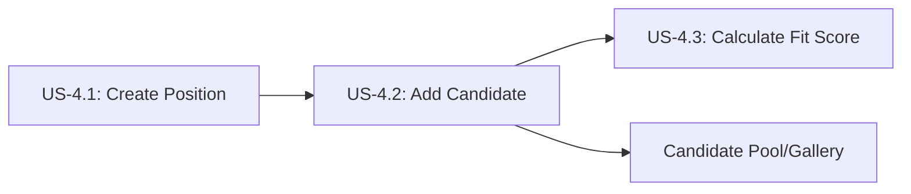

# Add Candidate to Scouting Network

**Story ID:** US-4.2  
**Epic:** Epic 0.7 - Scouting Network (ATS-Lite)  
**Persona:** Scout/Recruiter, HR Admin, Hiring Manager  
**Priority:** Must Have  
**Complexity:** M (2-3 days)

---

## User Story

> **As a** Scout/Recruiter,  
> **I want to** add candidates to the scouting network with their Player Card attributes,  
> **So that** I can build a talent pool and evaluate candidates against position requirements.

---

## User Journey Context

### Story Position in Journey

### Entry Points (How user arrives here)

| Entry Source | Condition | Pre-loaded Data | User State |
|--------------|-----------|-----------------|------------|
| Scouting Network "Add Candidate" button | Recruiter sourcing candidates | None | Proactive recruiting |
| Candidate Pool "+" button | Viewing candidate pool | None | Building talent pipeline |
| Position Kanban "Add to Position" | Specific position needs candidates | position_id | Filling specific role |
| Employee referral link | Employee refers someone | referrer_employee_id, referral source | Processing referral |
| Import from external source | CSV/LinkedIn import | Candidate basic data | Bulk adding |

### Exit Points (Where user goes after)

| Exit Condition | Destination | Data Passed | User State |
|----------------|-------------|-------------|------------|
| Success (Candidate Added) | Candidate detail page | candidate_id, candidate_code | Can view/edit candidate |
| Success (Quick Add) | Candidate pool list | candidate_id | Can add more candidates |
| Success (Add to Position) | Position Kanban | candidate_id, application_id | Candidate in pipeline |
| Cancel | Previous screen | None | Unchanged |
| Duplicate Error | Existing candidate profile | existing_candidate_id | Can link or update |
| Validation Error | Same form | Form data preserved | Needs to fix errors |

### Story Dependencies

| Dependency | Type | Required Data | If Missing |
|------------|------|---------------|------------|
| Player Card System - Attributes | Must exist | Attribute definitions for rating | Show error: "Attributes not configured" |
| Sources configured | Should exist | Source list (LinkedIn, Referral, etc.) | Use default "Other" source |
| Foundation Auth - User Permissions | Must have | Scout, Manager, or HR Admin role | Permission denied |

### Stories That Depend on This

| Story ID | What It Needs | Data Provided |
|----------|---------------|---------------|
| US-4.3 | Candidate attributes for fit score | candidate_id, candidate_attributes |
| US-4.4 | Candidates to display in Kanban | candidate details |
| US-4.5 | Candidate to move through pipeline | candidate_id |
| US-4.11 | Source data for effectiveness tracking | source_id, candidate outcomes |

---

## Business Logic

### Business Rules

| Rule ID | Rule Name | Condition | Action | Error Message |
|---------|-----------|-----------|--------|---------------|
| BR-005 | Candidate Email Uniqueness | On create/update | Validate email is unique (case-insensitive) | "A candidate with email {email} already exists (Candidate ID: {id})" |
| BR-020 | Candidate Code Auto-Generation | On candidate create | Generate CAN-{YEAR}-{SEQUENCE} | N/A (automated) |

### Data Requirements

| Field ID | Field Name | Type | Required | Validation | Default | Notes |
|----------|------------|------|----------|------------|---------|-------|
| first_name | First Name | string | Yes | 2-50 chars, letters only | - | No numbers/special chars |
| last_name | Last Name | string | Yes | 2-50 chars, letters only | - | No numbers/special chars |
| email | Email Address | email | Yes | Valid email format, unique | - | Used for communication |
| phone | Phone Number | string | No | Valid international format | null | E.164 format preferred |
| linkedin_url | LinkedIn URL | url | No | Must start with https://linkedin.com or https://www.linkedin.com | null | Profile link |
| portfolio_url | Portfolio/Website | url | No | Valid URL | null | Work samples |
| current_company | Current Company | string | No | Max 100 chars | null | Where they work now |
| current_title | Current Title | string | No | Max 100 chars | null | Their current role |
| years_experience | Years of Experience | integer | No | 0-50 | null | Total work experience |
| location | Location | string | No | Max 100 chars | null | City, Country |
| source_id | Source | UUID (select) | Yes | Must exist in Sources table | "Direct Application" | How we found them |
| source_details | Source Details | string | No | Max 500 chars | null | E.g., "Referred by John Doe" |
| resume_url | Resume File | file | No | PDF, DOC, DOCX; max 10MB | null | Cloud storage path |
| cover_letter | Cover Letter | text | No | Max 5,000 chars | null | Application letter |
| current_ability | Current Ability | integer | Yes | 1-20 | - | Overall current skill level |
| potential_ability | Potential Ability | integer | Yes | 1-20 | - | Growth potential estimate |

### Candidate Attributes (Child Entity - Player Card)

| Field ID | Field Name | Type | Required | Validation | Default | Notes |
|----------|------------|------|----------|------------|---------|-------|
| attribute_id | Attribute | UUID (select) | Yes | Must exist in Player Card System | - | Skill/capability |
| score | Score | integer | Yes | 1-20 | - | Rating for this attribute |
| assessed_by | Assessed By | UUID | Auto | Current user | current_user | Who rated this |
| assessed_at | Assessment Date | timestamp | Auto | - | now() | When rated |
| notes | Rating Notes | text | No | Max 500 chars | null | Rationale for score |

### State Transitions

| Current State | Event | Next State | Side Effects |
|---------------|-------|------------|--------------|
| (None) | User creates candidate | Active | candidate_code generated (BR-020) |
| Active | User deactivates | Inactive | Removed from active searches |
| Inactive | User reactivates | Active | Available for positions |
| Active | Candidate hired (any position) | Hired | candidate.employee_id set, hired_at recorded |
| Active | HR Admin blacklists | Blacklisted | Cannot be added to positions (BR-017) |

### Calculated Fields

| Field | Formula | Triggers |
|-------|---------|----------|
| candidate_code | CAN-{YEAR}-{SEQUENCE} | On create (BR-020) |
| age | today - birth_date (if collected) | On view |
| days_in_pool | today - created_at | On view |

---

## Acceptance Criteria

### Scenario 1: Happy Path - Add Complete Candidate Profile

**Type:** ✅ Happy Path  
**Journey Position:** Entry → Middle → Exit  
**Covers:** Main Flow steps 1 → 20

**Given**
- I am logged in as Scout/Recruiter with "Add Candidate" permission
- Player Card attributes are configured (Backend Development, Database Design, Communication, etc.)
- Sources are configured (LinkedIn, Employee Referral, Indeed, etc.)
- I navigated from Scouting Network

**When**
- I click "Add Candidate" button
- I enter first name: "John"
- I enter last name: "Smith"
- I enter email: "john.smith@example.com"
- I enter phone: "+66-81-234-5678"
- I enter LinkedIn URL: "https://www.linkedin.com/in/johnsmith"
- I enter current company: "Tech Corp"
- I enter current title: "Backend Developer"
- I enter years experience: 8
- I enter location: "Bangkok, Thailand"
- I select source: "LinkedIn"
- I add source details: "Found via job posting search"
- I upload resume: "john_smith_resume.pdf" (2.5 MB)
- I rate attributes:
  - Backend Development: 18/20 with note "Strong Python/Node.js skills"
  - Database Design: 16/20 with note "PostgreSQL expert"
  - System Architecture: 14/20
  - Communication: 15/20
  - Leadership: 12/20
- I set Current Ability: 16/20
- I set Potential Ability: 18/20
- I click "Save Candidate"

**Then**
- System validates email uniqueness (BR-005): "john.smith@example.com" not in database
- System validates all required fields are present
- System validates file size < 10 MB
- System generates candidate code: "CAN-2026-001" (BR-020)
- System creates Candidate record with status = "Active"
- System uploads resume to cloud storage, stores URL
- System creates 5 CandidateAttribute records
- System sets assessed_by = current_user for all attributes
- System shows success message: "Candidate John Smith (CAN-2026-001) added successfully"
- System redirects to candidate detail page

**And** (Side Effects)
- Candidate appears in candidate pool list
- Candidate is searchable by name/email/skills
- System logs audit trail: "Candidate CAN-2026-001 created by {user}"
- If source is "Employee Referral", referrer is linked for bonus tracking

---

### Scenario 2: Alternative Path - Quick Add (Minimal Info)

**Type:** 🔀 Alternative Path  
**Journey Position:** Entry → Quick Exit

**Given**
- I am a Scout quickly adding multiple candidates from a job board
- I want to save basic info now, complete profiles later

**When**
- I click "Add Candidate"
- I enter only required fields:
  - First name: "Jane"
  - Last name: "Doe"
  - Email: "jane.doe@example.com"
  - Source: "Indeed"
  - Current Ability: 14
  - Potential Ability: 16
- I skip all optional fields (no phone, no resume, no detailed attributes)
- I click "Save & Add Another" (instead of "Save Candidate")

**Then**
- System creates candidate with minimal info: CAN-2026-002
- Candidate status = "Active"
- Candidate attributes are empty (can be added later)
- System shows toast: "Candidate Jane Doe added"
- Form clears and remains open for adding next candidate
- I can quickly add more candidates in succession

---

### Scenario 3: Alternative Path - Add Candidate Directly to Position

**Type:** 🔀 Alternative Path  
**Journey Position:** Entry from Position Context → Create Application

**Given**
- I am viewing Position "Senior Backend Developer" (POS-2026-001) in Kanban
- Position has defined requirements (Backend 16, Database 14, Architecture 12)
- I found a great candidate on LinkedIn

**When**
- I click "Add Candidate to This Position" from position Kanban
- System opens candidate creation form with position context
- I enter candidate details: "Alex Chen", "alex.chen@example.com", LinkedIn source
- I rate attributes: Backend 18, Database 17, Architecture 15
- I set Current Ability: 17, Potential: 18
- I click "Add & Apply to Position"

**Then**
- System creates Candidate record: CAN-2026-003
- System automatically creates Application record linking candidate to POS-2026-001
- System calculates fit score: (18×0.5 + 17×0.3 + 15×0.2) / (16×0.5 + 14×0.3 + 12×0.2) = 109% (US-4.3)
- System shows: "Candidate Alex Chen added and applied to Senior Backend Developer"
- System redirects to position Kanban showing new application card with 109% fit score
- Application status = "New"

---

### Scenario 4: Alternative Path - Employee Referral

**Type:** 🔀 Alternative Path  
**Journey Position:** Entry via Referral

**Given**
- Employee "Sarah Lee" (EMP-2026-015) wants to refer her former colleague
- System has "Employee Referral" source configured
- Referral bonus program is active

**When**
- Sarah navigates to "Refer a Candidate" (available to all employees)
- System opens simplified referral form
- Sarah enters:
  - Friend's name: "Michael Wong"
  - Email: "michael.wong@example.com"
  - LinkedIn: "https://linkedin.com/in/michaelwong"
  - Reason for referral: "Excellent backend developer, worked together for 3 years"
- System pre-fills source: "Employee Referral"
- System pre-fills source_details: "Referred by Sarah Lee (EMP-2026-015)"
- Sarah clicks "Submit Referral"

**Then**
- System creates Candidate record: CAN-2026-004
- Source = "Employee Referral"
- source_details includes referrer ID
- System links referrer_employee_id = EMP-2026-015 (for bonus tracking)
- System sends notification to recruiting team about new referral
- System sends thank-you email to Sarah
- Sarah can track referral status in "My Referrals" dashboard
- If candidate is hired, Sarah becomes eligible for referral bonus (tracked in US-4.11)

---

### Scenario 5: Validation Error - Invalid Email Format

**Type:** ❌ Validation Error  
**Journey Position:** Middle → Loop back

**Given**
- I am adding a candidate
- I enter email: "invalid-email-format" (no @ symbol)

**When**
- I tab out of email field or click save

**Then**
- System validates email format
- System shows inline error: "Please enter a valid email address"
- Field is highlighted in red
- Save button is disabled
- Other valid fields retain their values
- Focus moves to email field

**Recovery**
- I correct email to: "valid.email@example.com"
- Error message disappears
- Save button is enabled
- I can successfully save candidate

---

### Scenario 6: Validation Error - Name Contains Numbers

**Type:** ❌ Validation Error

**Given**
- I enter first name: "John123"

**When**
- I tab out or attempt to save

**Then**
- System shows error: "Name can only contain letters and spaces"
- Field highlighted in red

**Recovery**
- I correct to: "John"
- Error clears

---

### Scenario 7: Validation Error - Resume File Too Large

**Type:** ❌ Validation Error

**Given**
- I attempt to upload resume file: "detailed_portfolio.pdf" (15 MB)
- Maximum allowed size is 10 MB

**When**
- I select the file

**Then**
- System checks file size
- System shows error: "Resume file must be less than 10 MB. Current file: 15 MB"
- File upload is rejected
- No file is attached

**Recovery**
- I compress the PDF to 8 MB
- I upload compressed version
- Upload succeeds

---

### Scenario 8: Validation Error - Invalid Attribute Score

**Type:** ❌ Validation Error

**Given**
- I am rating candidate attributes
- I enter Backend Development score: 25 (outside 1-20 range)

**When**
- I tab out of field

**Then**
- System shows error: "Score must be between 1 and 20"
- Field highlighted
- Value is reset or constrained to valid range

**Recovery**
- I enter valid score: 18
- Error clears

---

### Scenario 9: Business Rule Error - Duplicate Email

**Type:** ⚠️ Business Rule Error  
**Covers:** BR-005

**Given**
- Candidate "John Smith" with email "john.smith@example.com" already exists (CAN-2026-001)
- I am adding a new candidate

**When**
- I enter email: "JOHN.SMITH@EXAMPLE.COM" (same email, different case)
- I fill other fields: "Jonathan", "Smith"
- I click "Save Candidate"

**Then**
- System validates email uniqueness (case-insensitive)
- System finds existing candidate CAN-2026-001
- System shows error: "A candidate with email john.smith@example.com already exists (Candidate ID: CAN-2026-001)"
- System offers options:
  - "View Existing Candidate" → Navigate to CAN-2026-001 profile
  - "Update Email" → Allow me to change email if this is different person
- Save is prevented

**Recovery Option 1: Same Person**
- I click "View Existing Candidate"
- System navigates to existing profile
- I can update that candidate instead

**Recovery Option 2: Different Person**
- I realize email is typo or conflict
- I correct email to: "jonathan.smith@example.com"
- Validation passes, new candidate created

---

### Scenario 10: Permission Denied - Employee Tries to Add Candidate

**Type:** 🔒 Permission Denied  
**Journey Position:** Entry blocked

**Given**
- I am logged in as regular Employee (not Scout/Recruiter/Manager/HR Admin)
- I do NOT have "Add Candidate" permission
- Employees can only refer candidates via referral form

**When**
- I attempt to navigate to candidate creation page via URL

**Then**
- System checks user permissions
- System shows "Access Denied" page
- Message: "You do not have permission to add candidates directly. You can refer candidates via the Referral Program."
- Link to "Refer a Candidate" form is provided
- "Add Candidate" menu item is hidden for employees

---

### Scenario 11: Edit/Update Loop - Edit Candidate Profile

**Type:** 🔄 Loop/Retry  
**Journey Position:** Edit existing

**Given**
- Candidate "Jane Doe" (CAN-2026-002) exists with minimal info
- I am viewing candidate profile

**When**
- I click "Edit Profile"
- I add missing info:
  - Phone: "+66-81-999-8888"
  - LinkedIn URL: "https://linkedin.com/in/janedoe"
  - Upload resume (that was missing)
- I update Current Ability from 14 to 15 (after reviewing resume)
- I add attribute ratings:
  - Frontend Development: 16
  - UI/UX Design: 17
  - Communication: 15
- I click "Save Changes"

**Then**
- System updates Candidate record CAN-2026-002
- System creates new CandidateAttribute records
- System updates current_ability
- System records updated_at timestamp
- System shows: "Candidate profile updated"
- If candidate has active applications, fit scores are recalculated with new attributes
- I can edit again if needed

**Loop Capability**
- Profile can be edited multiple times
- Attribute scores can be updated as more information becomes available
- Attribute history can be tracked (assessed_at timestamps)

---

### Scenario 12: Edit/Update Loop - Update Attribute Ratings After Interview

**Type:** 🔄 Loop/Retry  
**Journey Position:** Update after assessment

**Given**
- Candidate "Alex Chen" (CAN-2026-003) was initially rated based on resume
- Alex completed technical interview
- I have new insights about their actual capabilities

**When**
- I open candidate profile
- I click "Update Attributes"
- I adjust Backend Development from 18 to 17 (slightly lower than expected)
- I adjust Communication from 15 to 18 (much better than expected)
- I add notes: "Interview revealed strong communication skills"
- I save changes

**Then**
- System updates CandidateAttribute records
- System creates new rows with updated scores and new assessed_at timestamps
- System preserves attribute history (can see rating changed over time)
- If Alex has applications, fit scores recalculate with new ratings
- Interviewers can see updated scores

---

### Scenario 13: Cancel/Back Navigation - Discard Unsaved Candidate

**Type:** 🔄 Loop/Retry  
**Journey Position:** Middle → Exit

**Given**
- I am adding a new candidate
- I have filled half the form (name, email, some attributes)
- I have NOT saved yet

**When**
- I click "Cancel" or browser back button

**Then**
- System detects unsaved changes
- System shows confirmation modal: "You have unsaved changes. Discard candidate?"
- Options: "Stay on Page" | "Discard"

**If Discard:**
- Navigate to previous screen
- No candidate record created
- All form data lost

**If Stay:**
- Remain on form
- Data preserved
- Can continue editing

---

### Scenario 14: Empty State - No Candidates Yet

**Type:** 📭 Empty State  
**Journey Position:** Entry (first time)

**Given**
- Recruiter just started using AscendHR
- NO candidates have been added yet

**When**
- I navigate to Candidate Pool

**Then**
- System shows empty state illustration
- Message: "No candidates yet. Let's add your first candidate!"
- Prominent CTA: "Add First Candidate"
- Help text: "Candidates are your talent pool. Add candidates from LinkedIn, referrals, or job boards."
- Clicking CTA opens candidate creation form
- No grid/list shown (no data)

---

### Scenario 15: Empty State - Filtered Results Empty

**Type:** 📭 Empty State  
**Journey Position:** Filter applied

**Given**
- I have 50 candidates total
- I filter by: Source = "Employee Referral" AND Backend Development > 18

**When**
- No candidates match these filters

**Then**
- System shows empty state for filtered view
- Message: "No candidates match your filters"
- Shows active filters: "Source: Employee Referral, Backend Development: >18"
- Button: "Clear Filters" or "Adjust Filters"
- Can clear filters to see all 50 candidates

---

### Scenario 16: Session Timeout - Lose Unsaved Work

**Type:** ⏰ Timeout  
**Journey Position:** Middle → Forced exit

**Given**
- I am adding a candidate
- I have filled extensive data (name, email, 10 attributes, resume uploaded)
- I step away for 35 minutes (session timeout is 30 min)
- I have NOT saved

**When**
- I return and click "Save Candidate"

**Then**
- System detects session expiration
- System shows: "Your session has expired. Please log in again."
- System attempts to preserve form data in browser local storage
- After re-login:
  - If local storage worked: Form data is restored, resume upload may need retry
  - If failed: Data is lost, must re-enter

**Best Practice:**
- System should auto-save draft to local storage every 30 seconds
- After re-login, show toast: "Your previous work has been restored"

---

### Scenario 17: Concurrent Modification - Two Recruiters Edit Same Candidate

**Type:** ⚡ Concurrent  
**Journey Position:** Conflict detection

**Given**
- Recruiter A is editing candidate "Jane Doe" (CAN-2026-002)
- Recruiter B also opens same candidate for editing
- Recruiter B updates phone number and saves
- Recruiter A is still editing (has stale data)

**When**
- Recruiter A updates LinkedIn URL and clicks "Save"

**Then**
- System detects version conflict (updated_at timestamp changed)
- System shows: "This candidate was modified by {Recruiter B} at {timestamp}. Your changes may overwrite theirs."
- Options:
  - "Reload Latest" → Discard my changes, load Recruiter B's version
  - "Force Overwrite" → Save my changes
  - "Merge Changes" → Show diff, allow selective merge

**If Reload:**
- Form reloads with Recruiter B's phone number update
- Recruiter A can re-apply LinkedIn URL change

**If Force:**
- Recruiter A's version saves
- Recruiter B's phone number change is lost

---

### Scenario 18: Integration Error - Attribute Definitions Not Available

**Type:** ⚠️ Integration Error  
**Journey Position:** Middle (dependency failure)

**Given**
- Player Card System is temporarily down
- Attributes cannot be loaded

**When**
- I click "Add Candidate"
- Form opens, system attempts to fetch attributes

**Then**
- API call to Player Card System fails
- System shows error: "Unable to load attributes. You can still create candidate with basic info."
- Attribute rating section is disabled/hidden
- I can save candidate with just basic info (name, email, source)
- Attributes can be added later when system is back

**Recovery:**
- System queues attribute loading for retry
- When Player Card System is back, notify user to complete attribute ratings

---

### Scenario 19: Integration Error - File Upload Service Down

**Type:** ⚠️ Integration Error

**Given**
- Cloud storage service (for resume uploads) is temporarily unavailable
- I attempt to upload resume

**When**
- I select file and click upload

**Then**
- Upload fails with network error
- System shows: "Unable to upload resume at this time. You can save candidate without resume and upload later."
- Checkbox: "Skip resume for now"
- If I check and save, candidate is created without resume
- I can return later to upload resume

---

### Scenario 20: Data Integrity - Source Deleted After Selection

**Type:** ⚠️ Integration Error

**Given**
- I select source: "Agency - Hays Recruitment"
- While I'm filling other fields, HR Admin deletes this source

**When**
- I click "Save Candidate"

**Then**
- System validates source_id still exists
- Source not found error
- System shows: "The selected source no longer exists. Please select a different source."
- Source dropdown refreshes
- Other form data preserved
- I must select valid source to proceed

---

## Scenario Coverage Checklist

| # | Type | Scenario # | Covered |
|---|------|------------|---------|
| 1 | Happy Path | Scenario 1 | ✓ |
| 2 | Alternative Path | Scenarios 2, 3, 4 | ✓ |
| 3 | Validation Error | Scenarios 5, 6, 7, 8 | ✓ |
| 4 | Business Rule Error | Scenario 9 | ✓ |
| 5 | Permission Denied | Scenario 10 | ✓ |
| 6 | Loop/Retry (Edit) | Scenarios 11, 12 | ✓ |
| 7 | Loop/Retry (Cancel/Back) | Scenario 13 | ✓ |
| 8 | Empty State | Scenarios 14, 15 | ✓ |
| 9 | Session Timeout | Scenario 16 | ✓ |
| 10 | Concurrent Modification | Scenario 17 | ✓ |
| 11 | Integration Errors | Scenarios 18, 19, 20 | ✓ (bonus) |

**Total Scenarios:** 20  
**Coverage:** Complete ✅

---

## UI/UX Requirements

### Form Sections

1. **Basic Information**
   - First Name, Last Name (side by side)
   - Email (with uniqueness check indicator)
   - Phone (international format helper)

2. **Professional Info**
   - Current Company, Current Title
   - Years of Experience (number input)
   - Location (autocomplete city/country)
   - LinkedIn URL, Portfolio URL

3. **Source Information**
   - Source dropdown (searchable)
   - Source details text area
   - If "Employee Referral": Show referrer selector

4. **Documents**
   - Resume upload (drag-and-drop + browse)
   - File preview after upload
   - Cover letter text area

5. **Player Card Attributes** (Expandable)
   - For each attribute:
     - Attribute name
     - Score slider (1-20 with color coding)
     - Notes field (optional)
   - "Add More Attributes" button

6. **Overall Assessment**
   - Current Ability slider (1-20)
   - Potential Ability slider (1-20)
   - Visual gap between current and potential

### Actions
- **Primary:** "Save Candidate" or "Add & Apply to Position" (if from position context)
- **Secondary:** "Save & Add Another" (for bulk adding)
- **Tertiary:** "Cancel"

### Visual Indicators
- Email uniqueness check (green checkmark or red X)
- Resume upload progress bar
- Attribute rating color coding (1-10 red, 11-15 yellow, 16-20 green)
- Unsaved changes dot indicator

---

**END OF US-4.2 DETAILED SPECIFICATION**
