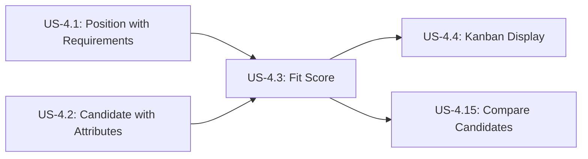

# Calculate and Display Fit Score

**Story ID:** US-4.3  
**Epic:** Epic 0.7 - Scouting Network (ATS-Lite)  
**Persona:** Scout/Recruiter, Hiring Manager  
**Priority:** Must Have  
**Complexity:** M (2-3 days)

---

## User Story

> **As a** Scout/Recruiter,  
> **I want to** see an automated fit score when I match candidates to positions,  
> **So that** I can quickly identify the best candidates for each role based on objective criteria.

---

## User Journey Context

### Story Position in Journey



### Entry Points (How user arrives here)

| Entry Source | Condition | Pre-loaded Data | User State |
|--------------|-----------|-----------------|------------|
| Add candidate to position (from Kanban) | Drag candidate card to position | candidate_id, position_id | Evaluating candidate fit |
| Position detail "Add Candidate" | Viewing position, click add | position_id, requirements | Actively recruiting |
| Candidate detail "Apply to Position" | Viewing candidate, select position | candidate_id, attributes | Matching candidate to roles |
| Batch application creation | Import/bulk add candidates | Multiple candidate_ids | Bulk processing |

### Exit Points (Where user goes after)

| Exit Condition | Destination | Data Passed | User State |
|----------------|-------------|-------------|------------|
| Fit score calculated | Kanban board with scored application | application_id, fit_score | Can prioritize candidates |
| High fit score (>90%) | Highlighted in green, priority flag | fit_score, application_id | Excited about match |
| Low fit score (<70%) | Highlighted in red, review needed | fit_score, application_id | May reject or reassess |
| Calculation error | Error message, manual review needed | error_details | Needs to fix data |

### Story Dependencies

| Dependency | Type | Required Data | If Missing |
|------------|------|---------------|------------|
| US-4.1 Position Requirements | Must exist | position_requirements with weights | Error: "Position has no requirements" |
| US-4.2 Candidate Attributes | Must exist | candidate_attributes with scores | Warning: "Incomplete attributes - partial score" |
| Player Card System - Attribute definitions | Must match | Same attribute_ids in both | Error: "Attribute mismatch" |

### Stories That Depend on This

| Story ID | What It Needs | Data Provided |
|----------|---------------|---------------|
| US-4.4 | Fit scores to display on cards | fit_score, color coding |
| US-4.5 | Fit scores for sorting/filtering | fit_score values |
| US-4.15 | Fit scores for comparison | fit_score, attribute breakdown |

---

## Business Logic

### Business Rules

| Rule ID | Rule Name | Condition | Action | Error Message |
|---------|-----------|-----------|--------|---------------|
| BR-003 | Fit Score Calculation | On application create/update | Calculate weighted percentage match | N/A (automated) |
| BR-004 | Duplicate Application Prevention | Before creating application | Check for existing active application | "Candidate already has active application for this position" |
| BR-012 | Mandatory Attribute Requirements | After fit score calculation | Flag if mandatory requirements not met | Warning displayed with icon |

### BR-003: Fit Score Calculation Formula

**Formula:**
```
Fit Score (%) = (Σ(candidate_attribute_i × weight_i) / Σ(required_attribute_i × weight_i)) × 100
```

**Where:**
- `candidate_attribute_i` = Candidate's score for attribute i (1-20)
- `required_attribute_i` = Position's required score for attribute i (1-20)
- `weight_i` = Weight assigned to attribute i (0.0-1.0, sum = 1.0)

**Example Calculation:**

Position Requirements:
- Backend Development: Required 16, Weight 50% (0.5)
- Database Design: Required 14, Weight 30% (0.3)
- System Architecture: Required 12, Weight 20% (0.2)

Candidate Attributes:
- Backend Development: 18
- Database Design: 16
- System Architecture: 10

Calculation:
```
Numerator = (18 × 0.5) + (16 × 0.3) + (10 × 0.2)
         = 9.0 + 4.8 + 2.0
         = 15.8

Denominator = (16 × 0.5) + (14 × 0.3) + (12 × 0.2)
            = 8.0 + 4.2 + 2.4
            = 14.6

Fit Score = (15.8 / 14.6) × 100 = 108.2%
```

Result: **108.2%** (exceeds requirements) → Display in GREEN

### Color Coding Rules

| Fit Score Range | Color | Badge Style | Meaning |
|-----------------|-------|-------------|---------|
| ≥ 90% | Green (#10B981) | `bg-green-500 text-white` | Excellent match |
| 70-89% | Yellow (#F59E0B) | `bg-yellow-500 text-white` | Good match |
| < 70% | Red (#EF4444) | `bg-red-500 text-white` | Below requirements |

### Data Requirements

**Inputs (from other entities):**

| Field | Source | Type | Required |
|-------|--------|------|----------|
| position_requirements | PositionRequirement table | Array of {attribute_id, required_score, weight, is_mandatory} | Yes |
| candidate_attributes | CandidateAttribute table | Array of {attribute_id, score} | Yes |

**Outputs (stored in Application):**

| Field | Type | Calculated | Stored |
|-------|------|-----------|--------|
| fit_score | Decimal | Yes | application.fit_score |
| fit_score_breakdown | JSON | Yes | application.fit_score_details |
| mandatory_requirements_met | Boolean | Yes | application.flags |

### State Transitions

| Trigger | Recalculation Required | Updates |
|---------|----------------------|---------|
| Application created | Yes | Calculate initial fit score |
| Candidate attributes updated | Yes | Recalculate all active applications for that candidate |
| Position requirements changed | Yes | Recalculate all applications for that position |
| Attribute manually adjusted | Yes | Recalculate affected applications |

---

## Acceptance Criteria

### Scenario 1: Happy Path - Calculate Fit Score for Perfect Match

**Type:** ✅ Happy Path  
**Journey Position:** Application Creation → Calculation → Display

**Given**
- Position "Senior Backend Developer" (POS-2026-001) has requirements:
  - Backend Development: 16 required, 40% weight
  - Database Design: 15 required, 30% weight
  - Problem Solving: 14 required, 20% weight
  - Communication: 12 required, 10% weight
- Candidate "Alex Chen" (CAN-2026-010) has attributes:
  - Backend Development: 18
  - Database Design: 17
  - Problem Solving: 15
  - Communication: 14
- All weights sum to 100% (0.4 + 0.3 + 0.2 + 0.1 = 1.0)

**When**
- Scout drags Alex Chen's card to POS-2026-001 in Kanban
- System creates Application record (APP-2026-050)

**Then**
- System loads position requirements (4 attributes)
- System loads candidate attributes (4 matching attributes)
- System applies BR-003 formula:
  - Numerator = (18×0.4) + (17×0.3) + (15×0.2) + (14×0.1) = 7.2 + 5.1 + 3.0 + 1.4 = 16.7
  - Denominator = (16×0.4) + (15×0.3) + (14×0.2) + (12×0.1) = 6.4 + 4.5 + 2.8 + 1.2 = 14.9
  - Fit Score = (16.7 / 14.9) × 100 = **112.1%**
- System stores fit_score = 112.1 in application record
- System determines color coding: 112.1% ≥ 90% → GREEN
- Application card displays:
  - Fit score badge: "112%" in green background
  - Visual indicator: ⭐ (star icon for excellent match)
- Tooltip on hover shows breakdown:
  ```
  Backend Development: 18/16 ✓ (112.5%)
  Database Design: 17/15 ✓ (113.3%)
  Problem Solving: 15/14 ✓ (107.1%)
  Communication: 14/12 ✓ (116.7%)
  Overall: 112.1% - Excellent Match!
  ```

---

### Scenario 2: Happy Path - Calculate Fit Score for Borderline Match

**Type:** ✅ Happy Path (Lower Score)

**Given**
- Same position requirements as Scenario 1
- Candidate "Jane Doe" has attributes:
  - Backend Development: 15 (below required 16)
  - Database Design: 14 (below required 15)
  - Problem Solving: 13 (below required 14)
  - Communication: 12 (meets required 12)

**When**
- Application created

**Then**
- Fit Score calculation:
  - Numerator = (15×0.4) + (14×0.3) + (13×0.2) + (12×0.1) = 6.0 + 4.2 + 2.6 + 1.2 = 14.0
  - Denominator = 14.9 (same as before)
  - Fit Score = (14.0 / 14.9) × 100 = **94.0%**
- Color coding: 94.0% ≥ 90% → Still GREEN (barely)
- Tooltip shows:
  ```
  Backend Development: 15/16 ⚠️ (93.8% - Below Required)
  Database Design: 14/15 ⚠️ (93.3% - Below Required)
  Problem Solving: 13/14 ⚠️ (92.9% - Below Required)
  Communication: 12/12 ✓ (100%)
  Overall: 94.0% - Good Match
  ```
- Warning icon shown: "Some requirements not fully met"

---

### Scenario 3: Happy Path - Calculate Fit Score for Poor Match

**Type:** ✅ Happy Path (Low Score)

**Given**
- Same position requirements
- Candidate "John Smith" has much lower attributes:
  - Backend Development: 10
  - Database Design: 9
  - Problem Solving: 11
  - Communication: 8

**When**
- Application created

**Then**
- Fit Score = (10×0.4 + 9×0.3 + 11×0.2 + 8×0.1) / 14.9 × 100 = 9.3 / 14.9 × 100 = **62.4%**
- Color coding: 62.4% < 70% → RED
- Badge displays: "62%" in red
- Strong visual indicator this is not a good match
- Tooltip shows all attributes below requirements
- System suggests: "Consider reviewing or rejecting - low fit score"

---

### Scenario 4: Alternative Path - Partial Attributes (Incomplete Data)

**Type:** 🔀 Alternative Path

**Given**
- Position requires 5 attributes (Backend, Database, Architecture, Communication, Leadership)
- Candidate has only 3 attributes rated (Backend, Database, Communication)
- Missing: Architecture, Leadership (representing 30% total weight)

**When**
- Application created

**Then**
- System detects missing attributes
- System calculates with available data (70% of requirements)
- Displays warning: "⚠️ Fit score calculated with incomplete data (70% coverage)"
- Badge shows: "Est. 85%" (estimated score)
- Tooltip shows:
  ```
  Backend Development: 18/16 ✓
  Database Design: 16/14 ✓
  Communication: 14/12 ✓
  System Architecture: Not Rated ⚠️
  Leadership: Not Rated ⚠️
  
  Partial Fit Score: 85% (based on 3/5 attributes)
  Complete candidate profile to get accurate score.
  ```
- "Update Attributes" button shown to add missing ratings

---

### Scenario 5: Alternative Path - Recalculate After Candidate Update

**Type:** 🔀 Alternative Path (Dynamic Update)

**Given**
- Candidate "Alex Chen" initially rated with Backend: 16
- Application created with fit score 98%
- After interview, scout updates Backend rating to 19 (higher)

**When**
- Scout updates candidate attributes
- System detects candidate has active applications

**Then**
- System automatically recalculates fit scores for all Alex's applications
- Original fit score 98% → New fit score 108%
- Color changes: Yellow → Green
- Card updates in real-time on Kanban
- Notification shown: "Fit scores updated for Alex Chen (3 applications affected)"
- Audit log records: "Fit score recalculated due to candidate attribute update"

---

### Scenario 6: Alternative Path - Recalculate After Position Requirements Change

**Type:** 🔀 Alternative Path (Dynamic Update)

**Given**
- Position has 10 applications with calculated fit scores
- Hiring manager updates requirements: Increases Backend from 16 to 18
- Adjusts weights: Backend 50% → 60%, Database 30% → 20%

**When**
- Manager saves updated requirements

**Then**
- System shows confirmation: "Changing requirements will recalculate fit scores for 10 applications. Continue?"
- Manager confirms
- System recalculates all 10 applications with new formula
- Fit scores update:
  - Some increase (if strong in Backend)
  - Some decrease (if weaker in Backend)
- Kanban refreshes with new scores
- Cards may change colors
- Notification: "10 fit scores recalculated for position Senior Backend Developer"

---

### Scenario 7: Validation Error - Position Has No Requirements

**Type:** ❌ Validation Error  
**Journey Position:** Entry blocked

**Given**
- Position created but requirements not defined yet (BR-001 not enforced if saved as draft)
- Scout attempts to add candidate to this position

**When**
- Application creation attempted

**Then**
- System checks for position requirements
- System finds 0 requirements defined
- System shows error: "Cannot calculate fit score: Position has no defined requirements"
- System suggests: "Add requirements to this position first"
- Application creation is blocked (cannot proceed)
- Scout must go back and add requirements to position

---

### Scenario 8: Validation Error - Attribute Mismatch

**Type:** ❌ Validation Error (Data Integrity)

**Given**
- Position requires: Backend Development (attribute_id: attr-001)
- Candidate rated: Backend Engineering (attribute_id: attr-999, different ID!)
- Attribute names similar but IDs don't match (data inconsistency)

**When**
- Application creation attempted

**Then**
- System cannot match candidate attributes to position requirements
- System treats as missing attribute
- Calculates partial fit score with warning
- Shows error: "⚠️ Attribute mismatch detected - Backend Development not found in candidate profile"
- Suggests: "Update candidate attributes to match position requirements"
- Allows application creation but flags for review

---

### Scenario 9: Business Rule Error - Duplicate Application

**Type:** ⚠️ Business Rule Error  
**Covers:** BR-004

**Given**
- Candidate "Jane Doe" already has active application (APP-2026-030) for position POS-2026-001
- Application status = Screening (active, not terminal)
- Scout attempts to add Jane Doe to same position again

**When**
- Scout drags Jane's card to POS-2026-001 in Kanban

**Then**
- System checks for existing applications (BR-004)
- System finds active application APP-2026-030
- System prevents duplicate, shows error: "Candidate Jane Doe already has an active application for this position (Status: Screening)"
- System offers: "View Existing Application" button
- No new application created
- No fit score calculated

**Recovery:**
- Click "View Existing Application" → Navigate to APP-2026-030
- See existing fit score and current status

---

### Scenario 10: Business Rule Error - Mandatory Requirements Not Met

**Type:** ⚠️ Business Rule Error  
**Covers:** BR-012

**Given**
- Position has Backend Development marked as mandatory (is_mandatory = true, minimum 16)
- Candidate has Backend Development: 14 (below mandatory minimum)
- Application created

**When**
- Fit score calculated

**Then**
- Fit score may still be reasonable (e.g., 92% overall)
- System checks mandatory requirements (BR-012)
- System finds: Backend 14 < 16 (mandatory not met)
- System flags application with warning icon: ⚠️
- Badge shows fit score with warning: "92% ⚠️"
- Tooltip shows:
  ```
  ❌ Mandatory requirement not met:
  Backend Development: 14/16 (Required: Minimum 16)
  
  This candidate does not meet minimum requirements
  for this position. Consider rejecting or requesting
  additional assessment.
  ```
- Application allowed but flagged for review
- Scout can still proceed but is warned

---

### Scenario 11: Validation Error - Division by Zero (Invalid Requirements)

**Type:** ❌ Validation Error (Edge Case)

**Given**
- Position has invalid requirements (all required_scores = 0)
- This should be prevented by validation, but edge case exists

**When**
- Fit score calculation attempted

**Then**
- Denominator = 0 (division by zero error)
- System catches exception
- System shows error: "Invalid position requirements - cannot calculate fit score"
- System logs error for admin review
- Application creation blocked
- Suggests: "Fix position requirements before adding candidates"

---

### Scenario 12: Permission Denied - View Fit Score Details

**Type:** 🔒 Permission Denied (Future Enhancement)

**Given**
- I am logged in as Interviewer (not Recruiter/Manager)
- I can view applications but not see detailed fit score breakdown
- Privacy settings hide formula from interviewers

**When**
- I hover over fit score badge

**Then**
- Tooltip shows only: "Fit Score: 95%" (no breakdown)
- Formula and attribute details hidden
- Message: "Detailed breakdown available to recruiters only"
- Prevents bias in interview based on calculated scores

**Note:** This is a future enhancement for interview fairness

---

### Scenario 13: Loop/Retry - Manual Recalculation

**Type:** 🔄 Loop/Retry

**Given**
- Fit scores were calculated yesterday
- System had a bug that was fixed today
- Admin wants to recalculate all scores with corrected algorithm

**When**
- Admin clicks "Recalculate All Fit Scores" button in admin panel

**Then**
- System shows confirmation: "Recalculate fit scores for 150 applications?"
- Admin confirms
- System processes in batches (10 at a time to avoid overload)
- Progress bar: "Recalculating... 50/150 (33%)"
- All fit scores updated with correct algorithm
- Cards refresh on Kanban for all recruiters
- Success message: "150 fit scores recalculated successfully"

---

### Scenario 14: Empty State - No Matching Attributes

**Type:** 📭 Empty State (Zero Match)

**Given**
- Position requires: Backend, Database, Architecture
- Candidate rated: Sales, Marketing, Communication
- Zero overlap in attributes

**When**
- Application attempted

**Then**
- System finds 0 matching attributes
- Fit score cannot be calculated meaningfully
- System shows: "0% - No matching attributes found"
- Message: "This candidate's skills don't align with position requirements"
- Suggests: "Consider different position or update candidate attributes"
- Application allowed but flagged as "Not suitable"

---

### Scenario 15: Session Timeout - Mid-Calculation (Unlikely)

**Type:** ⏰ Timeout

**Given**
- Scout is dragging candidate to position
- Calculation takes 2 seconds (unusually slow)
- Session expires during calculation (rare edge case)

**When**
- Calculation in progress, session expires

**Then**
- Calculation completes (server-side, doesn't need session)
- Application created with fit score
- Scout's session expired, redirected to login
- After re-login: Application exists with fit score
- Scout can continue viewing/managing application

**Reasoning:** Fit score calculation is server-side atomic operation, completes even if client disconnects.

---

### Scenario 16: Concurrent Modification - Two Scouts Add Same Candidate

**Type:** ⚡ Concurrent (Race Condition)

**Given**
- Scout A drags candidate to position at 10:00:00.000
- Scout B drags same candidate to same position at 10:00:00.100
- Both clicks within 100ms

**When**
- Both requests hit server simultaneously

**Then**
- First request (Scout A) creates application with fit score
- Second request (Scout B) triggers duplicate check (BR-004)
- Scout B sees error: "Candidate already added (just now by Scout A)"
- Only one application created
- Only one fit score calculated
- Database constraint prevents duplicate

---

### Scenario 17: Data Integrity - Attribute Deleted During Calculation

**Type:** ⚠️ Data Integrity (Extreme Edge Case)

**Given**
- Calculation started for application
- During calculation, admin deletes "Leadership" attribute from Player Card System
- Candidate had Leadership rating, position requires it

**When**
- Calculation tries to access deleted attribute

**Then**
- System handles gracefully:
  - Treats deleted attribute as "not rated"
  - Calculates with remaining attributes
  - Logs warning: "Attribute attr-005 (Leadership) not found during calculation"
  - Shows warning on application: "Some attributes unavailable during calculation"
- Application still created
- Fit score partial but valid
- Admin alerted to attribute deletion issue

---

### Scenario 18: Performance - Calculate for 100 Candidates

**Type:** ⚠️ Performance (Bulk Operation)

**Given**
- Scout imports 100 candidates from CSV
- All 100 applied to same position
- System must calculate 100 fit scores

**When**
- Bulk import triggers 100 application creations

**Then**
- System processes calculations in parallel (batch of 20)
- Progress indicator: "Calculating fit scores... 20/100"
- All 100 scores calculated within 10 seconds
- Kanban updates with all 100 applications sorted by fit score
- High scores (>90%) appear at top automatically
- No performance degradation or timeout

**Performance Target:** <0.1 seconds per fit score calculation

---

### Scenario 19: Integration Error - Player Card System Slow Response

**Type:** ⚠️ Integration Error

**Given**
- Application creation triggered
- Player Card System API to fetch attributes is slow (5 second response time)

**When**
- System waits for attribute data

**Then**
- System shows loading indicator: "Loading candidate attributes..."
- After 5 seconds, data returns
- Fit score calculated normally
- Total time: 5.5 seconds
- User experience: Slightly slow but completes
- If timeout (>10 seconds): Show error "Unable to fetch attributes, please try again"

---

### Scenario 20: Caching - Fast Recalculation for Same Position

**Type:** 🔄 Optimization (Caching)

**Given**
- 50 candidates being evaluated for same position
- Position requirements don't change
- Requirements data can be cached

**When**
- Each candidate added sequentially

**Then**
- First calculation: Fetches requirements from database (100ms)
- Subsequent 49 calculations: Use cached requirements (1ms)
- Significant performance improvement
- Cache invalidated when requirements change
- All 50 calculations complete in <2 seconds total

---

## Scenario Coverage Checklist

| # | Type | Scenario # | Covered |
|---|------|------------|---------|
| 1 | Happy Path | Scenarios 1, 2, 3 | ✓ |
| 2 | Alternative Path | Scenarios 4, 5, 6 | ✓ |
| 3 | Validation Error | Scenarios 7, 8, 11 | ✓ |
| 4 | Business Rule Error | Scenarios 9, 10 | ✓ |
| 5 | Permission Denied | Scenario 12 | ✓ (future) |
| 6 | Loop/Retry | Scenario 13 | ✓ |
| 7 | Empty State | Scenario 14 | ✓ |
| 8 | Session Timeout | Scenario 15 | ✓ |
| 9 | Concurrent Modification | Scenario 16 | ✓ |
| 10 | Data Integrity | Scenario 17 | ✓ |
| 11 | Performance | Scenarios 18, 19, 20 | ✓ (bonus) |

**Total Scenarios:** 20  
**Coverage:** Complete ✅

---

## UI/UX Requirements

### Fit Score Badge Display

**On Application Card:**
```
┌─────────────────────────────┐
│ Alex Chen                   │
│ Backend Developer           │
│                             │
│ ┌─────────┐                │
│ │   95%   │  ← Fit Score   │
│ └─────────┘     Badge      │
│   (Green)                   │
│                             │
│ Source: LinkedIn            │
│ 5 days in stage             │
└─────────────────────────────┘
```

### Fit Score Tooltip (on hover)

```
┌────────────────────────────────────┐
│ Fit Score Breakdown                │
├────────────────────────────────────┤
│ Backend Development:    18/16  ✓   │
│ Progress: ████████░░ 112.5%        │
│                                    │
│ Database Design:        17/15  ✓   │
│ Progress: ████████░░ 113.3%        │
│                                    │
│ Problem Solving:        15/14  ✓   │
│ Progress: ████████░░ 107.1%        │
│                                    │
│ Communication:          14/12  ✓   │
│ Progress: █████████░ 116.7%        │
│                                    │
│ Overall Fit Score: 112.1%          │
│ ⭐ Excellent Match!                 │
└────────────────────────────────────┘
```

### Warning Icon for Mandatory Requirements

```
┌─────────────────────────────┐
│ Jane Doe                    │
│ Backend Developer           │
│                             │
│ ┌──────────┐               │
│ │ 92% ⚠️  │  ← Warning    │
│ └──────────┘                │
│  (Yellow)                   │
│                             │
│ ⚠️ Mandatory req. not met   │
└─────────────────────────────┘
```

### Color Palette

```css
.fit-score-excellent { /* ≥90% */
  background: #10B981; /* green-500 */
  color: white;
}

.fit-score-good { /* 70-89% */
  background: #F59E0B; /* yellow-500 */
  color: white;
}

.fit-score-poor { /* <70% */
  background: #EF4444; /* red-500 */
  color: white;
}
```

---

## Technical Implementation

### Database Schema

**Application Table:**
```sql
CREATE TABLE applications (
  application_id UUID PRIMARY KEY,
  candidate_id UUID NOT NULL,
  position_id UUID NOT NULL,
  fit_score DECIMAL(5,2), -- e.g., 108.25
  fit_score_details JSONB, -- Attribute breakdown
  mandatory_requirements_met BOOLEAN,
  created_at TIMESTAMP,
  updated_at TIMESTAMP,
  UNIQUE(candidate_id, position_id) WHERE status NOT IN ('Hired', 'Rejected', 'Withdrew')
);

CREATE INDEX idx_applications_fit_score ON applications(fit_score DESC);
```

### Calculation Function (Pseudo-code)

```javascript
function calculateFitScore(candidateId, positionId) {
  // 1. Fetch requirements
  const requirements = await db.query(`
    SELECT attribute_id, required_score, weight, is_mandatory
    FROM position_requirements
    WHERE position_id = $1
  `, [positionId]);
  
  if (requirements.length === 0) {
    throw new Error('Position has no requirements');
  }
  
  // 2. Fetch candidate attributes
  const attributes = await db.query(`
    SELECT attribute_id, score
    FROM candidate_attributes
    WHERE candidate_id = $1
  `, [candidateId]);
  
  const attributeMap = new Map(attributes.map(a => [a.attribute_id, a.score]));
  
  // 3. Calculate fit score
  let numerator = 0;
  let denominator = 0;
  let mandatoryMet = true;
  const breakdown = [];
  
  for (const req of requirements) {
    const candidateScore = attributeMap.get(req.attribute_id) || 0;
    
    numerator += candidateScore * req.weight;
    denominator += req.required_score * req.weight;
    
    // Check mandatory
    if (req.is_mandatory && candidateScore < req.required_score) {
      mandatoryMet = false;
    }
    
    breakdown.push({
      attribute_id: req.attribute_id,
      candidate_score: candidateScore,
      required_score: req.required_score,
      weight: req.weight,
      percentage: (candidateScore / req.required_score) * 100
    });
  }
  
  if (denominator === 0) {
    throw new Error('Invalid requirements: denominator is zero');
  }
  
  const fitScore = (numerator / denominator) * 100;
  
  return {
    fit_score: Math.round(fitScore * 100) / 100, // 2 decimal places
    mandatory_requirements_met: mandatoryMet,
    breakdown: breakdown
  };
}
```

### Trigger for Auto-Recalculation

```sql
-- Trigger when candidate attributes updated
CREATE TRIGGER recalculate_fit_scores_on_candidate_update
AFTER UPDATE ON candidate_attributes
FOR EACH ROW
EXECUTE FUNCTION queue_fit_score_recalculation('candidate', NEW.candidate_id);

-- Trigger when position requirements updated
CREATE TRIGGER recalculate_fit_scores_on_position_update
AFTER UPDATE ON position_requirements
FOR EACH ROW
EXECUTE FUNCTION queue_fit_score_recalculation('position', NEW.position_id);
```

---

**END OF US-4.3 DETAILED SPECIFICATION**
