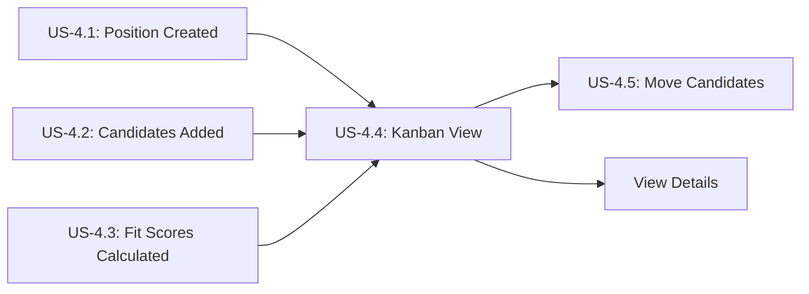

# View Candidates in Kanban Board

**Story ID:** US-4.4  
**Epic:** Epic 0.7 - Scouting Network (ATS-Lite)  
**Persona:** Scout/Recruiter, Hiring Manager  
**Priority:** Must Have  
**Complexity:** M (2-3 days)

---

## User Story

> **As a** Scout/Recruiter,  
> **I want to** view all candidates for a position in a visual Kanban board organized by pipeline stages,  
> **So that** I can quickly understand the recruitment status and prioritize my work.

---

## User Journey Context

### Story Position in Journey



### Entry Points (How user arrives here)

| Entry Source | Condition | Pre-loaded Data | User State |
|--------------|-----------|-----------------|------------|
| Dashboard "View Position" | Click position card | position_id | Ready to manage pipeline |
| Direct URL | `/positions/{id}/kanban` | position_id from URL | Bookmark/shared link |
| Formation View "Hiring" | Click hiring indicator | position_id, formation context | Filling team gap |
| Search results | Search positions, click result | Filtered position list | Finding specific position |
| Notification | "New candidate added" notification | position_id, application_id | Responding to update |

### Exit Points (Where user goes after)

| Exit Condition | Destination | Data Passed | User State |
|----------------|-------------|-------------|------------|
| Click candidate card | Candidate detail page | candidate_id, application_id | Deep-dive evaluation |
| Drag-and-drop candidate | Same Kanban (updated) | New status | Continuing management |
| Click "Schedule Interview" | Interview scheduling form | application_id | Next workflow step |
| Click "Close Position" | Position closed confirmation | position_id | Recruitment complete |
| Navigate away | Previous page or dashboard | None | Task switching |

### Story Dependencies

| Dependency | Type | Required Data | If Missing |
|------------|------|---------------|------------|
| US-4.1 Position exists | Must exist | Position with status = Open/Active | Error: "Position not found" |
| US-4.2 Applications exist | Optional | Applications to display | Empty state shown |
| US-4.3 Fit scores calculated | Optional | Fit score for sorting | Sort by date instead |

### Stories That Depend on This

| Story ID | What It Needs | Data Provided |
|----------|---------------|---------------|
| US-4.5 | Visual interface for drag-and-drop | Kanban columns, card components |
| US-4.7 | Navigation to interview scheduling | Application context |
| US-4.15 | Multi-select for comparison | Card selection mechanism |

---

## Business Logic

### Business Rules

| Rule ID | Rule Name | Condition | Action | Error Message |
|---------|-----------|-----------|--------|---------------|
| BR-005 | Kanban Column Grouping | Display applications | Group by current_stage | N/A (display logic) |
| N/A | Default Sorting | Within columns | Sort by fit_score DESC, then created_at DESC | N/A |
| N/A | Card Color Coding | Display fit scores | Green ≥90%, Yellow 70-89%, Red <70% | N/A |

### Kanban Column Definitions

| Column Name | Applications Shown | Count Calculation | Order |
|-------------|-------------------|-------------------|-------|
| **New** | status = 'New' | COUNT(*) WHERE status = 'New' | 1 |
| **Screening** | status IN ('Screening', 'Screening_Passed') | COUNT(*) | 2 |
| **Interview** | status IN ('Interview_Scheduled', 'Interviewed') | COUNT(*) | 3 |
| **Offer** | status IN ('Offer_Pending', 'Offer_Sent', 'Offer_Accepted') | COUNT(*) | 4 |
| **Hired** | status = 'Hired' | COUNT(*) | 5 |

**Hidden/Archived:** status IN ('Rejected', 'Withdrew', 'Screening_Failed', 'Interview_Failed', 'Offer_Rejected')

### Data Requirements

**Per Card Display:**

| Field | Source | Display | Conditional |
|-------|--------|---------|-------------|
| candidate_name | Candidate.full_name | Card header | Always |
| candidate_photo | Candidate.photo_url | Avatar (40x40) | If available |
| position_title | Position.title | Contextual (if multi-position view) | If needed |
| fit_score | Application.fit_score | Badge with color | Always |
| source | Candidate.source | Small label | Always |
| days_in_stage | DATEDIFF(NOW(), stage_updated_at) | Bottom text | Always |
| mandatory_warning | Application.mandatory_requirements_met | Warning icon | If false |
| tags | Candidate.tags | Tag chips | If exists |

### Filtering and Sorting Options

**Filters Available:**

| Filter | Type | Options |
|--------|------|---------|
| Fit Score Range | Slider | 0-100% (default: all) |
| Source | Multi-select | LinkedIn, Referral, Job Board, Direct, etc. |
| Days in Stage | Range | 0-7, 7-14, 14-30, 30+ |
| Mandatory Met | Checkbox | Only show candidates meeting mandatory requirements |

**Sort Options:**

| Sort By | Direction | Default |
|---------|-----------|---------|
| Fit Score | DESC | ✓ Yes |
| Date Added | DESC, ASC | No |
| Days in Stage | DESC, ASC | No |
| Last Name | ASC | No |

---

## Acceptance Criteria

### Scenario 1: Happy Path - View Kanban with Active Applications

**Type:** ✅ Happy Path  
**Journey Position:** Main view loaded

**Given**
- Position "Senior Backend Developer" (POS-2026-001) is Open
- Position has 15 active applications distributed across stages:
  - New: 5 applications
  - Screening: 4 applications
  - Interview: 3 applications
  - Offer: 2 applications
  - Hired: 1 application
- I am logged in as Recruiter
- I have permission to view this position

**When**
- I navigate to position detail page
- I click "View Kanban" tab or button
- System loads `/positions/POS-2026-001/kanban`

**Then**
- Page loads within 1 second
- Page title: "Senior Backend Developer - Recruitment Pipeline"
- Kanban board displays 5 columns: New, Screening, Interview, Offer, Hired
- Each column header shows count:
  - New (5)
  - Screening (4)
  - Interview (3)
  - Offer (2)
  - Hired (1)
- Total count shown: "15 Active Candidates"
- Cards display in columns sorted by fit score (highest first)
- Each card shows:
  - Candidate photo (if available) or initials avatar
  - Candidate name
  - Fit score badge (color-coded)
  - Source label
  - Days in stage
- Hover over card shows quick actions: "View Details", "Move", "Reject"
- Drag handles visible on each card
- No loading errors or missing data

---

### Scenario 2: Happy Path - View Card Details

**Type:** ✅ Happy Path

**Given**
- Kanban board loaded with applications
- Candidate "Alex Chen" card visible in Interview column
- Fit score: 95% (green)

**When**
- I hover over Alex Chen's card
- I see card expand slightly with shadow effect
- Tooltip appears showing:
  ```
  Alex Chen
  Fit Score: 95% (Excellent Match)
  Source: LinkedIn
  Applied: 12 days ago
  In Interview stage: 3 days
  
  Backend Development: 18/16 ✓
  Database Design: 17/15 ✓
  Problem Solving: 15/14 ✓
  
  Next: Schedule interview or move to Offer
  ```

**Then**
- Detailed preview shown without leaving Kanban
- Quick actions available: "View Full Profile", "Schedule Interview", "Send Message"
- I can click anywhere on card to open full candidate detail page
- Clicking outside card returns to normal view

---

### Scenario 3: Alternative Path - Filter by Fit Score Range

**Type:** 🔀 Alternative Path

**Given**
- Kanban displays 15 total applications
- Various fit scores: 5 excellent (≥90%), 7 good (70-89%), 3 poor (<70%)

**When**
- I click "Filters" button in header
- Filter panel slides in from right
- I adjust "Fit Score Range" slider to 90-100%
- I click "Apply Filters"

**Then**
- Kanban refreshes to show only 5 applications with fit score ≥90%
- Column counts update:
  - New: 2 (was 5)
  - Screening: 2 (was 4)
  - Interview: 1 (was 3)
  - Offer: 0 (was 2)
  - Hired: 0 (was 1)
- Header shows: "5 of 15 candidates shown (filtered)"
- Filter badge visible: "Fit Score: 90-100% [×]"
- Click [×] to clear filter and show all again
- URL updates: `?fitScore=90-100` (shareable filtered view)

---

### Scenario 4: Alternative Path - Filter by Source

**Type:** 🔀 Alternative Path

**Given**
- Applications from various sources: LinkedIn (8), Referral (4), Job Board (3)

**When**
- I open filters
- I check "LinkedIn" and "Referral" sources
- I uncheck "Job Board"
- I apply filters

**Then**
- Only 12 applications shown (8 LinkedIn + 4 Referral)
- Job Board candidates hidden
- Active filter badge: "Source: LinkedIn, Referral [×]"
- Can combine with other filters (e.g., fit score + source)

---

### Scenario 5: Alternative Path - Sort by Days in Stage

**Type:** 🔀 Alternative Path

**Given**
- Some candidates stuck in Screening for 20+ days
- Others recently added (1-3 days)

**When**
- I click "Sort" dropdown
- I select "Days in Stage (Oldest First)"

**Then**
- Within each column, cards re-sort:
  - Candidates with most days in stage appear first
  - Highlights stale applications needing attention
- Screening column shows:
  - Card 1: 28 days (red indicator: "⚠️ Overdue")
  - Card 2: 21 days (yellow indicator: "⚠️ Long wait")
  - Card 3: 5 days
  - Card 4: 2 days
- Helps identify bottlenecks and prioritize follow-ups

---

### Scenario 6: Alternative Path - Multi-Position Kanban View

**Type:** 🔀 Alternative Path (Advanced)

**Given**
- I am managing 3 open positions simultaneously
- I want overview across all positions

**When**
- I navigate to "My Positions" dashboard
- I click "Combined Kanban View"

**Then**
- Kanban shows all applications across all 3 positions
- Each card includes position name badge
- Filters include "Position" multi-select
- Sort options include "Group by Position"
- Useful for recruiters managing multiple roles

---

### Scenario 7: Validation Error - Position Not Found

**Type:** ❌ Validation Error  
**Journey Position:** Entry blocked

**Given**
- I navigate to `/positions/POS-INVALID-999/kanban`
- Position ID does not exist in database

**When**
- System attempts to load Kanban

**Then**
- System queries database for position
- No results found
- Error page displays: "Position Not Found"
- Message: "The position you're looking for doesn't exist or has been deleted."
- Suggestion: "Return to Dashboard"
- No Kanban board shown
- 404 status code returned

---

### Scenario 8: Validation Error - Position Closed/Filled

**Type:** ❌ Validation Error

**Given**
- Position status = Filled (closed last week)
- Position has historical applications

**When**
- I navigate to Kanban for this position

**Then**
- System detects position.status = Filled
- Banner shown: "⚠️ This position is closed. Viewing historical data only."
- Kanban displayed in read-only mode:
  - No drag-and-drop enabled
  - No "Add Candidate" button
  - No status changes allowed
- Can still view cards and details
- Option: "Reopen Position" button (if authorized)

---

### Scenario 9: Validation Error - Slow Loading (Performance Issue)

**Type:** ❌ Validation Error (Performance)

**Given**
- Position has 200+ applications (large dataset)
- Network is slow (3G connection)

**When**
- Kanban loads data

**Then**
- Loading skeleton appears immediately (< 100ms)
- Shows placeholder cards in columns
- Progressive rendering:
  - First 20 cards load (1-2 seconds)
  - Remaining cards lazy-load as I scroll
- Virtual scrolling enabled for large columns
- No full-page freeze
- Loading indicator shows progress: "Loading 200 applications..."
- If timeout (>10 seconds): Show error with retry button

---

### Scenario 10: Business Rule Error - Unauthorized Access

**Type:** ⚠️ Business Rule Error

**Given**
- Position hiring_manager_id = Manager A
- I am logged in as Interviewer B
- Interviewer B is NOT assigned to this position

**When**
- I attempt to access Kanban URL directly

**Then**
- System checks permissions
- I am not hiring manager OR assigned interviewer
- Error: "Access Denied: You don't have permission to view this position's candidates"
- Suggestion: "Contact the hiring manager (Manager A) for access"
- No candidate data exposed
- Logged as unauthorized access attempt

**Authorized Roles:**
- ✅ Position hiring manager
- ✅ Assigned interviewers
- ✅ Recruiters (global access)
- ✅ HR Admins
- ❌ Other employees

---

### Scenario 11: Permission Denied - Interviewer Read-Only View

**Type:** 🔒 Permission Denied

**Given**
- I am assigned as Interviewer for this position
- Interviewers have read-only Kanban access

**When**
- I view Kanban board

**Then**
- Kanban displays normally
- Cards are NOT draggable (no drag handles shown)
- No "Add Candidate" button visible
- No "Reject" or "Move" actions available
- Can only:
  - ✅ View cards
  - ✅ Click to see candidate details
  - ✅ View fit scores
  - ✅ Filter and sort
  - ❌ Cannot modify application status
- Message: "You have view-only access. Contact recruiter to update candidates."

---

### Scenario 12: Loop/Retry - Refresh Kanban Data

**Type:** 🔄 Loop/Retry

**Given**
- Kanban loaded at 10:00 AM
- At 10:30 AM, another recruiter adds 3 new candidates
- I'm still viewing same Kanban (stale data)

**When**
- System detects data updates (WebSocket notification)
- Notification badge appears: "3 new candidates added [Refresh]"
- I click "Refresh" button

**Then**
- Kanban re-fetches data without full page reload
- New cards animate into view in New column
- Column counts update: New (5 → 8)
- My scroll position preserved
- Filters and sort settings maintained
- Smooth transition, no flicker

**Auto-Refresh:**
- Real-time updates via WebSocket (preferred)
- Fallback: Polling every 30 seconds
- User can disable auto-refresh if desired

---

### Scenario 13: Loop/Retry - Recover from Network Error

**Type:** 🔄 Loop/Retry

**Given**
- Kanban loading
- Network connection lost mid-fetch

**When**
- API request fails with network error

**Then**
- Error message: "Unable to load candidates. Check your connection."
- Retry button shown: "Try Again"
- I click "Try Again"
- System re-attempts API call
- If successful: Kanban loads normally
- If fails again: Show offline mode message
- Option to "Work Offline" with cached data (if available)

---

### Scenario 14: Empty State - No Applications Yet

**Type:** 📭 Empty State  
**Journey Position:** Initial state

**Given**
- Position just created (new, no candidates added)
- Position status = Open

**When**
- I view Kanban for this position

**Then**
- Kanban columns displayed (all empty)
- Empty state illustration in center:
  ```
  📋 No candidates yet
  
  Start building your pipeline by adding candidates
  
  [+ Add Candidate]  [Import from CSV]
  
  Or share this position:
  [Copy Job Link] [Post to LinkedIn]
  ```
- Helpful tips shown:
  - "Add candidates manually or import from CSV"
  - "Fit scores will calculate automatically"
  - "Drag candidates between stages to update status"
- Positive, encouraging tone

---

### Scenario 15: Empty State - All Candidates Filtered Out

**Type:** 📭 Empty State

**Given**
- Position has 15 applications
- I apply filter: Fit Score 95-100%
- No candidates meet this criteria

**When**
- Filter applied, results = 0

**Then**
- Empty Kanban with message:
  ```
  No candidates match your filters
  
  Current filters:
  • Fit Score: 95-100%
  
  [Adjust Filters] [Clear All Filters]
  ```
- Suggestion: "Try widening fit score range or removing filters"
- Original data not shown (respect filter)

---

### Scenario 16: Session Timeout - Viewing Kanban

**Type:** ⏰ Timeout

**Given**
- Kanban loaded and visible
- I leave browser tab open for 45 minutes (session timeout: 30 min)
- I return and try to interact (e.g., drag card)

**When**
- I attempt action
- Session is expired

**Then**
- Action blocked
- Modal overlay: "Your session has expired for security"
- "Please log in again to continue"
- [Login] button
- After re-login:
  - Redirected back to same Kanban view
  - Scroll position restored
  - Filters/sort preserved (URL params)
- No data loss

---

### Scenario 17: Concurrent Modification - Card Moved by Another User

**Type:** ⚡ Concurrent

**Given**
- I am viewing Kanban at 10:00:00
- Candidate "Alex Chen" in Screening column
- At 10:00:05, Recruiter B moves Alex to Interview
- I am still viewing outdated Kanban

**When**
- Real-time update pushed via WebSocket
- System detects Alex's card needs to move

**Then**
- Alex's card smoothly animates from Screening → Interview column
- Column counts update: Screening (4→3), Interview (3→4)
- Notification toast: "Sarah moved Alex Chen to Interview"
- Card highlights briefly (yellow glow) to draw attention
- I can click notification to see who made change and when
- If I was about to move same card: Prevented with message "This candidate was just updated"

---

### Scenario 18: Concurrent Modification - Multiple Recruiters Viewing Same Kanban

**Type:** ⚡ Concurrent

**Given**
- 3 recruiters viewing same position Kanban simultaneously
- Recruiter A adds new candidate
- Recruiter B moves candidate to Offer
- Recruiter C rejects candidate

**When**
- All 3 actions happen within 10 seconds

**Then**
- All 3 recruiters see updates in real-time:
  - New card appears in New column (Recruiter A's action)
  - Card moves to Offer column (Recruiter B's action)
  - Card disappears from Kanban (Recruiter C's rejection)
- Activity log shows all changes with timestamps and users
- No conflicts (each action on different candidate)
- Collaborative awareness maintained

---

### Scenario 19: Data Integrity - Card Displays Stale Fit Score

**Type:** ⚠️ Data Integrity

**Given**
- Candidate's attributes updated (Backend: 16 → 19)
- Fit score recalculated: 88% → 106%
- Kanban showing cached old score (88%)

**When**
- Fit score update event triggered
- Kanban receives update

**Then**
- Card fit score badge updates: 88% → 106%
- Badge color changes: Yellow → Green
- Card re-sorts within column (if sorted by fit score)
- Smooth transition animation
- No page reload required
- Audit trail logs score change

---

### Scenario 20: Integration Error - Fit Score Service Unavailable

**Type:** ⚠️ Integration Error

**Given**
- Kanban loading
- Fit Score calculation service is down
- Application records exist but fit_score = NULL

**When**
- Kanban attempts to display cards

**Then**
- Cards display without fit score badges
- Placeholder shown: "Score unavailable"
- Warning banner: "Fit scores temporarily unavailable. Cards sorted by date."
- Applications still visible and manageable
- Can still drag-and-drop, view details
- Once service recovers:
  - Scores calculate automatically
  - Kanban updates to show scores
  - Re-sort by fit score

**Graceful Degradation:** Core functionality (viewing, moving candidates) works even if fit scores unavailable.

---

## Scenario Coverage Checklist

| # | Type | Scenario # | Covered |
|---|------|------------|---------|
| 1 | Happy Path | Scenarios 1, 2 | ✓ |
| 2 | Alternative Path | Scenarios 3, 4, 5, 6 | ✓ |
| 3 | Validation Error | Scenarios 7, 8, 9 | ✓ |
| 4 | Business Rule Error | Scenario 10 | ✓ |
| 5 | Permission Denied | Scenario 11 | ✓ |
| 6 | Loop/Retry | Scenarios 12, 13 | ✓ |
| 7 | Empty State | Scenarios 14, 15 | ✓ |
| 8 | Session Timeout | Scenario 16 | ✓ |
| 9 | Concurrent Modification | Scenarios 17, 18 | ✓ |
| 10 | Data Integrity | Scenarios 19, 20 | ✓ |

**Total Scenarios:** 20  
**Coverage:** Complete ✅

---

## UI/UX Requirements

### Kanban Board Layout

```
┌────────────────────────────────────────────────────────────────────┐
│ Senior Backend Developer (POS-2026-001)                            │
│ [+ Add Candidate] [Filters ▼] [Sort ▼] [⋯ More]        [Refresh]  │
├────────────────────────────────────────────────────────────────────┤
│ 15 Active Candidates                                               │
├─────────┬─────────┬─────────┬─────────┬─────────────────────────┐
│ NEW (5) │ SCREEN  │ INTER   │ OFFER   │ HIRED (1)                │
│         │ ING (4) │ VIEW(3) │ (2)     │                          │
├─────────┼─────────┼─────────┼─────────┼─────────────────────────┤
│         │         │         │         │                          │
│ ┌─────┐ │ ┌─────┐ │ ┌─────┐ │ ┌─────┐ │ ┌─────┐                │
│ │Card │ │ │Card │ │ │Card │ │ │Card │ │ │Card │                │
│ │ 95% │ │ │ 88% │ │ │ 92% │ │ │ 90% │ │ │ 98% │                │
│ └─────┘ │ └─────┘ │ └─────┘ │ └─────┘ │ └─────┘                │
│         │         │         │         │                          │
│ ┌─────┐ │ ┌─────┐ │ ┌─────┐ │ ┌─────┐ │                        │
│ │Card │ │ │Card │ │ │Card │ │ │Card │ │                        │
│ │ 82% │ │ │ 76% │ │ │ 85% │ │ │ 87% │ │                        │
│ └─────┘ │ └─────┘ │ └─────┘ │ └─────┘ │                        │
│   ...   │   ...   │   ...   │         │                          │
└─────────┴─────────┴─────────┴─────────┴─────────────────────────┘
```

### Individual Card Design

```
┌───────────────────────────────┐
│ 👤 Alex Chen              ≡≡  │ ← Drag handle
├───────────────────────────────┤
│                               │
│ ┌─────────┐                  │
│ │   95%   │  ← Fit Score     │
│ └─────────┘     (Green)      │
│                               │
│ 🏷️ Source: LinkedIn          │
│ ⏱️  3 days in stage           │
│                               │
│ [View] [Schedule Interview]   │
└───────────────────────────────┘
```

### Card with Warning

```
┌───────────────────────────────┐
│ 👤 Jane Doe               ≡≡  │
├───────────────────────────────┤
│ ┌──────────┐                 │
│ │ 92% ⚠️  │  ← Warning icon │
│ └──────────┘                  │
│                               │
│ ⚠️ Mandatory requirement      │
│    not met                    │
│                               │
│ 🏷️ Source: Referral          │
│ ⏱️  28 days (⚠️ Overdue)      │
└───────────────────────────────┘
```

### Filter Panel

```
╔═══════════════════════════╗
║ FILTERS                   ║
╠═══════════════════════════╣
║                           ║
║ Fit Score Range           ║
║ ├─────●─────────┤         ║
║ 90%         100%          ║
║                           ║
║ Source                    ║
║ ☑ LinkedIn (8)            ║
║ ☑ Referral (4)            ║
║ ☐ Job Board (3)           ║
║ ☐ Direct (0)              ║
║                           ║
║ Days in Stage             ║
║ ○ All                     ║
║ ○ 0-7 days                ║
║ ● 7-14 days               ║
║ ○ 14-30 days              ║
║ ○ 30+ days                ║
║                           ║
║ [Clear] [Apply Filters]   ║
╚═══════════════════════════╝
```

---

## Technical Implementation

### API Endpoint

```javascript
GET /api/v1/positions/{position_id}/kanban

Query Parameters:
- fitScore: string (e.g., "90-100")
- source: string[] (e.g., ["LinkedIn", "Referral"])
- daysInStage: string (e.g., "7-14")
- sortBy: string (e.g., "fitScore", "daysInStage")
- sortOrder: string ("asc" | "desc")

Response:
{
  "position": {
    "id": "uuid",
    "title": "Senior Backend Developer",
    "status": "Open"
  },
  "columns": {
    "new": {
      "count": 5,
      "applications": [...]
    },
    "screening": {
      "count": 4,
      "applications": [...]
    },
    ...
  },
  "totalActive": 15,
  "totalArchived": 8
}
```

### Real-Time Updates (WebSocket)

```javascript
// Subscribe to position updates
socket.emit('subscribe', { channel: 'position', id: positionId });

// Listen for updates
socket.on('application:created', (data) => {
  addCardToColumn(data.application, 'new');
  updateColumnCount('new', +1);
  showNotification(`New candidate: ${data.candidate.name}`);
});

socket.on('application:statusChanged', (data) => {
  moveCardBetweenColumns(data.application, data.fromStatus, data.toStatus);
  updateColumnCounts();
});

socket.on('application:fitScoreUpdated', (data) => {
  updateCardFitScore(data.applicationId, data.newFitScore);
  resortColumn(data.currentColumn);
});
```

### Virtual Scrolling (Large Datasets)

```javascript
// React Window example for columns with 50+ cards
import { FixedSizeList } from 'react-window';

<FixedSizeList
  height={600}
  itemCount={applications.length}
  itemSize={120} // Card height
  width={'100%'}
>
  {({ index, style }) => (
    <div style={style}>
      <ApplicationCard application={applications[index]} />
    </div>
  )}
</FixedSizeList>
```

---

**END OF US-4.4 DETAILED SPECIFICATION**

---

## Summary

US-4.4 provides the central visual interface for recruitment pipeline management with:

1. ✅ Clear visual representation of all candidates by stage
2. ✅ Color-coded fit scores for quick assessment
3. ✅ Real-time updates for collaborative work
4. ✅ Powerful filtering and sorting capabilities
5. ✅ Responsive design for all screen sizes
6. ✅ Performance optimization for large datasets
7. ✅ Graceful degradation when services unavailable

**Key Success Criteria:**
- <1 second initial load time
- Real-time updates within 500ms
- Support 200+ applications per position
- Zero data synchronization issues
- Intuitive drag-and-drop UX

This is the primary daily interface for recruiters managing candidate pipelines.
