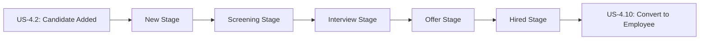

# Move Candidate Through Pipeline Stages

**Story ID:** US-4.5  
**Epic:** Epic 0.7 - Scouting Network (ATS-Lite)  
**Persona:** Scout/Recruiter, Hiring Manager  
**Priority:** Must Have  
**Complexity:** M (2-3 days)

---

## User Story

> **As a** Scout/Recruiter,  
> **I want to** move candidates between pipeline stages via drag-and-drop,  
> **So that** I can efficiently update candidate status as they progress through recruitment.

---

## User Journey Context

### Story Position in Journey



### Entry Points (How user arrives here)

| Entry Source | Condition | Pre-loaded Data | User State |
|--------------|-----------|-----------------|------------|
| Kanban board view | Viewing position pipeline | Applications in various stages | Managing recruitment |
| Application detail page | Viewing specific application | Application details | Updating status |
| Bulk action menu | Selected multiple applications | List of application_ids | Efficient processing |
| Keyboard navigation | Using arrow keys | Current focused application | Power user workflow |

### Exit Points (Where user goes after)

| Exit Condition | Destination | Data Passed | User State |
|----------------|-------------|-------------|------------|
| Stage changed successfully | Same Kanban (updated) | New application status | Continue pipeline management |
| Invalid transition attempted | Error toast, card snaps back | Error message | Frustrated, needs clarification |
| Rejection triggered | Application removed from pipeline | Rejection reason | Pipeline cleaned up |
| Offer stage reached | Offer creation form | Application ready for offer | Next step clear |
| Hired stage reached | Conversion process (US-4.10) | Ready to convert | Final stage |

### Story Dependencies

| Dependency | Type | Required Data | If Missing |
|------------|------|---------------|------------|
| US-4.3 Applications exist | Must exist | Applications to move | Empty Kanban, nothing to move |
| US-4.4 Kanban board displayed | Must exist | Visual interface | Cannot drag-and-drop |
| BR-006 Valid transitions | Business rule | Transition rules | Invalid moves blocked |

### Stories That Depend on This

| Story ID | What It Needs | Data Provided |
|----------|---------------|---------------|
| US-4.7 | Application in Interview stage | Triggers interview scheduling |
| US-4.9 | Application in Offer stage | Triggers offer creation |
| US-4.10 | Application in Hired stage | Triggers employee conversion |

---

## Business Logic

### Business Rules

| Rule ID | Rule Name | Condition | Action | Error Message |
|---------|-----------|-----------|--------|---------------|
| BR-006 | Application Stage Transitions | On drag-and-drop or status change | Validate transition is allowed | "Invalid stage transition: Cannot move from {current} to {target}" |
| BR-015 | Rejection Reason Required | On rejection | Must provide reason | "Please provide a reason for rejection" |

### BR-006: Valid Stage Transitions (State Machine)

**Valid Transition Matrix:**

| From State | To State (Valid) | To State (Invalid) |
|-----------|------------------|-------------------|
| New | Screening, Rejected, Withdrew | Interview, Offer, Hired |
| Screening | Screening_Passed, Screening_Failed, Rejected, Withdrew | Interview, Offer, Hired |
| Screening_Passed | Interview_Scheduled, Rejected, Withdrew | Offer, Hired |
| Interview_Scheduled | Interviewed, Rejected, Withdrew | Offer, Hired |
| Interviewed | Offer_Pending, Interview_Failed, Rejected, Withdrew | Hired |
| Offer_Pending | Offer_Sent, Rejected, Withdrew | Hired |
| Offer_Sent | Offer_Accepted, Offer_Rejected, Withdrew | Hired |
| Offer_Accepted | Hired | - |

**Terminal States (Cannot move from):**
- Hired
- Rejected
- Withdrew
- Screening_Failed
- Interview_Failed
- Offer_Rejected

**Kanban Columns Mapping:**

| Kanban Column | Application Statuses Shown |
|--------------|----------------------------|
| New | New |
| Screening | Screening, Screening_Passed |
| Interview | Interview_Scheduled, Interviewed |
| Offer | Offer_Pending, Offer_Sent, Offer_Accepted |
| Hired | Hired |

**Rejected/Failed:** Removed from Kanban (filtered out) or shown in separate "Archive" column

### Data Requirements

**Updates on Stage Change:**

| Field | Updated | Value/Logic |
|-------|---------|-------------|
| application.status | Yes | New status based on target stage |
| application.current_stage | Yes | Kanban column name |
| application.stage_updated_at | Yes | Current timestamp |
| application.updated_by | Yes | Current user ID |

**Activity Log Entry:**
```json
{
  "action": "stage_changed",
  "from_status": "Screening",
  "to_status": "Interview_Scheduled",
  "changed_by": "user_id",
  "timestamp": "2026-01-12T14:30:00Z",
  "notes": "Passed phone screening"
}
```

### State Transitions

| Current Status | Event | Next Status | Side Effects |
|----------------|-------|-------------|--------------|
| New | Drag to Screening | Screening | stage_updated_at updated |
| Screening | Mark as Passed | Screening_Passed | Enable move to Interview |
| Screening | Mark as Failed | Screening_Failed | Remove from Kanban, rejection_reason required |
| Screening_Passed | Drag to Interview | Interview_Scheduled | Prompt to schedule interview |
| Interviewed | Manager approves | Offer_Pending | Enable offer creation |
| Offer_Accepted | Recruiter confirms hire | Hired | Trigger US-4.10 conversion |

---

## Acceptance Criteria

### Scenario 1: Happy Path - Drag from New to Screening

**Type:** ✅ Happy Path  
**Journey Position:** Early pipeline progression

**Given**
- Application "Alex Chen → Senior Backend Dev" (APP-2026-050) with status = New
- Application displayed as card in "New" column of Kanban
- I am logged in as Recruiter with permission to manage pipeline
- Position has active applications in various stages

**When**
- I hover over Alex Chen's application card
- Drag handle appears on card
- I click and hold card
- I drag card from "New" column to "Screening" column
- Visual feedback shows card moving, target column highlighted
- I release mouse in "Screening" column (drop)

**Then**
- System validates transition: New → Screening (BR-006: Valid ✓)
- System updates application.status = "Screening"
- System updates application.current_stage = "Screening"
- System updates application.stage_updated_at = {current timestamp}
- System logs activity: "Status changed from New to Screening by {recruiter}"
- Card animates smoothly from New column to Screening column
- Card appears in Screening column
- New column count decrements: 5 → 4
- Screening column count increments: 3 → 4
- Toast notification: "Alex Chen moved to Screening"
- No page reload (real-time update)

**And**
- Other recruiters viewing same Kanban see update in real-time
- Card maintains same fit score badge and candidate info
- Card position in Screening column based on sort order (default: by fit score)

---

### Scenario 2: Happy Path - Progress Through Multiple Stages

**Type:** ✅ Happy Path (Full Pipeline Flow)

**Given**
- Application starts in New stage
- Recruiter manages candidate through complete pipeline

**When - Step 1: New → Screening**
- Recruiter drags to Screening
- Status = Screening

**When - Step 2: Screening → Screening_Passed**
- Recruiter clicks "Mark as Passed" on card
- System prompts: "Screening decision?"
- Recruiter selects "Pass" + adds note "Good phone screen"
- Status = Screening_Passed

**When - Step 3: Screening_Passed → Interview**
- Recruiter drags to Interview column
- System validates transition (valid ✓)
- Status = Interview_Scheduled
- System prompts: "Schedule interview?" (link to US-4.7)

**When - Step 4: Interview → Interviewed**
- After interview conducted, interviewer marks as "Completed"
- Status = Interviewed

**When - Step 5: Interviewed → Offer**
- Hiring manager approves candidate
- Recruiter drags to Offer column
- Status = Offer_Pending
- System prompts: "Create offer?" (link to US-4.9)

**When - Step 6: Offer_Accepted → Hired**
- After candidate accepts offer
- Recruiter drags to Hired column
- Status = Hired
- System triggers US-4.10 conversion process

**Then**
- Complete pipeline traversal successful
- All stage changes logged in activity timeline
- Each transition validated against BR-006
- Candidate progresses from New → Hired over 15-30 days (typical)

---

### Scenario 3: Alternative Path - Quick Reject from Any Stage

**Type:** 🔀 Alternative Path (Rejection Flow)

**Given**
- Application in Screening stage
- Candidate not suitable (e.g., wrong skills, location mismatch)
- I want to quickly reject without moving through pipeline

**When**
- I right-click on application card
- Context menu appears with options
- I select "Reject Candidate"
- Modal opens: "Reject Alex Chen?"

**Then**
- System shows rejection form:
  - Rejection reason dropdown: "Not qualified", "Failed screening", "Position filled", "Candidate withdrew", "Other"
  - Additional notes text area
  - Checkbox: "Send rejection email to candidate" (optional)
- I select reason: "Not qualified"
- I add note: "Insufficient backend experience"
- I click "Confirm Rejection"
- System validates: rejection_reason is provided (BR-015 ✓)
- System updates application.status = "Rejected"
- System stores application.rejection_reason
- Card disappears from Kanban (filtered out)
- Card appears in "Rejected" archive (if viewing archives)
- Toast: "Alex Chen rejected. Rejection email queued."
- Activity log: "Application rejected by {recruiter}. Reason: Not qualified"

---

### Scenario 4: Alternative Path - Candidate Withdraws

**Type:** 🔀 Alternative Path

**Given**
- Application in Interview stage
- Candidate emails recruiter: "I've accepted another offer"

**When**
- Recruiter clicks "Mark as Withdrew" action on card
- System prompts: "Confirm candidate withdrew?"
- Recruiter confirms

**Then**
- application.status = "Withdrew"
- Card removed from active Kanban
- No rejection reason required (candidate initiated)
- Activity log: "Candidate withdrew from application"
- No negative impact on source effectiveness metrics
- Position remains open for other candidates

---

### Scenario 5: Alternative Path - Bulk Move Multiple Candidates

**Type:** 🔀 Alternative Path (Efficiency)

**Given**
- 5 candidates in Screening stage
- All passed phone screening
- I want to move all to Interview stage efficiently

**When**
- I enable "Select Mode" on Kanban
- Checkboxes appear on each card
- I select 5 candidates (checkboxes checked)
- I click "Move Selected" button
- Dropdown shows: "Move to: Interview"
- I select "Interview" and confirm

**Then**
- System validates each transition (all 5 valid: Screening → Interview)
- System updates all 5 applications to status = Interview_Scheduled
- All 5 cards move to Interview column simultaneously
- Animation shows batch movement
- Screening count: 8 → 3
- Interview count: 2 → 7
- Toast: "5 candidates moved to Interview"
- Prompt: "Schedule interviews for these candidates?" (batch scheduling option)

---

### Scenario 6: Validation Error - Invalid Transition (Skip Stages)

**Type:** ❌ Validation Error  
**Covers:** BR-006 violation

**Given**
- Application in New stage (just added)
- I attempt to skip directly to Offer stage

**When**
- I drag card from "New" column to "Offer" column
- I release card (drop attempt)

**Then**
- System validates transition: New → Offer_Pending
- Transition is NOT in valid paths (BR-006)
- System shows error toast: "Invalid stage transition: Cannot move from New to Offer"
- System suggests: "Candidates must go through Screening and Interview before Offer"
- Card snaps back to "New" column with bounce animation
- application.status remains "New" (unchanged)
- No database update occurs
- Activity log: "Invalid transition attempted: New → Offer (blocked)"

**Recovery:**
- I must move through valid stages: New → Screening → Interview → Offer
- Cannot skip stages

---

### Scenario 7: Validation Error - Move from Terminal State

**Type:** ❌ Validation Error

**Given**
- Application already in "Hired" state (terminal)
- Candidate was hired last week, conversion complete

**When**
- I attempt to drag Hired card to different column

**Then**
- Card is not draggable (drag handle disabled/hidden)
- If I force it via API: System rejects with error
- Error: "Cannot move application: Status is Hired (terminal state)"
- Explanation: "Hired applications cannot be moved. Use employee management instead."
- Card remains in Hired column (or hidden if filtering)

**Terminal States:**
- Hired → Cannot move (conversion complete)
- Rejected → Cannot move (decision final)
- Withdrew → Cannot move (candidate-initiated)

---

### Scenario 8: Validation Error - Missing Screening Decision

**Type:** ❌ Validation Error (Prerequisites)

**Given**
- Application in Screening stage
- Screening decision NOT marked (neither Pass nor Fail)
- I attempt to move to Interview

**When**
- I drag from Screening to Interview

**Then**
- System checks: screening decision made?
- Decision not found
- System shows modal: "Screening Decision Required"
- Modal content:
  - "Please mark screening as Passed or Failed before moving to Interview"
  - Radio buttons: ○ Pass  ○ Fail
  - Notes field (optional)
  - Buttons: "Save Decision & Move" | "Cancel"
- I must make decision to proceed
- If I select "Pass": Move to Interview (status = Interview_Scheduled)
- If I select "Fail": Move to Rejected (status = Screening_Failed)
- If I cancel: Card snaps back to Screening, no change

---

### Scenario 9: Validation Error - No Interview Completed

**Type:** ❌ Validation Error

**Given**
- Application in Interview_Scheduled stage
- Interview scheduled but not yet conducted/completed
- I attempt to move to Offer

**When**
- I drag to Offer column

**Then**
- System checks: interview.status = Completed?
- No completed interview found
- Error toast: "Cannot move to Offer: No completed interview found"
- Suggestion: "Complete at least one interview with feedback before making offer"
- Card snaps back to Interview column
- Link shown: "View/Complete Interview"

**Recovery:**
- Conduct and complete interview (US-4.7, US-4.8)
- After interview.status = Completed, can move to Offer

---

### Scenario 10: Business Rule Error - Rejection Without Reason

**Type:** ⚠️ Business Rule Error  
**Covers:** BR-015

**Given**
- Application in any active stage
- I select "Reject Candidate"

**When**
- Rejection modal opens
- I skip rejection reason (leave dropdown empty)
- I click "Confirm Rejection"

**Then**
- System validates: rejection_reason is required (BR-015)
- System shows error: "Please provide a reason for rejection"
- Rejection reason dropdown highlighted in red
- Modal remains open (rejection not processed)
- application.status unchanged

**Recovery:**
- I select reason from dropdown: "Not qualified"
- Optionally add notes
- Click "Confirm Rejection" again
- Validation passes, rejection proceeds

---

### Scenario 11: Permission Denied - Interviewer Tries to Move Candidate

**Type:** 🔒 Permission Denied

**Given**
- I am logged in as Interviewer (not Recruiter/Manager)
- Interviewers can only view and provide feedback
- Application in Interview stage

**When**
- I view Kanban board (read-only for interviewers)
- I attempt to drag application card

**Then**
- Cards are not draggable (drag handles hidden for interviewers)
- On hover: Cursor remains pointer (not grab cursor)
- If I try to force via URL/API: System checks permissions
- Error: "Access Denied: You do not have permission to change application status"
- Suggestion: "Contact recruiter to update application status"

**Allowed Actions for Interviewers:**
- ✅ View applications
- ✅ View candidate details
- ✅ Provide interview feedback
- ❌ Move candidates through pipeline
- ❌ Reject candidates
- ❌ Create offers

---

### Scenario 12: Loop/Retry - Move Back to Earlier Stage

**Type:** 🔄 Loop/Retry (Regression)

**Given**
- Application in Offer_Sent stage
- Candidate hasn't responded to offer for 10 days
- I want to move back to Interview for additional assessment

**When**
- I drag from Offer column back to Interview column

**Then**
- System detects backward transition
- System shows confirmation: "Move back to Interview? This will cancel the pending offer."
- Options: "Confirm" | "Cancel"
- I click "Confirm"
- System validates (backward moves generally allowed for non-terminal states)
- Status: Offer_Sent → Interviewed
- offer.status = Withdrawn (if offer record exists)
- Card moves back to Interview column
- Activity log: "Moved back from Offer to Interview by {recruiter}. Reason: Re-assessment needed"
- New interviews can be scheduled

**Use Cases for Backward Moves:**
- Candidate didn't respond to offer → Move back to Interview
- Need additional screening → Move from Interview back to Screening
- Candidate wants different role → Move back to New to reposition

---

### Scenario 13: Cancel/Back Navigation - Undo Accidental Move

**Type:** 🔄 Loop/Retry (Undo)

**Given**
- I accidentally drag candidate from Interview to Hired (wrong column)
- Card moves, status changes to Hired
- I immediately realize mistake

**When**
- System shows "Undo" button in toast notification (5-second window)
- Toast: "Moved to Hired. [Undo]"
- I click "Undo" within 5 seconds

**Then**
- System reverts status: Hired → Interviewed
- Card moves back to Interview column
- All changes rolled back
- Activity log: "Status change undone by {recruiter}"
- No conversion to employee triggered (caught in time)

**If Undo Window Expires (>5 seconds):**
- Must manually move back or contact admin
- If conversion already started (for Hired status), cannot undo easily

---

### Scenario 14: Empty State - No Applications in Stage

**Type:** 📭 Empty State

**Given**
- Position has 10 total applications
- All applications in New, Screening, or Interview stages
- ZERO applications in Offer stage

**When**
- I view Kanban board
- "Offer" column is displayed

**Then**
- Offer column shows count: 0
- Empty state message in column: "No candidates at offer stage yet"
- Column is still a valid drop target (can drag candidates here)
- Visual cue: Dashed border on empty column
- Help text: "Drag candidates here after successful interviews"

---

### Scenario 15: Empty State - All Applications Terminal

**Type:** 📭 Empty State (Position Complete)

**Given**
- Position had 20 applications total
- 5 rejected, 3 withdrew, 1 hired
- All 9 active applications moved to terminal states
- Position now filled

**When**
- I view Kanban for this position

**Then**
- All active columns (New, Screening, Interview, Offer) show count: 0
- Hired column shows: 1
- Empty state: "All candidates processed. Position filled."
- Message: "This position is now closed. View hired employee: EMP-2026-050"
- Link to employee profile
- Option to "View Rejected Candidates" (archive)
- Kanban essentially read-only (no active pipeline)

---

### Scenario 16: Session Timeout - Mid-Drag Operation

**Type:** ⏰ Timeout

**Given**
- I start dragging a candidate card
- Session expires during drag (rare edge case)
- I release card in target column

**When**
- Drop event fires, but session invalid

**Then**
- System detects session expired
- Drop action fails gracefully
- Card snaps back to original position
- Modal: "Your session has expired. Please log in again."
- No status change occurs (safe failure)
- After re-login: Kanban loads with original state
- I can retry the drag operation

**Prevention:**
- Drag operations timeout after 30 seconds
- Session check before applying status change

---

### Scenario 17: Concurrent Modification - Two Recruiters Move Same Candidate

**Type:** ⚡ Concurrent (Race Condition)

**Given**
- Recruiter A and Recruiter B both viewing same position Kanban
- Candidate in Screening stage
- Recruiter A drags to Interview at 10:00:00.000
- Recruiter B drags same candidate to Rejected at 10:00:00.100
- Both operations within 100ms

**When**
- Server receives both requests nearly simultaneously

**Then**
- First request (Recruiter A) processes: Screening → Interview_Scheduled
- Database updates application.status = Interview_Scheduled
- Second request (Recruiter B) attempts: Screening → Rejected
- System detects status changed (optimistic locking check)
- Error to Recruiter B: "This candidate was just moved to Interview by Recruiter A"
- Recruiter B's card refreshes showing Interview status
- Only Recruiter A's action persists
- Recruiter B must reload and make decision based on current state

**Optimistic Locking Implementation:**
```sql
UPDATE applications 
SET status = 'Rejected', version = version + 1
WHERE application_id = ? 
  AND status = 'Screening'  -- Expected current status
  AND version = ?;          -- Expected version number

-- If rows_affected = 0, status already changed by someone else
```

---

### Scenario 18: Concurrent Modification - Status Changed While Dragging

**Type:** ⚡ Concurrent

**Given**
- I start dragging candidate (pick up card at 10:00:00)
- While dragging (card in mid-air), another recruiter moves same candidate
- I drop card at 10:00:05 (5 seconds later)

**When**
- I drop card in Interview column
- System validates current status before updating

**Then**
- System finds status changed from Screening to Interviewed (by other recruiter)
- Error: "This candidate was updated by another user while you were dragging"
- Card refreshes to show current status (Interviewed)
- My drop action is rejected
- Toast: "Candidate status was changed. Please review current state and try again."
- No conflicting update applied

**User Experience:**
- Real-time updates preferred (WebSocket) to prevent stale state
- If real-time available: Card updates position before I drop
- I see it move automatically and adjust my action

---

### Scenario 19: Data Integrity - Position Deleted During Move

**Type:** ⚠️ Data Integrity (Extreme Edge Case)

**Given**
- I am moving candidate in position POS-2026-010 pipeline
- Simultaneously, HR Admin deletes position POS-2026-010
- I drop card to new stage

**When**
- System attempts to update application

**Then**
- Foreign key constraint: position_id references deleted position
- Update fails with constraint violation
- System catches error gracefully
- Error message: "This position was deleted. Cannot update application."
- Suggestion: "Contact HR admin for clarification."
- Card removed from view (position no longer exists)
- Application data preserved in database (soft delete of position preferred)

**Best Practice:**
- Positions should be soft-deleted (status = Deleted) not hard-deleted
- Applications remain accessible for audit purposes
- Recruiters notified when position is deleted

---

### Scenario 20: Integration Error - Activity Log Service Down

**Type:** ⚠️ Integration Error (Non-Critical)

**Given**
- I move candidate from Screening to Interview
- Activity logging service is temporarily unavailable
- Status change succeeds

**When**
- System attempts to log activity
- Logging service returns error

**Then**
- Status change completes successfully (main operation)
- System logs warning: "Activity log failed - will retry"
- Activity is queued for async logging
- User sees successful move (no error shown)
- Activity eventually logged when service recovers
- Missing log entries backfilled from queue

**Reasoning:** Activity logging is important but non-critical. Should not block main workflow.

---

## Scenario Coverage Checklist

| # | Type | Scenario # | Covered |
|---|------|------------|---------|
| 1 | Happy Path | Scenarios 1, 2 | ✓ |
| 2 | Alternative Path | Scenarios 3, 4, 5, 12 | ✓ |
| 3 | Validation Error | Scenarios 6, 7, 8, 9 | ✓ |
| 4 | Business Rule Error | Scenario 10 | ✓ |
| 5 | Permission Denied | Scenario 11 | ✓ |
| 6 | Loop/Retry | Scenarios 12, 13 | ✓ |
| 7 | Empty State | Scenarios 14, 15 | ✓ |
| 8 | Session Timeout | Scenario 16 | ✓ |
| 9 | Concurrent Modification | Scenarios 17, 18 | ✓ |
| 10 | Data Integrity | Scenario 19, 20 | ✓ |

**Total Scenarios:** 20  
**Coverage:** Complete ✅

---

## UI/UX Requirements

### Drag-and-Drop Interaction

**Visual States:**

1. **Idle State (Before Drag)**
```
┌───────────────────────┐
│ Alex Chen             │
│ Backend Developer     │
│ ┌─────┐              │
│ │ 95% │  Fit Score   │
│ └─────┘              │
│ Source: LinkedIn      │
│ 3 days in stage       │
└───────────────────────┘
```

2. **Hover State**
```
┌───────────────────────┐
│ ≡≡ Alex Chen      ←   │ Grab cursor
│ Backend Developer     │
│ ...                   │
└───────────────────────┘
```

3. **Dragging State**
```
┌───────────────────────┐
│ Alex Chen             │ ← Semi-transparent
│ Backend Developer     │    Shadow effect
│ ...                   │    Follows mouse
└───────────────────────┘
```

4. **Valid Drop Target (Column Highlighted)**
```
╔═══════════════════════╗ ← Green border
║ INTERVIEW STAGE       ║    Lighter background
║                       ║
║ Drop candidate here   ║
║                       ║
╚═══════════════════════╝
```

5. **Invalid Drop Target (Column Grayed)**
```
┌───────────────────────┐ ← Red border
│ OFFER STAGE           │    Grayed out
│                       │
│ ⚠️ Invalid transition │
│                       │
└───────────────────────┘
```

6. **Drop Success (Animation)**
```
Card smoothly slides into position in target column
with ease-out animation (300ms duration)
```

7. **Drop Failure (Snap Back)**
```
Card bounces back to original position
with elastic animation (400ms duration)
Error toast appears
```

### Kanban Column Layout

```
┌──────────────────────────────────────────────────────────────────┐
│  Senior Backend Developer (POS-2026-001)            [Filters ▼]  │
├──────────────────────────────────────────────────────────────────┤
│                                                                   │
│  NEW (5)  │ SCREENING (3) │ INTERVIEW (7) │ OFFER (2) │ HIRED(1) │
│           │               │               │           │          │
│  [Card]   │   [Card]      │   [Card]      │  [Card]   │ [Card]  │
│  [Card]   │   [Card]      │   [Card]      │  [Card]   │         │
│  [Card]   │   [Card]      │   [Card]      │           │         │
│  [Card]   │               │   [Card]      │           │         │
│  [Card]   │               │   [Card]      │           │         │
│           │               │   [Card]      │           │         │
│           │               │   [Card]      │           │         │
│                                                                   │
└──────────────────────────────────────────────────────────────────┘
```

### Context Menu (Right-Click)

```
┌─────────────────────────┐
│ View Details            │
│ Schedule Interview      │
│ ──────────────────────  │
│ Mark as Screening Pass  │
│ Mark as Screening Fail  │
│ ──────────────────────  │
│ Reject Candidate    ❌  │
│ Mark as Withdrew        │
└─────────────────────────┘
```

### Bulk Action Bar

```
┌──────────────────────────────────────────────────┐
│  3 candidates selected                           │
│  [Move to ▼] [Reject] [Export] [✕ Deselect All] │
└──────────────────────────────────────────────────┘
```

### Rejection Modal

```
╔════════════════════════════════════════╗
║  Reject Candidate                      ║
╠════════════════════════════════════════╣
║                                        ║
║  Candidate: Alex Chen                  ║
║  Position: Senior Backend Developer    ║
║                                        ║
║  Rejection Reason: *                   ║
║  [Not qualified            ▼]          ║
║                                        ║
║  Additional Notes:                     ║
║  ┌────────────────────────────┐       ║
║  │ Insufficient experience... │       ║
║  │                            │       ║
║  └────────────────────────────┘       ║
║                                        ║
║  ☐ Send rejection email to candidate  ║
║                                        ║
║  [Cancel]            [Confirm Reject]  ║
╚════════════════════════════════════════╝
```

### Real-Time Update Notification

```
┌────────────────────────────────────────┐
│ ℹ️ Sarah Lee moved Alex Chen to        │
│    Interview stage                     │
│                         [Dismiss] [View]│
└────────────────────────────────────────┘
```

### Undo Toast

```
┌────────────────────────────────────────┐
│ ✓ Moved to Hired           [Undo] 4s   │
└────────────────────────────────────────┘
     ↑ Auto-dismiss after 5 seconds
```

---

## Technical Implementation

### State Machine Validation

```javascript
const VALID_TRANSITIONS = {
  'New': ['Screening', 'Rejected', 'Withdrew'],
  'Screening': ['Screening_Passed', 'Screening_Failed', 'Rejected', 'Withdrew'],
  'Screening_Passed': ['Interview_Scheduled', 'Rejected', 'Withdrew'],
  'Interview_Scheduled': ['Interviewed', 'Rejected', 'Withdrew'],
  'Interviewed': ['Offer_Pending', 'Interview_Failed', 'Rejected', 'Withdrew'],
  'Offer_Pending': ['Offer_Sent', 'Rejected', 'Withdrew'],
  'Offer_Sent': ['Offer_Accepted', 'Offer_Rejected', 'Withdrew'],
  'Offer_Accepted': ['Hired']
};

function isValidTransition(fromStatus, toStatus) {
  const allowedTransitions = VALID_TRANSITIONS[fromStatus];
  return allowedTransitions && allowedTransitions.includes(toStatus);
}

function validateStageChange(applicationId, newStatus) {
  const application = getApplication(applicationId);
  
  if (!isValidTransition(application.status, newStatus)) {
    throw new ValidationError(
      `Invalid stage transition: Cannot move from ${application.status} to ${newStatus}`
    );
  }
  
  // Additional validations based on target status
  if (newStatus === 'Interview_Scheduled' && !application.screening_passed) {
    throw new ValidationError('Screening must be marked as passed before interview');
  }
  
  if (newStatus === 'Offer_Pending' && !hasCompletedInterview(applicationId)) {
    throw new ValidationError('At least one interview must be completed before offer');
  }
  
  return true;
}
```

### Optimistic Locking for Concurrent Updates

```javascript
async function updateApplicationStatus(applicationId, newStatus, currentVersion) {
  const result = await db.query(`
    UPDATE applications
    SET status = $1,
        current_stage = $2,
        stage_updated_at = NOW(),
        version = version + 1
    WHERE application_id = $3
      AND version = $4
    RETURNING *
  `, [newStatus, getStageFromStatus(newStatus), applicationId, currentVersion]);
  
  if (result.rowCount === 0) {
    // Version mismatch - someone else updated
    throw new ConcurrentModificationError(
      'Application was modified by another user. Please refresh and try again.'
    );
  }
  
  return result.rows[0];
}
```

### Drag-and-Drop Event Handlers

```javascript
// React DnD example
const onDragStart = (applicationId) => {
  setDraggingApplication(applicationId);
};

const onDragOver = (targetStage) => {
  const app = getApplication(draggingApplication);
  const targetStatus = getStatusFromStage(targetStage);
  
  if (isValidTransition(app.status, targetStatus)) {
    setDropZoneValid(true);
    setHighlightedColumn(targetStage);
  } else {
    setDropZoneValid(false);
  }
};

const onDrop = async (targetStage) => {
  const app = getApplication(draggingApplication);
  const targetStatus = getStatusFromStage(targetStage);
  
  try {
    // Validate transition
    validateStageChange(app.id, targetStatus);
    
    // Update status
    await updateApplicationStatus(app.id, targetStatus, app.version);
    
    // Show success
    showToast('Candidate moved successfully', 'success');
    
    // Refresh Kanban
    refreshKanban();
    
  } catch (error) {
    // Show error
    showToast(error.message, 'error');
    
    // Snap card back
    snapCardBack(draggingApplication);
  } finally {
    setDraggingApplication(null);
    setHighlightedColumn(null);
  }
};
```

### Real-Time Updates (WebSocket)

```javascript
// Subscribe to application updates for current position
socket.on('application:updated', (data) => {
  if (data.position_id === currentPositionId) {
    // Update local state
    updateApplicationInState(data.application);
    
    // Show notification if changed by another user
    if (data.updated_by !== currentUserId) {
      showNotification(
        `${data.updated_by_name} moved ${data.candidate_name} to ${data.new_stage}`
      );
    }
  }
});
```

### Activity Logging

```javascript
async function logStageChange(applicationId, fromStatus, toStatus, userId) {
  await db.query(`
    INSERT INTO activity_logs (
      entity_type,
      entity_id,
      action,
      details,
      user_id,
      created_at
    ) VALUES (
      'application',
      $1,
      'stage_changed',
      $2,
      $3,
      NOW()
    )
  `, [
    applicationId,
    JSON.stringify({ from: fromStatus, to: toStatus }),
    userId
  ]);
}
```

---

## Keyboard Shortcuts

| Key | Action |
|-----|--------|
| ←→ | Navigate between cards in same column |
| ↑↓ | Navigate between columns |
| Enter | Open selected card details |
| R | Reject selected candidate |
| I | Schedule interview for selected candidate |
| O | Create offer for selected candidate |
| Space | Select/deselect card (for bulk actions) |
| Esc | Cancel current action/close modal |

---

## Performance Considerations

**Optimizations:**

1. **Virtual Scrolling**
   - Load only visible cards (20-30 at a time)
   - Lazy load as user scrolls
   - Prevents performance issues with 100+ applications

2. **Debounced Drag Events**
   - Throttle drag-over events to 60fps
   - Prevent excessive re-renders

3. **Optimistic UI Updates**
   - Update UI immediately on drag
   - Rollback if server rejects
   - Better perceived performance

4. **Batch Updates**
   - Group multiple status changes into single database transaction
   - Reduce database roundtrips

5. **Caching**
   - Cache position requirements (used for validation)
   - Cache user permissions
   - Reduce API calls

---

**END OF US-4.5 DETAILED SPECIFICATION**

---

## Summary

US-4.5 enables recruiters to efficiently manage candidates through the recruitment pipeline with:

1. ✅ Intuitive drag-and-drop interface
2. ✅ Strict state machine validation (BR-006)
3. ✅ Support for bulk operations
4. ✅ Real-time updates across multiple users
5. ✅ Comprehensive error handling
6. ✅ Keyboard shortcuts for power users
7. ✅ Performance optimizations for large pipelines

**Key Success Criteria:**
- <100ms drag-and-drop response time
- Zero invalid state transitions
- 100% activity logging coverage
- Real-time sync across concurrent users
- Graceful handling of all edge cases

This story is critical for daily recruiter productivity and pipeline management.
