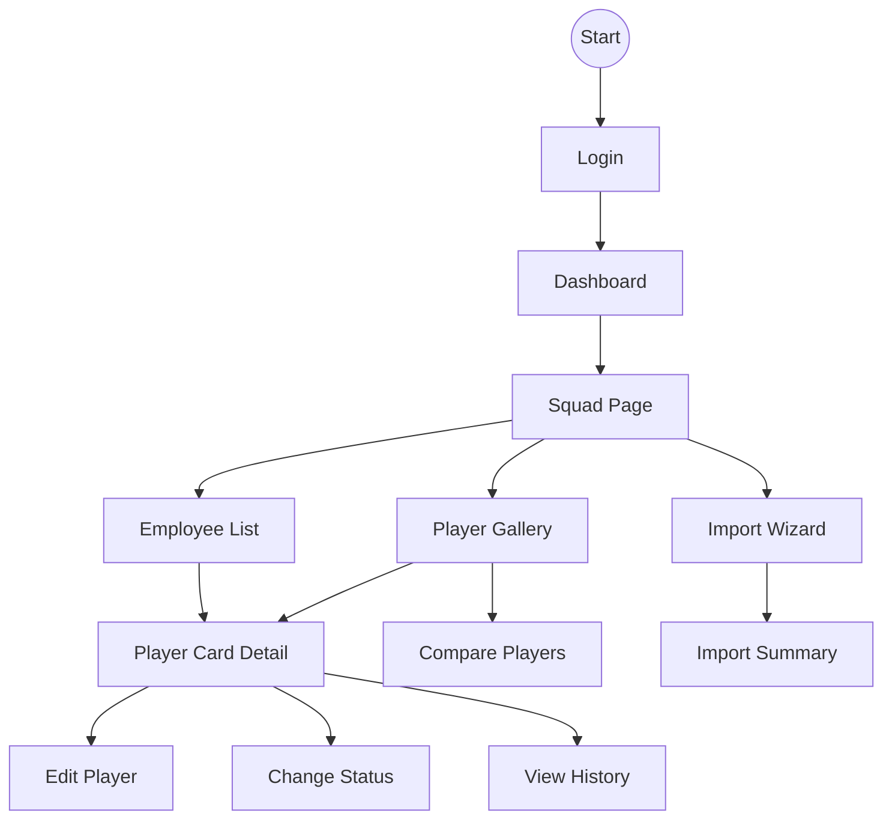
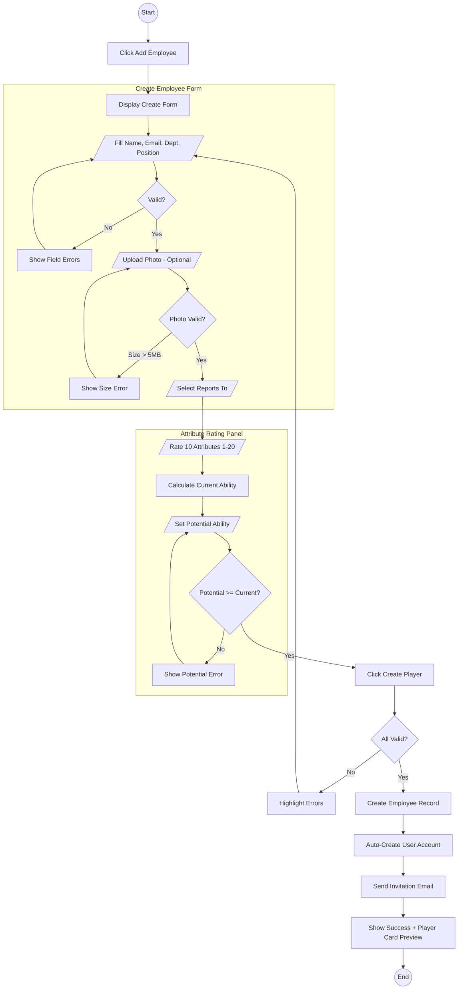
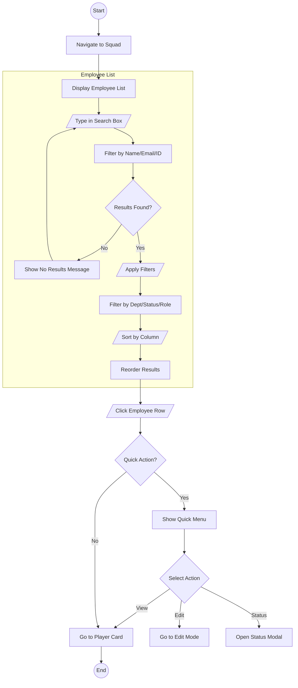
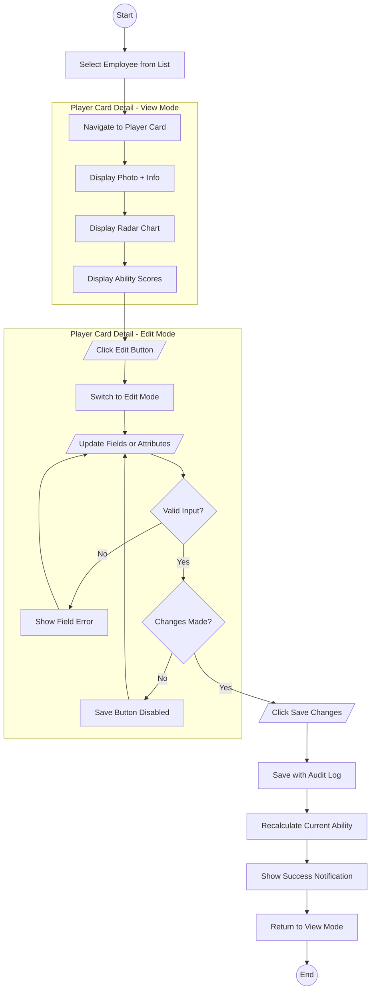
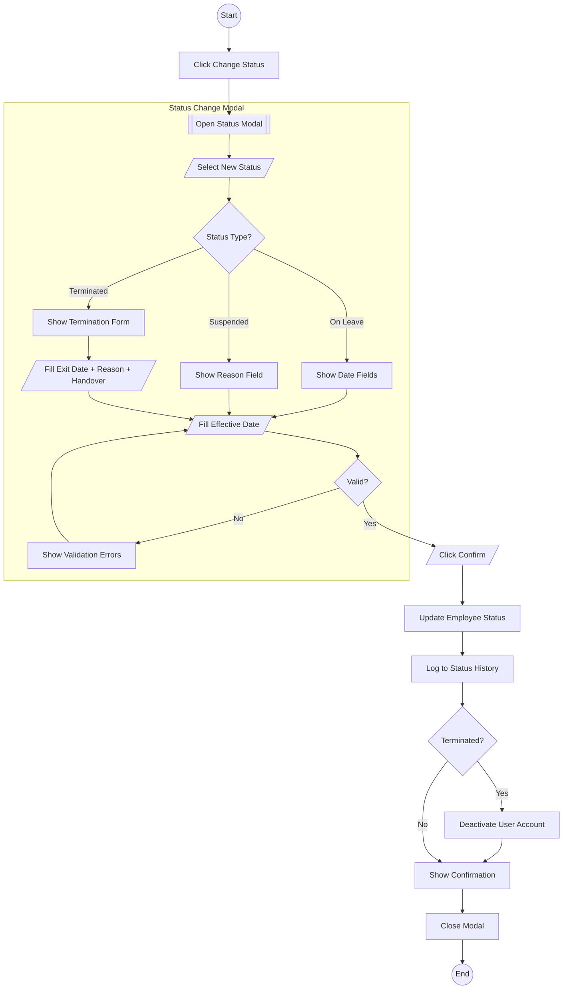
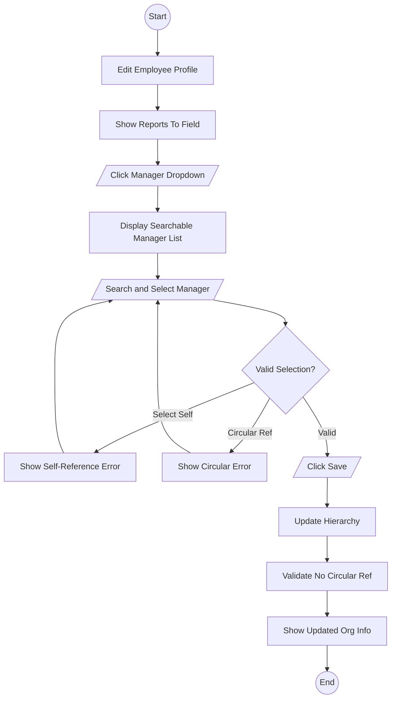
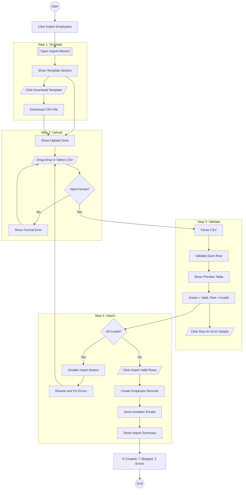
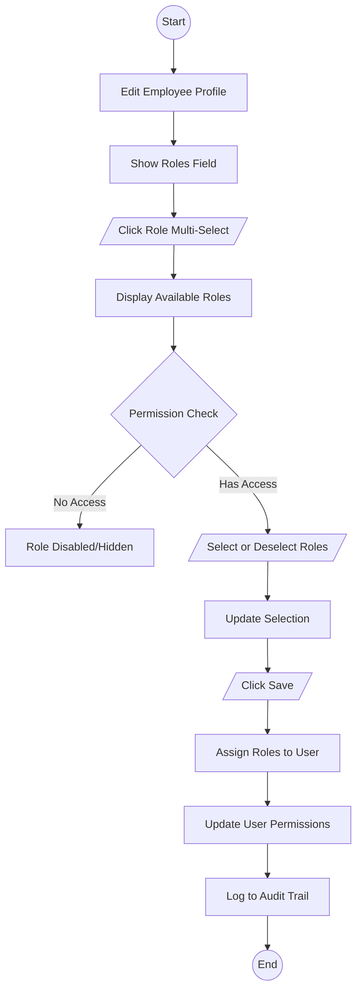
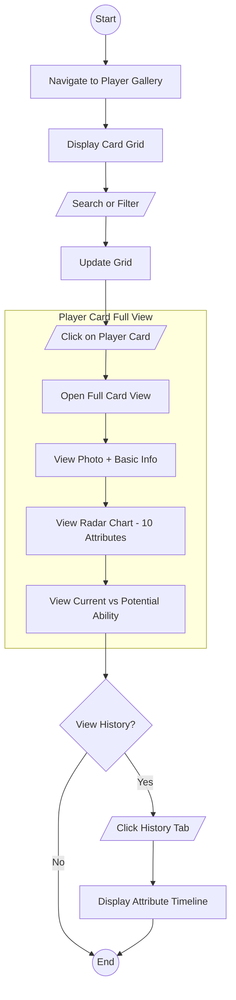
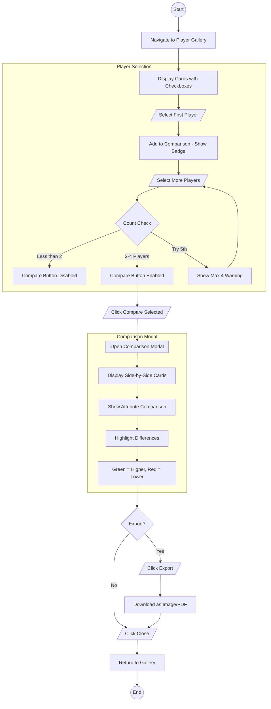

# Player Card System - UX Flow Diagrams (Combined)

**Source PRD:** `/ascendhr/user-story/player-card-system.md`  
**Purpose:** All Mermaid.js diagrams in one file for easy copy-paste to [mermaid.live](https://mermaid.live)

---

## 00: Site Map

---

## 01: Create Employee + Player Card (US-0.4.1)

---

## 02: Employee List & Search (US-0.4.2)

---

## 03: View & Update Employee (US-0.4.3)

---

## 04: Change Employment Status (US-0.4.4)

---

## 05: Manage Reporting Structure (US-0.4.5)

---

## 06: Bulk Import Employees (US-0.4.6)

---

## 07: Assign Roles (US-0.4.7)

---

## 08: View Player Card (US-0.4.8a)

---

## 09: Compare Players (US-0.4.8b)

---

## Screen Inventory

| # | Screen | Used In | Components |
|---|--------|---------|------------|
| 1 | Employee List | 01, 02, 03 | DataGrid, Search, Filters |
| 2 | Create Employee Form | 01 | Form, Photo Upload |
| 3 | Attribute Rating Panel | 01, 03 | Sliders, Radar Chart |
| 4 | Filter Panel | 02 | Dropdowns, Range |
| 5 | Quick Actions Menu | 02 | Dropdown |
| 6 | Player Card Detail (View) | 03, 08 | Card, Radar, Tabs |
| 7 | Player Card Detail (Edit) | 03 | Form, Sliders |
| 8 | Status Change Modal | 04 | Modal, Form |
| 9 | Termination Form | 04 | Extended Form |
| 10 | Manager Dropdown | 05 | Searchable Select |
| 11 | Import Wizard | 06 | Steps, Upload, Table |
| 12 | Role Assignment Field | 07 | Multi-select |
| 13 | Player Gallery | 08, 09 | Card Grid, Checkboxes |
| 14 | Comparison Modal | 09 | Side-by-side Cards |
